# Procedure 16: Create a logical variable by assignment

Logical variables are True or False values which are derived by logical assignment.  To create a logical variable as the result of an evaluation assignment, start by creating a variable x by typing:

``` r
x <- 1
```

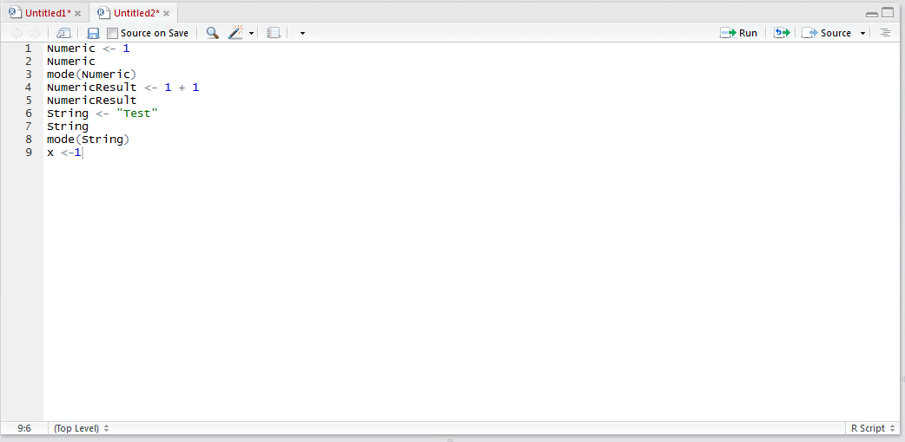

Run the line of script to console:

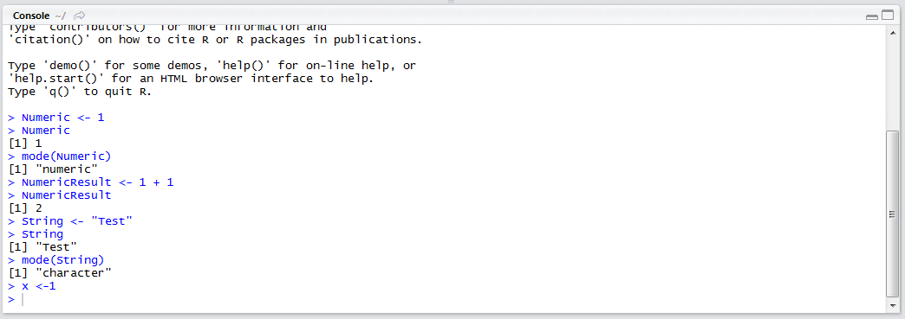

Create another variable y by typing:

``` r
y <- 2
```

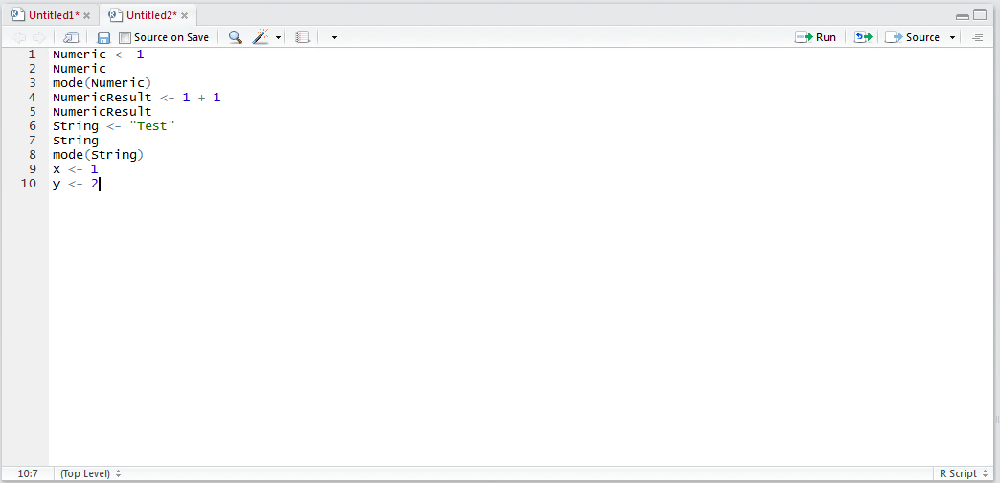

Run the line of script to console:

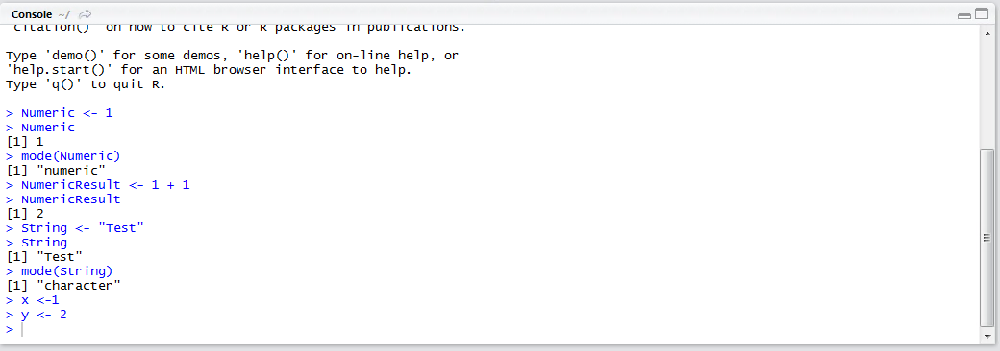

The logical variable will be created as the result of comparing one variable to another, in this case, questioning if x is greater than y.  Type:

``` r
Logical <- x > y
```

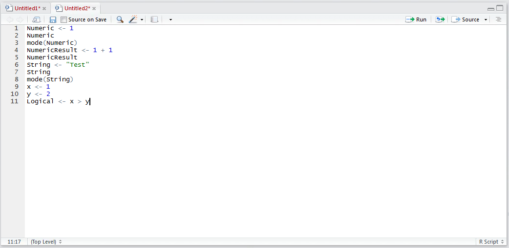

Run the line of script to the console:

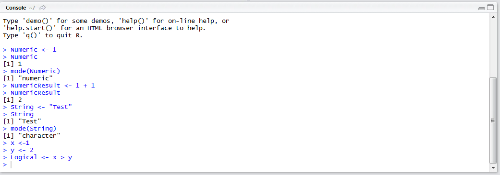

It can be seen that the variable Logical has been created and is available in the Environment pane:

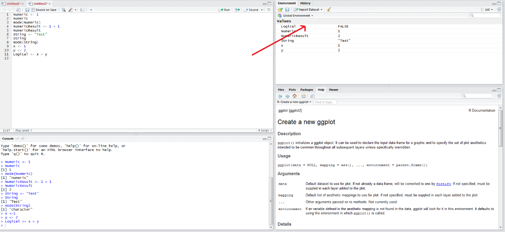

Naturally, the variable can also be referenced via simply typing into the script editor:

``` r
Logical
```

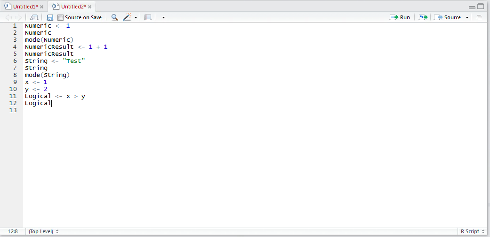

Run the script to console:

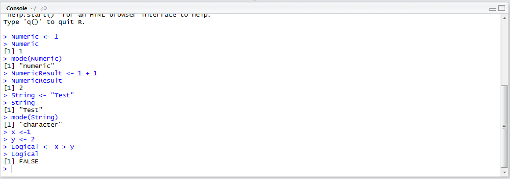

It can be seen that the variable has been written out as FALSE, in this instance, with the opposing value being TRUE.  Using the mode() function,  typing into the script editor:

``` r
mode(Logical)
```

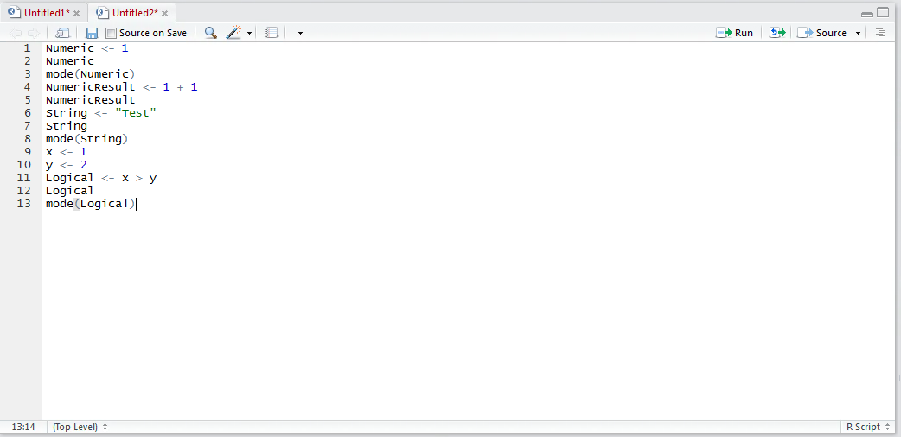

Run the script to console:

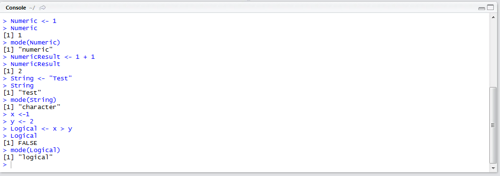

It can be seen that the variable writes out as being of type logical.

