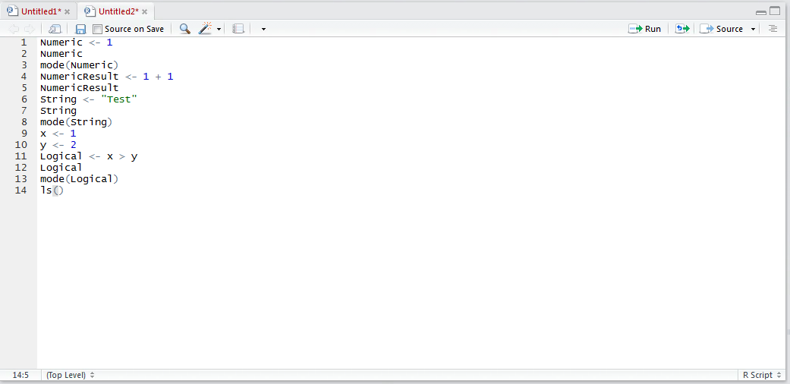
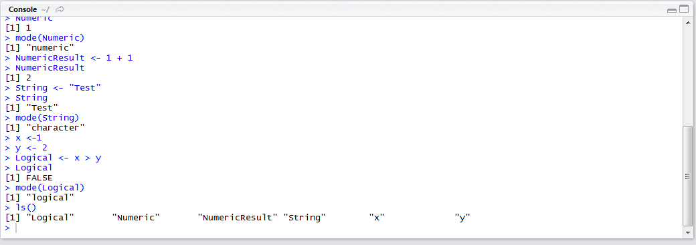
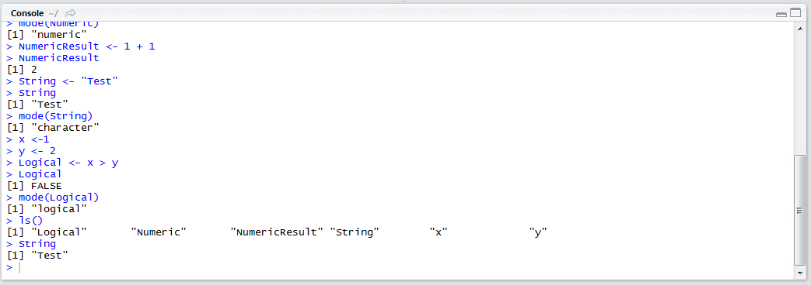

# Procedure 17: List Variables in R

While RStudio will display the variables in the session at a given point in time,  the function can be replicated to console also.  The ls() function,  which has hitherto been used to identify the functions in a package, is by default used to identify objects in the session.  In the script editor,  type:

``` r
ls()
```



Run the line of script to console:



The variable names are returned to the console.  To reference these,  it is simply a matter of typing the variable name:

``` r
String
```


Run the line of script to console:

