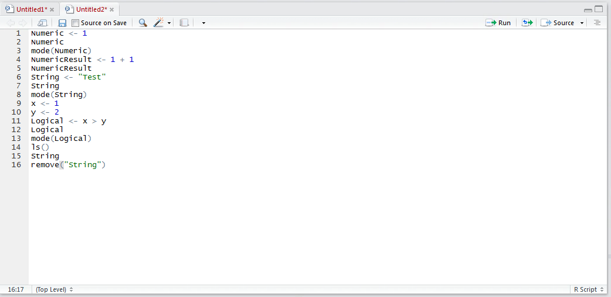
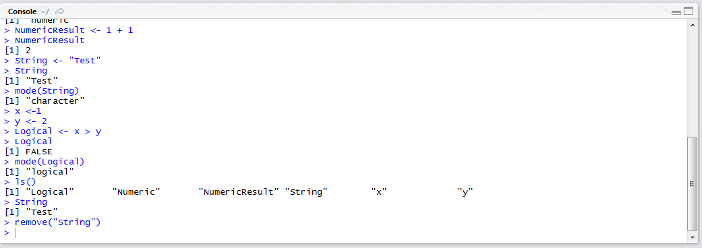
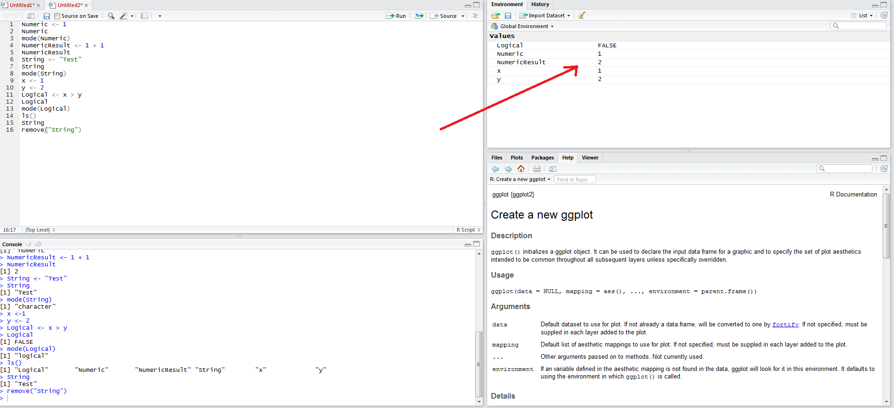
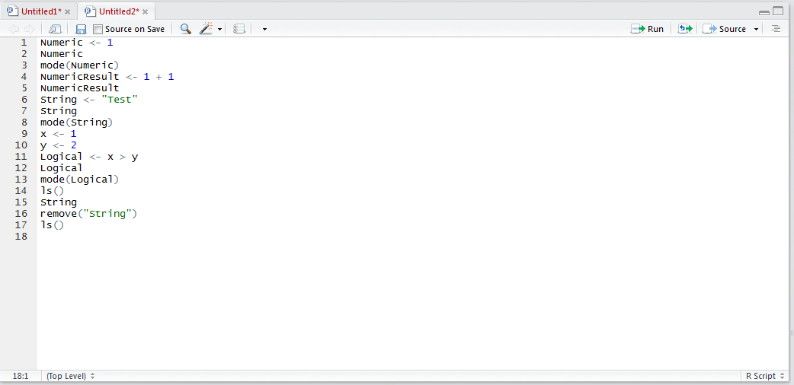
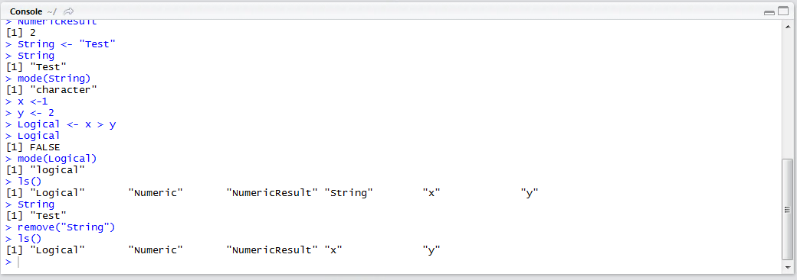

# Procedure 18: Remove Variables in R

In the event that long and complex scripts are being processed, where the objects might be using a substantial amount of memory (such as a large table from a database), it may be prudent to remove the objects when the script no longer needs it.

To remove an object, the remove() function is used taking an argument as the name of the variable to be removed.  In this example, the String variable will be removed.  Type:

``` r
remove("String")
```



Run the line of script to console:



It can be seen that the String variable no longer appears in the environment pane:



Naturally the variable will not be available in the session upon inspection of the ls() function.  Type:

``` r
ls()
```



Run the line of script to console:



It can be observed that the return is now minus the String variable.