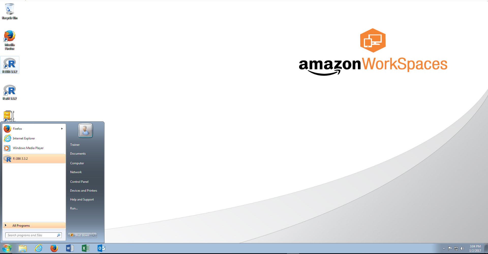
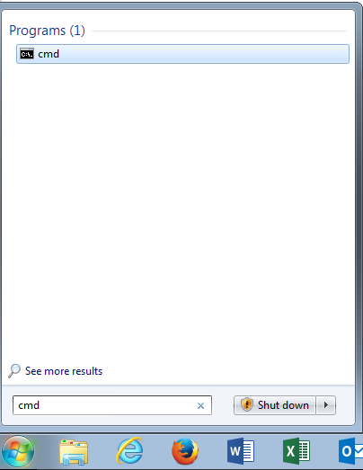
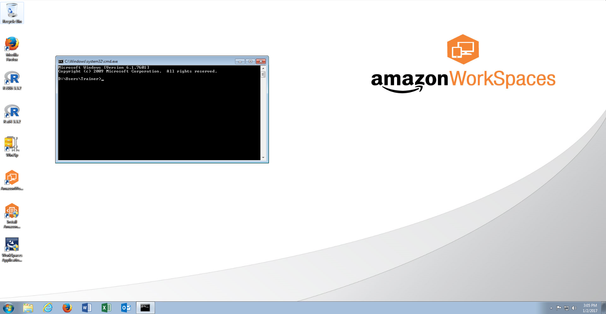
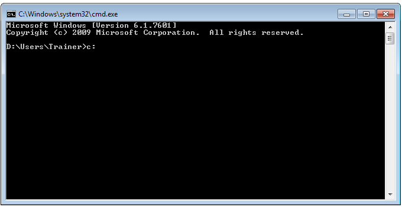
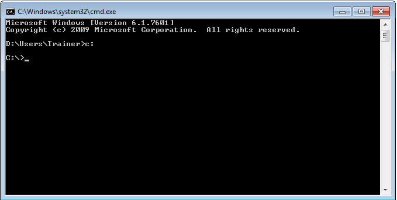
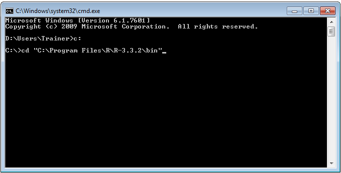
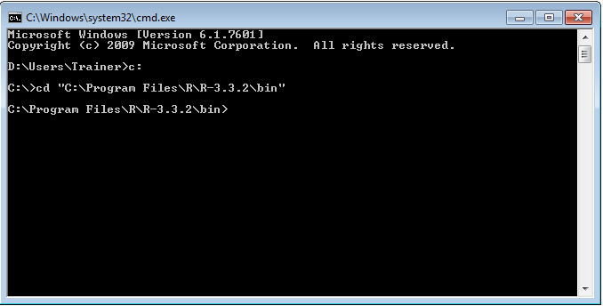
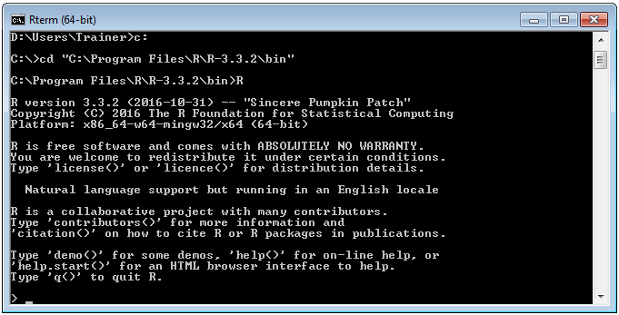

# Procedure 1: Navigate to and launch the R command line

To launch the R Core Command Line software, start by launching the command prompt.  The quickest way to launch the command prompt is to click the Start button firstly:



Then in the run \ search bar type CMD,  which will suggest the appropriate application:



Click on, rather run, the application:



It is unlikely that the Command Prompt will be in the correct directory to run R.  Switch to the C:, which is where all installed programs tend to reside, by typing:

``` r
c:
```



Press the Enter key to make the drive change:



To navigate to the directory containing the R command line type:

cd "C:\Program Files\R\R-3.3.2\bin"



Commit the drive by change pressing the Enter key:



To launch the R console application type:

``` r
R
```

Invoke R Core by pressing the Enter key:



Upon successful launch of the R Core Command Line Interface, introductory text will be displayed with a chevron (i.e >) denoting the command line input awaiting with a flashing cursor:
