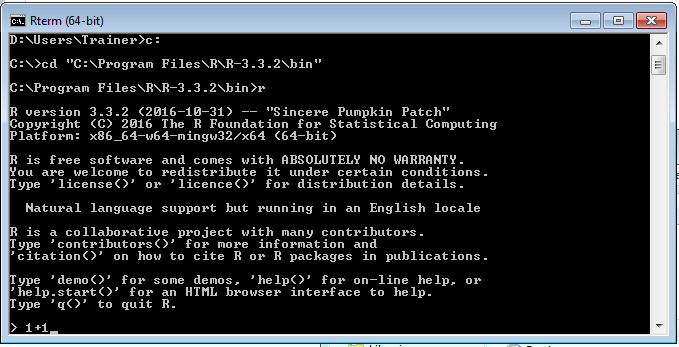
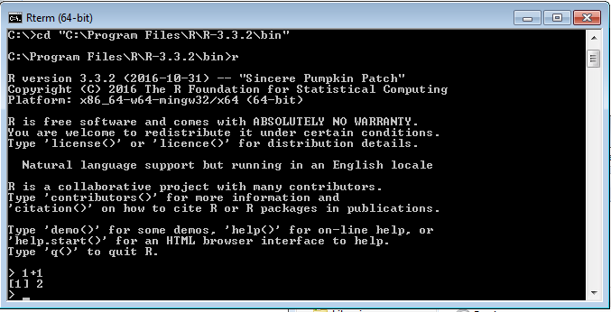
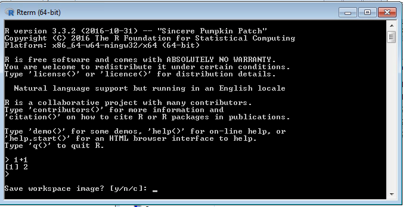
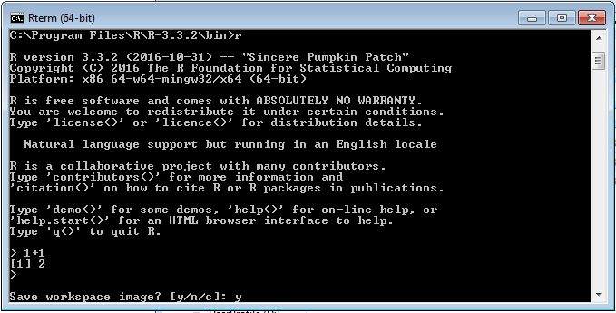
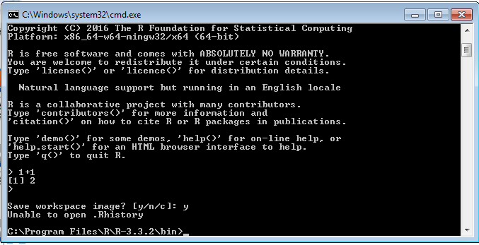

# Procedure 2: Issue commands to the R Console

R is an interpreted language for mathematical and statistical computing. R processes as script, line by line.  In this example the sum of 1 + 1 will be returned, which will of course be 2.  To perform such a calculation type:

``` r
1+1
```



Press the Enter key to commit and execute the line of script:



It can be seen that a line has been returned showing [1] 2, where [1] is the position in the result vector, where 2 is the actual value returned from the line of script.  The mathematical operators (in this case +) are much the same as Excel:

* + Addition.
* - Subtract
* / Divide
* * Multiply

This procedure has shown a simple line of script being written, executed and returned by R.  Although rudimentary, it is an R program.

To exit the R console, hold down the CTRL key and the D key:



There are three options presented when exiting the R console:

* y: Save the workspace image for reloading.  This will keep everything in the current session.
* n: Clear the workspace so that the next time r is loaded it will be afresh.
* c: Cancel and go back to the workspace.

In this example, type:

``` r
 y
```



Press the Enter key to commit the command:



Notice that an error was returned ‘Unable to open .Rhistory’.  The error is created as the operating system will not allow the user to write to the same directory as R is running, which introduces the concept of working directories, as follows.