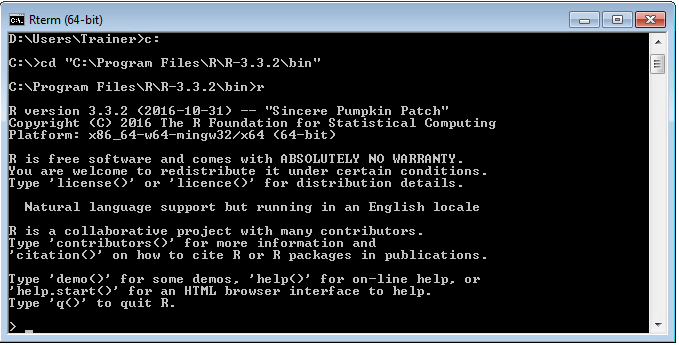
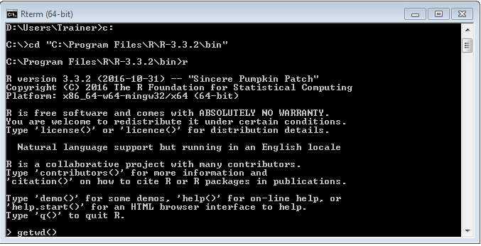
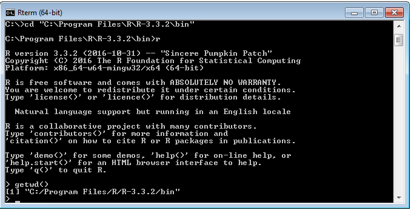
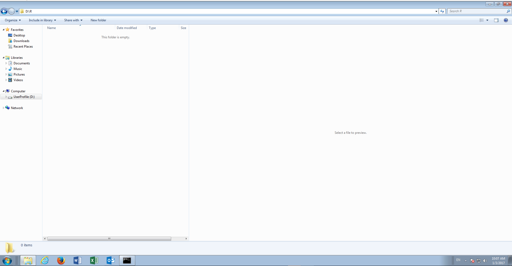
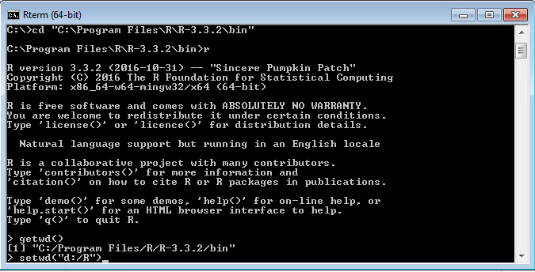
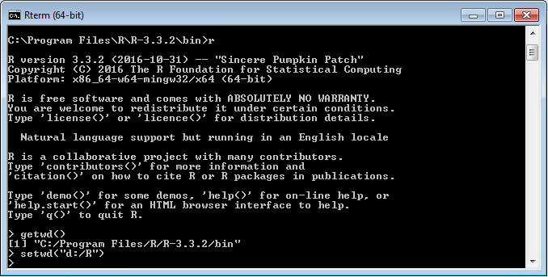
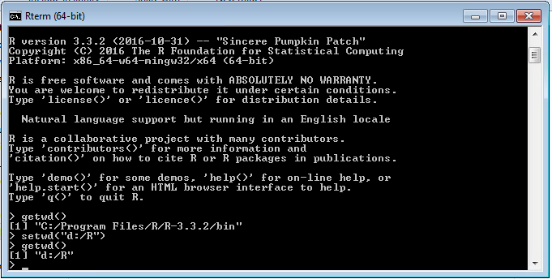
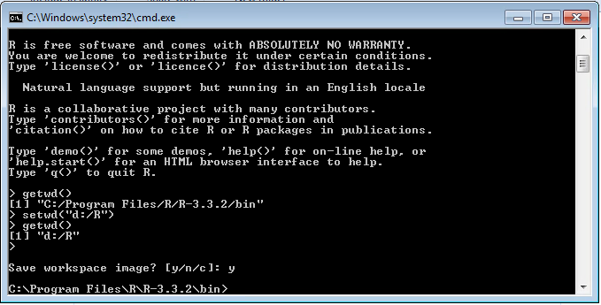
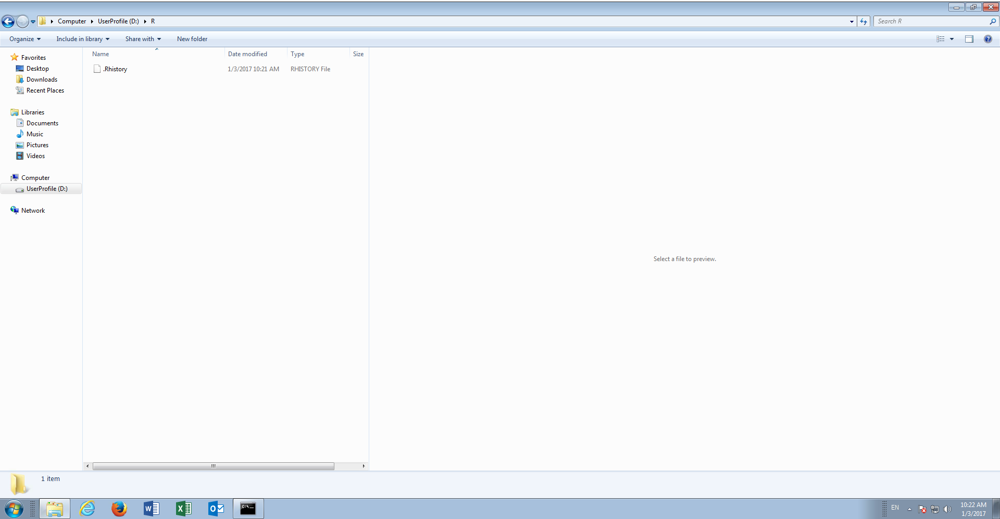

# Procedure 3: Set a Working Directory

A working directory is where R will look for files during a session.  The files may be the R session, or in subsequent procedures it will be data to be imported and data saved as the result of processing.  

In procedure 2, it was observed that there was a failure when saving the R history, owing to the working directory not being set (rather set incorrectly).  It follows that the working directory need be set.

Start by executing procedure 1 to load the R console.



To identify the current working directory use the getwd() function, type the script line:

``` r
getwd()
```



Execute the command by pressing the Enter key:



The current working directory, which is the directory containing the executable, is returned.  Saving files to the same directory as the R software is not desirable, quite beyond it causing errors, and as such, this should be changed to an appropriate directory.

Create a directory to be used throughput these procedures.  In this case the files will be saved to the d:\ in a directory called R:



To set this as the working directory in R use the setwd() function with the directory in quotation marks, type:

``` r
setwd("d:/R")
```



Press the Enter key to process the line of script:



The absence of any error message confirms that the working directory has been changed, although this can be affirmed by executing the getwd() function:

``` r
getwd()
```



The working directory is now set to d:\r.

If R is exited, and y is selected to save, it can be observed that there were no errors:



Furthermore, it can be seen that the .RHistory file has been saved to the working directory:

