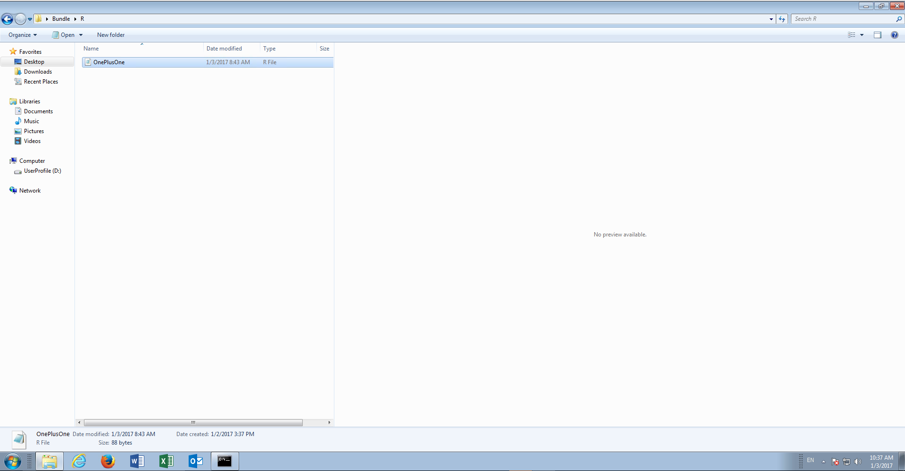
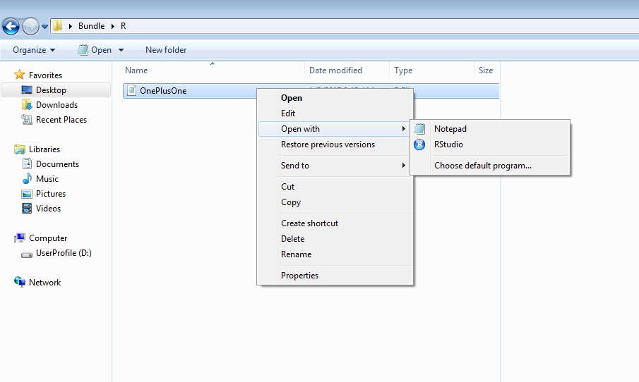
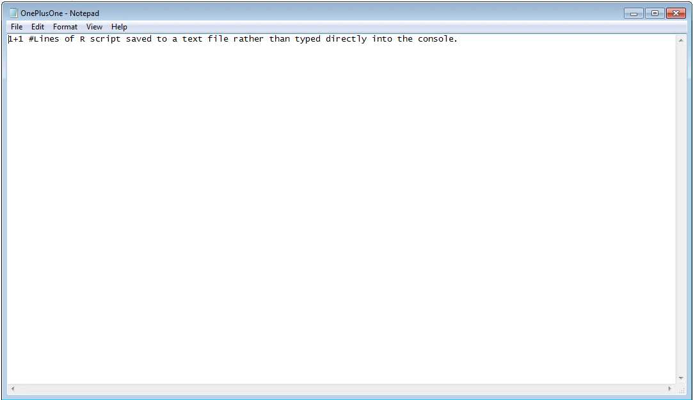
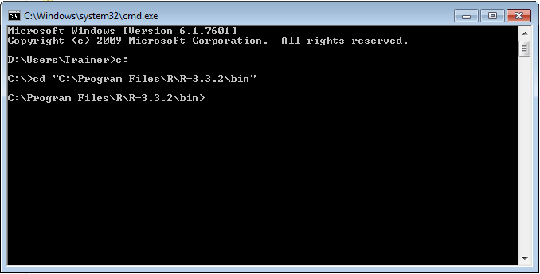
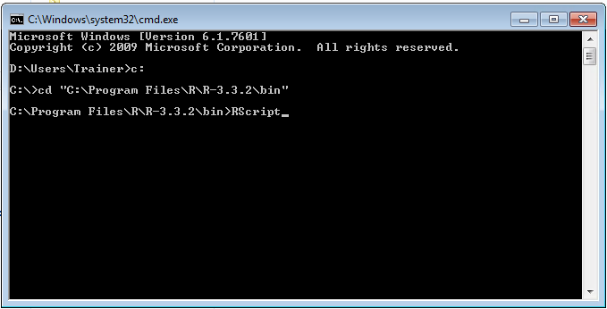
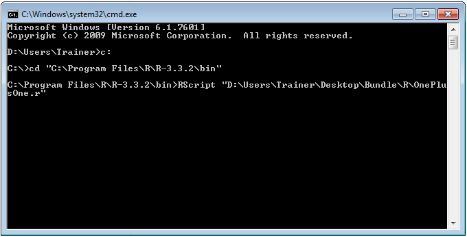
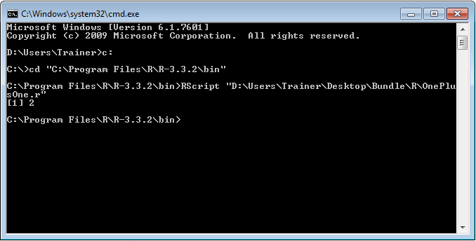

# Procedure 4: Run a script from the R command line

The procedures presented thus far have used the R Console to directly process commands line by line, requiring the Enter key to be pressed to execute.  An alternative means to execute R commands is a script execution approach, where each script line is presented as the line of a text file.

In Windows Explorer navigate the directory Bundle\R\:



In the directory Bundle\R, there is a file called OnePlusOne.r.  Right click on this file:



For the time being click on Notepad to open the file:



Inside the text file it can see seem that the same command that was executed in procedure 1 is present as a line in the text file.  Notice also the presence of a hash tag after the command, which is a comment whereby everything after the hash (to the right of) is ignored.

For the purposes of this procedure, close Notepad, as it is purely to illustrate that the contents of the file are the same as would be entered directly into the R console.

Open the command prompt and navigate to the R directory as described in procedure 1, although do not load R.exe instead this procedure uses RScript.exe:



The RScript program exists for the purposes of executing a series of R script lines rather than requiring a command to be entered one by one into the console for interpretation by R.  

To execute the script OnePlusOne.r, start by typing:

``` r
RScript
```



Followed by the name of the R script to execute, which is in this case Bundle\R\OnePlusOne.r:

``` r
RScript "D:\Users\Trainer\Desktop\Bundle\R\OnePlusOne.r"
```



Notice that the structure is the executable, RScript.exe, followed by the directory and file name of the script within double quotations.

Press Enter to launch the RScript.exe program with the script passed as an argument:



Once completed, RScript will return to the command prompt.  It can be seen that the output to the command line is the same as that observed in Procedure 1.  

Two means of interacting with R have now been put forward, the first being the entry of command script into the R Console with the second being the staging of those commands in a text file with a view to invoking these commands in RScript.exe.