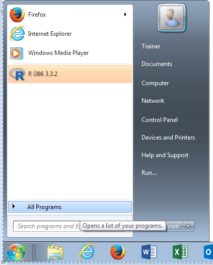
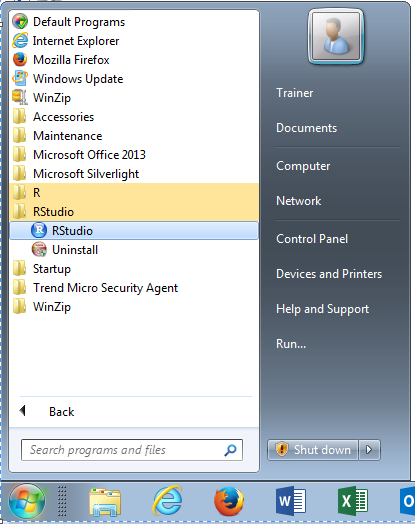
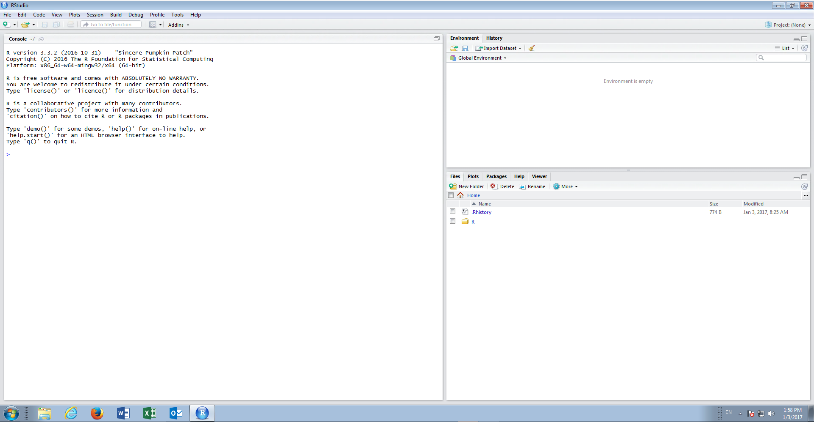
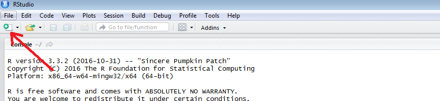
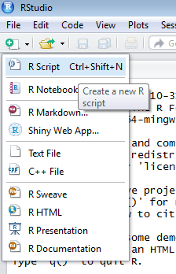
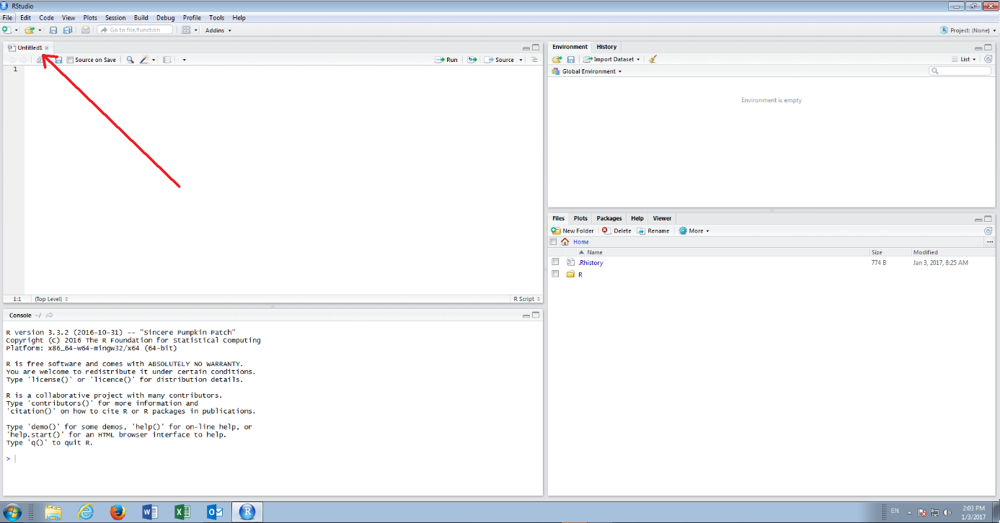

# Procedure 5: Launching R Studio

RStudio is distinct from R Core and conceptually it should be viewed that RStudio overlays RCore (although they are independent installations of R in actually).  To launch RStudio, navigate to and click the Start button, then navigate to All Programs:

Expanding All Programs, navigate to the RStudio folder:

Click on the application RStudio to launch:

For all procedures that follow, using RStudio, a script active, console passive approach will be taken.  
To create a new script, that will be the target for all R Console interactions, click the New Script button in the top

left-hand corner of RStudio, under File:

In the sub menu, click the first option titled ‘R Script’:

A new, empty, script will be loaded:

A script will be the focus of all attention, and a user will be active in the script window only, leaving the console alone.  No command is ever entered directly into the console.