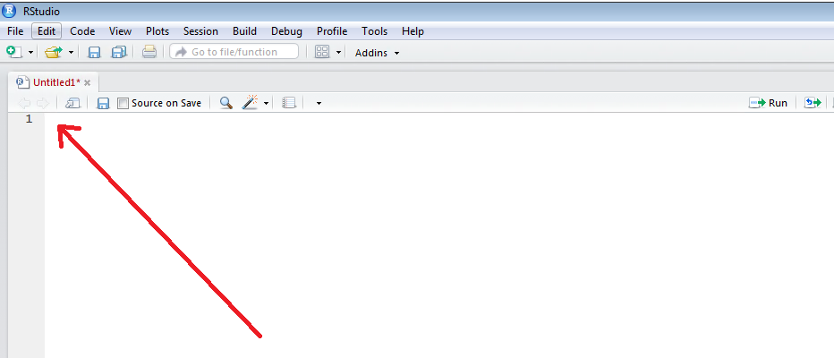
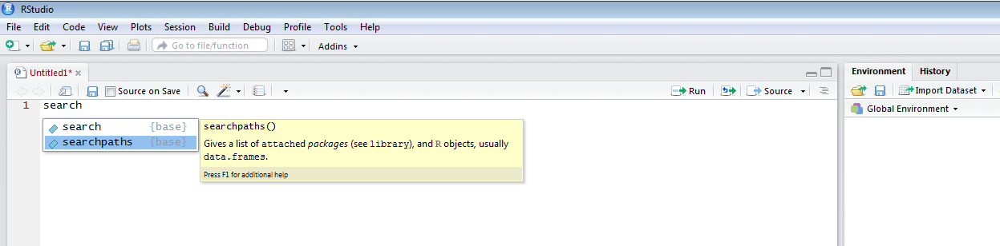
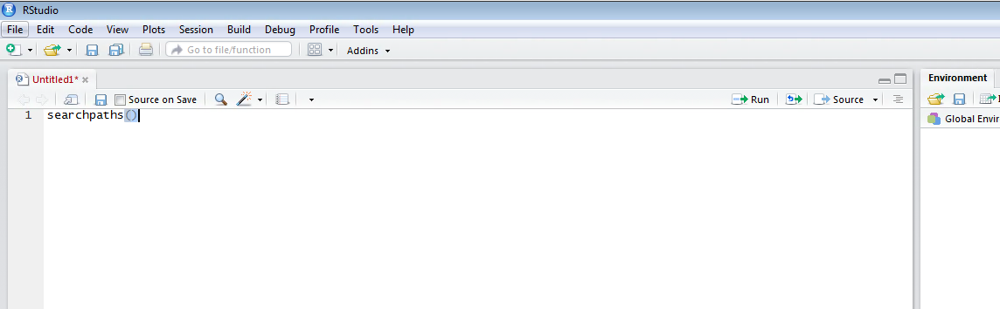
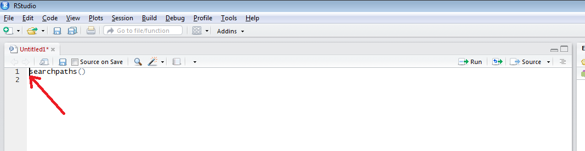
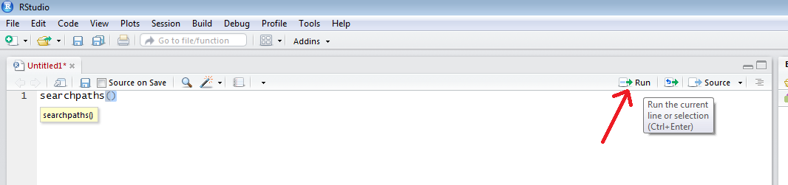
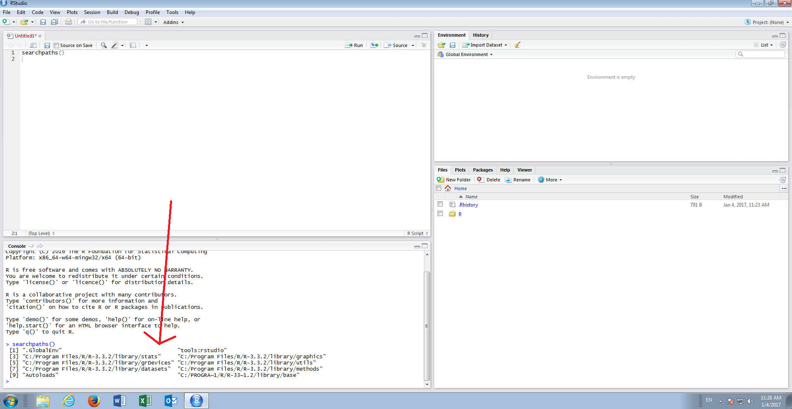
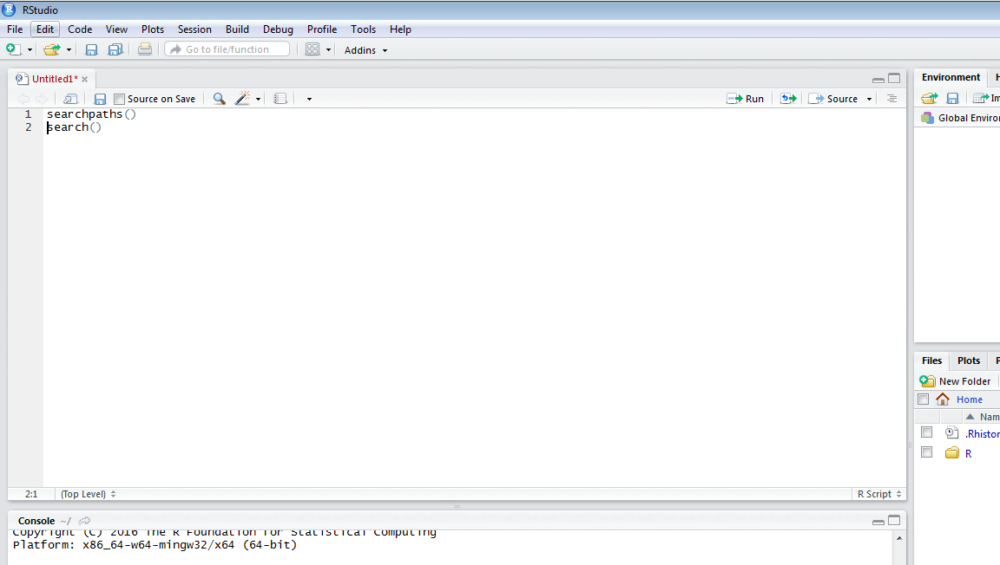
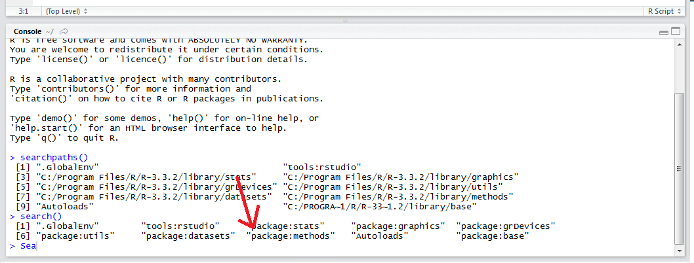

# Procedure 6: Identify Packages Installed

Packages are a collection of files contained in the runtime directory of R. The runtime directory, where the packages are installed, is know as the search path.

To get a picture of the packages installed start by setting focus in the script window by clicking in the pane in the top top left hand corner:



To view the physical location of the packages type:

``` r
searchpaths()
```





Intellisense in Rstudio will suggest the function as the keystrokes take place.
Upon the function having been written in the script editor, move the cursor to the start of the line (it will be implicitly understood that this has taken place in future procedures when the instruction to Run to console is given):



Click the Run button or achieve the same via a Ctrl+Enter key combination:



Running sends the line of script to the console for execution:



Upon close inspection,  it can be seen that the packages and their file location in the R execution directory have been listed in the console:

``` r
[1] ".GlobalEnv"                                   "tools:rstudio"                               
 [3] "C:/Program Files/R/R-3.3.2/library/stats"     "C:/Program Files/R/R-3.3.2/library/graphics" 
 [5] "C:/Program Files/R/R-3.3.2/library/grDevices" "C:/Program Files/R/R-3.3.2/library/utils"    
 [7] "C:/Program Files/R/R-3.3.2/library/datasets"  "C:/Program Files/R/R-3.3.2/library/methods"  
 [9] "Autoloads"                                    "C:/PROGRA~1/R/R-33~1.2/library/base"   
A more environment focussed presentation of the pakages can be achived by creating a new li
```

the script editor and typing:

``` r
search()
```



Run to console:



The search() function gives a more concise list of the packages that are available and loaded.