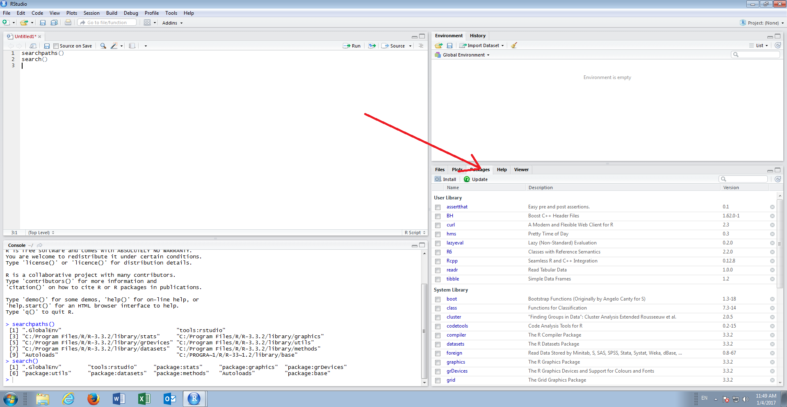
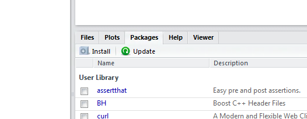
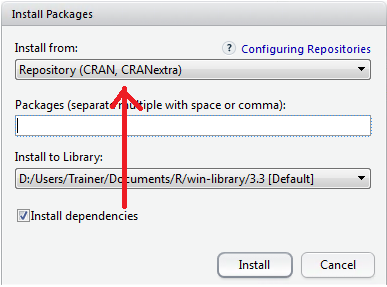
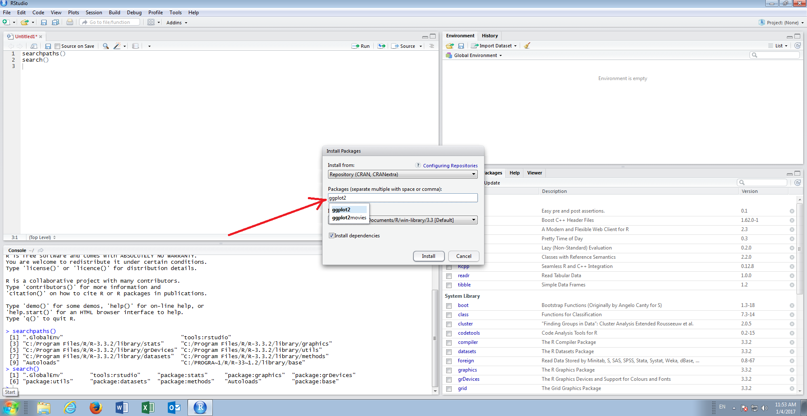
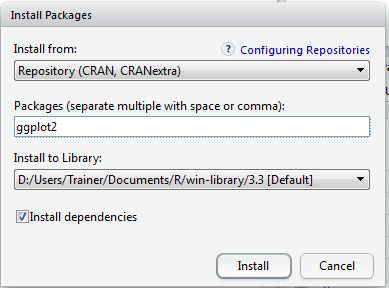
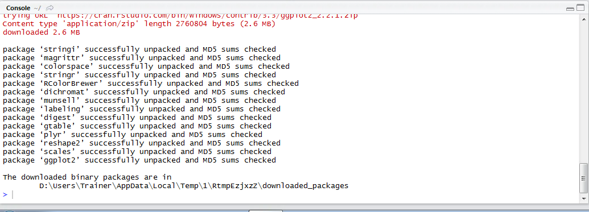
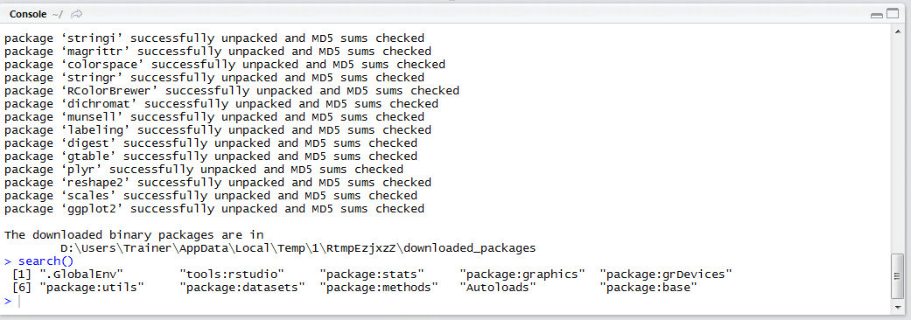

# Procedure 7: Browsing and Installing Packages

For the purposes of these procedures all external packages will be sourced from CRAN via Rstudio.   In this procedure the graphics and plotting package titled ggplot2 will be installed.

Navigate to the Packages pane, clicking the tab if necessary, in the bottom right hand corner of RStudio:



Click on the button Install:



The Install Package dialog box will display,  defaulting to the CRAN mirror:



To search for a package by name, type the name in the package textbox:

``` r
ggplot2
```



Autocomplete will suggest two packages having reviewed potential matched on CRAN,  accept \ click on the suggested ggplot2:



Always keep the Install Dependencies button as checked.  Clicking install will send commands to the console to install the packages:



The package is now installed.  

Executing the search() function it can be observed however that the package appears not to be loaded:

