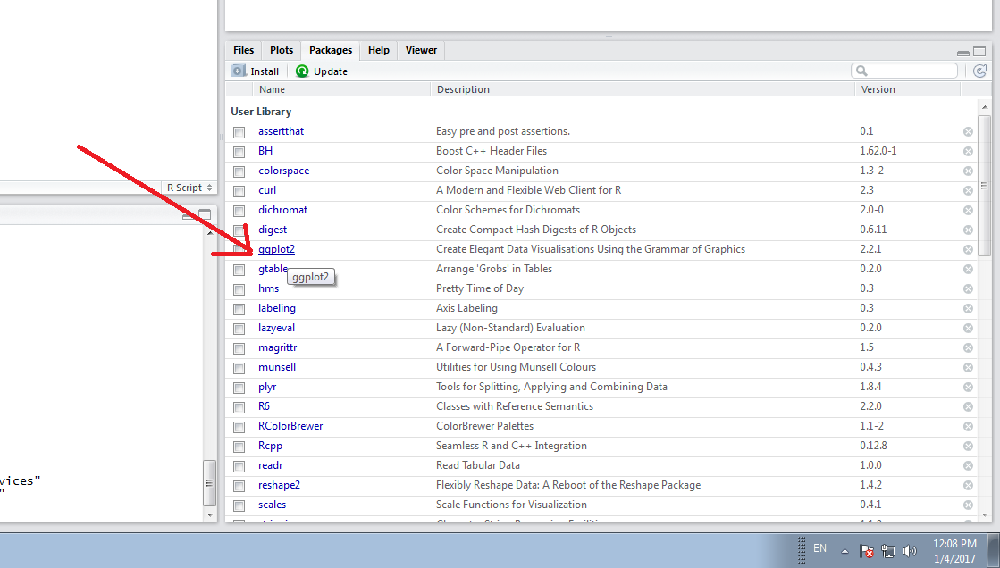
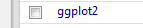
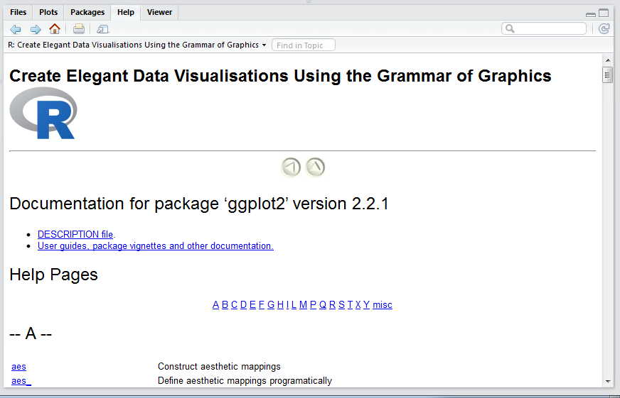
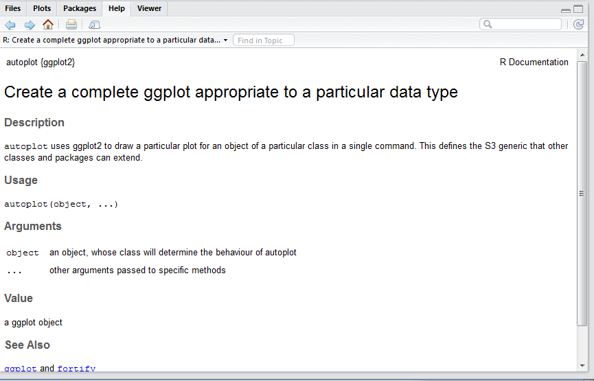

# Procedure 8: Review Help and Documentation

In the packages pane a list of all packages installed has been presented.  It can be seen,  following the execution of Procedure 7,  that ggplot2 is now installed.  It is customary for packages to carry good documentation,  which can be accessed by clicking on the hyperlink overlaying the package name:

Clicking on the link immediate navigation to the packages documentation takes place:

This feature provides a more intuitive means to navigate to documentation for functions. In this example,  scroll down and click on the function link autopilot:

It can be seen that the documentation is displayed, navigating away from the index.