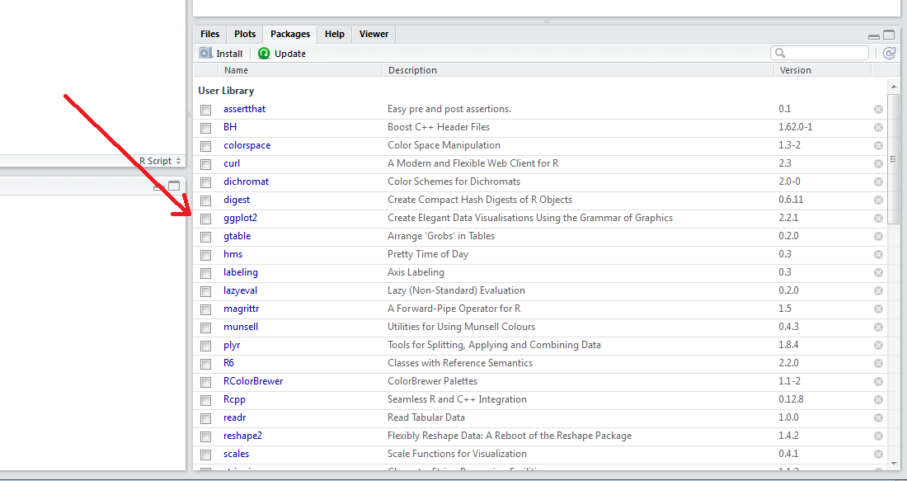
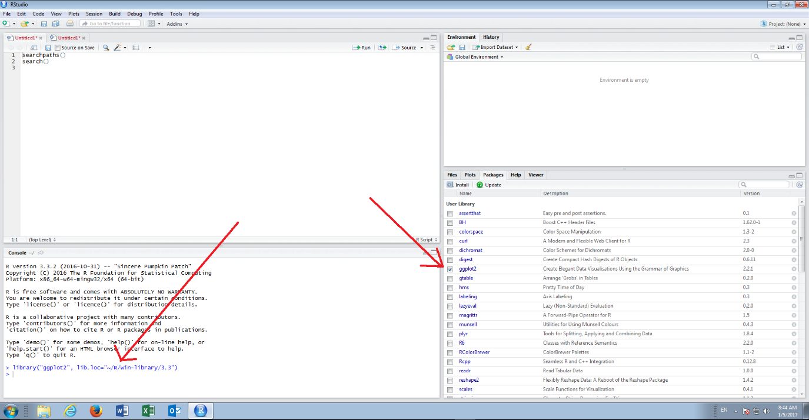
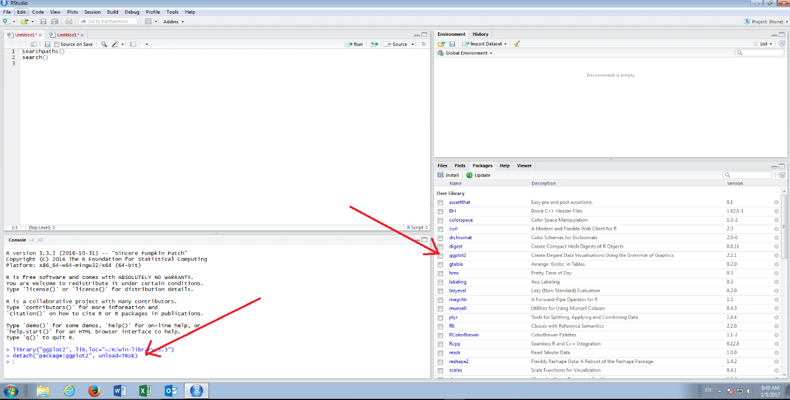

# Procedure 9: Load and Unload Packages in RStudio

hen a package is installed it is not by default available for use, to save memory and resources.  Loading a package in RStudio is an extremely simple toggle process which will send the command to console to load a specific package on select,  unload on deselect.

Loading a package uses the library() function, invoked before a script is run.

Navigate to the packages pane in the bottom right hand corner of the RStudio, clicking on the tab if necessary.

Note the package that was installed in procedure 7,  ggplot2, and the check box to the left hand side of the package name.  To load the package simply select the text box via a click of the mouse:

On selection of the checkbox the library() function, complete with the required parameters, will be processed in the console.  It can also be observed that the location of the package has been specified in this function call,  although that is not strictly necessary.

To unload the package,  deselect the checkbox in the packages pane next to ggplot2:

On deselection of the checkbox the detach() function is sent to the console for the package (notice the string will match the return of the search() function).

