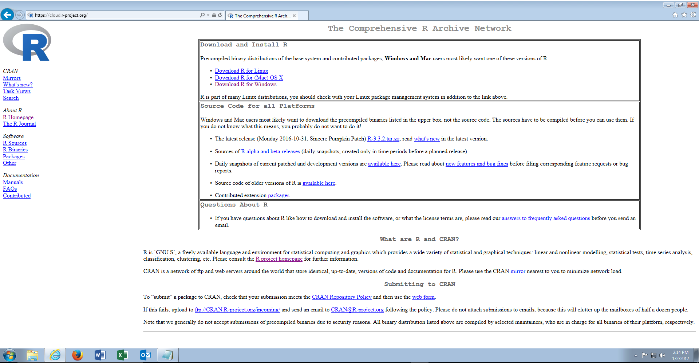
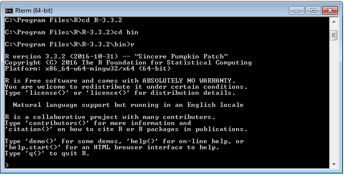
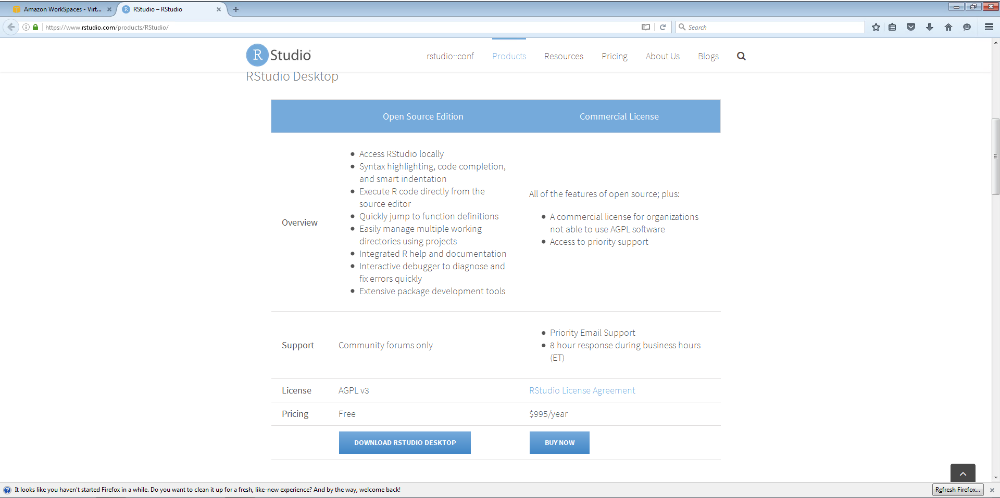
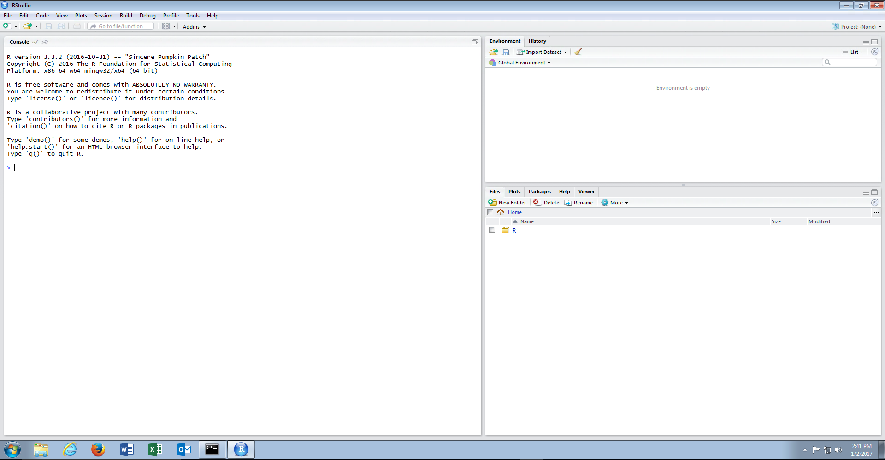

# Module 2: Getting Started with R

R is the software package that is the primary focus of this training. For this module, R is two separate software packages and installs.

Core R is available from https://www.r-project.org/ or by using a mirror such as http://cloud.r-project.org. Core R is created and published by the R Core Development Team.  Fundamentally the view that Core R is a command line only tool, used for production deployments only, should be adopted.  R Core \ R Command Line is used very little in this training course and is predominantly shown as a precursor to RStudio Console.  

Once R Core is downloaded and installed, the command line application is available in C:\Program Files\R\R-3.3.2\bin\titled R.exe although navigation to and invocation of the application is detailed in procedure 1.

In this example, the latest version of R for Windows has been installed with the default settings.

RStudio is a feature rich Integrated Development Environment (so-called IDE) that improves productivity in creating R Scripts, although in production the execution of these scripts might well fall to the core installation.  
The software can be downloaded from https://www.rstudio.com/products/RStudio/ and is free, although there are commercial editions.

As with R Core, the defaults have been left unchanged during the installation.

