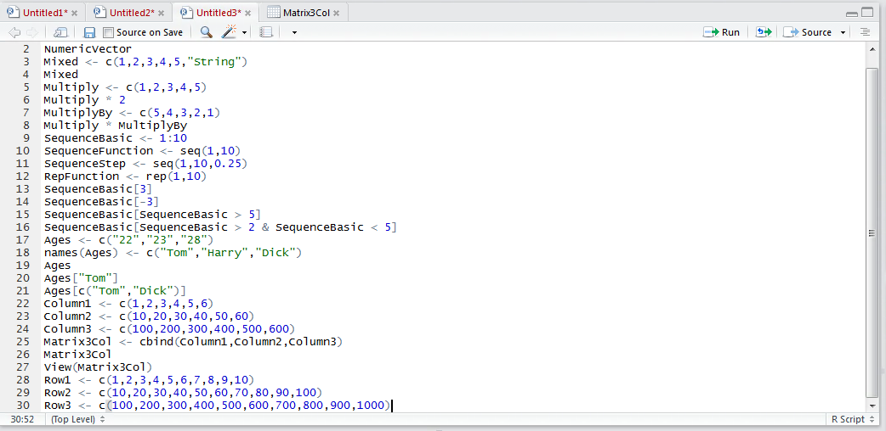
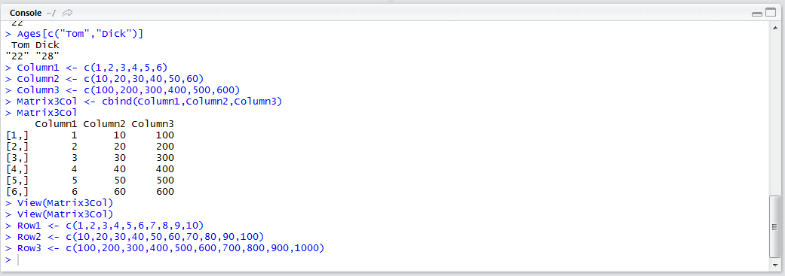
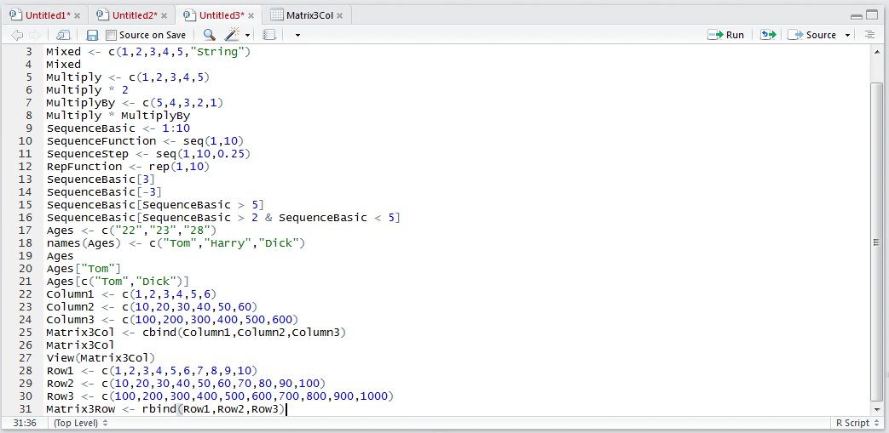
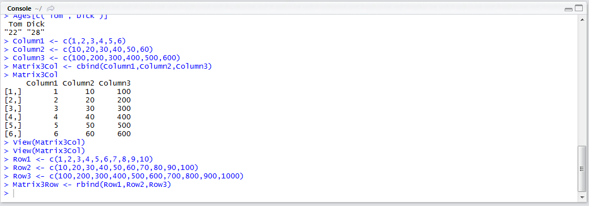
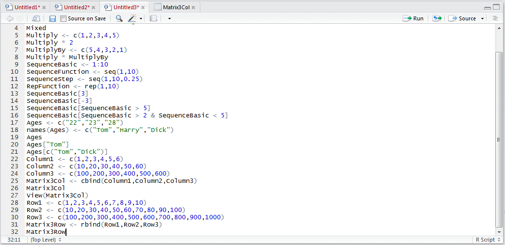
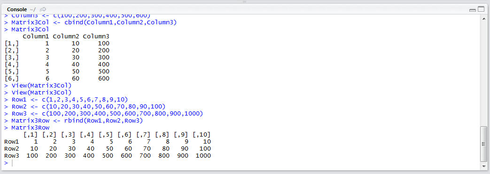

# Procedure 10: Combine Vectors to make a Matrix with rbind

Whereas procedure 26 brought vectors together as columns,   rbind() can bring vectors together as rows.  Start by creating two vectors in a script block:

``` r
Row1 <- c(1,2,3,4,5,6,7,8,9,10)
Row2 <- c(10,20,30,40,50,60,70,80,90,100)
Row3 <- c(100,200,300,400,500,600,700,800,900,1000)
```



Run the script block to console:



To bind the vectors as rows use the rbind() function:

``` r
Matrix3Row <- c(Row1,Row2,Row3)
```



Run the line of script to console:



The matrix can be viewed by typing:

``` r
Matrix3Row
```



Run the line of script to console:

