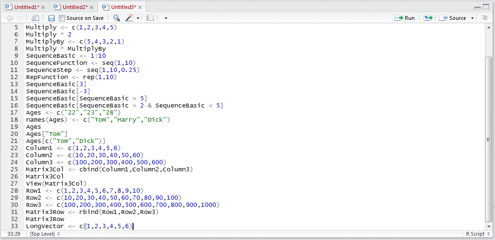
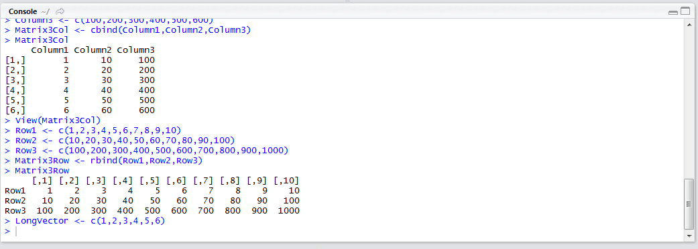
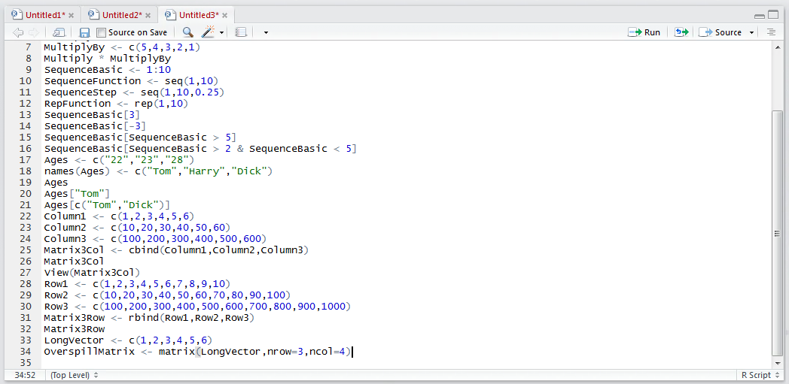
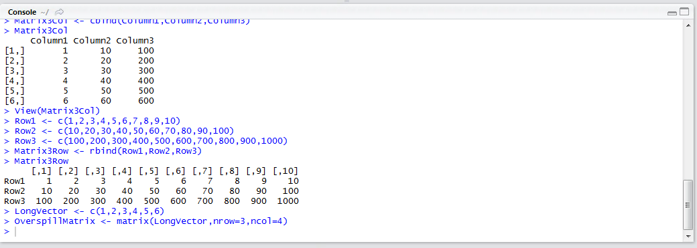
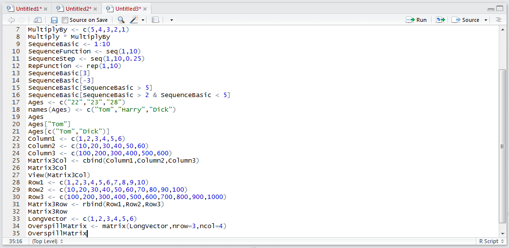
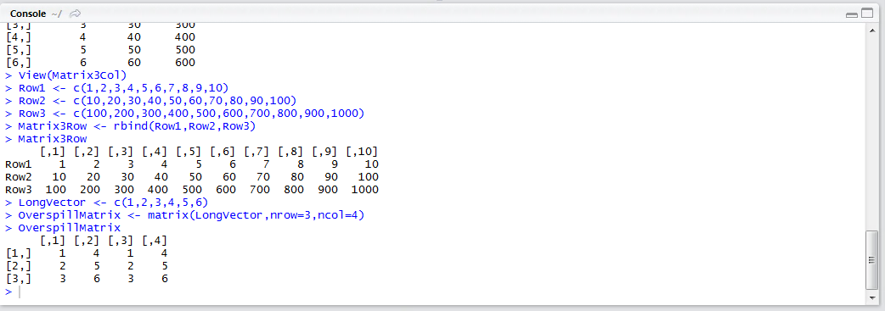

# Procedure 11: Create a Matrix of defined size with a Vector

Procedure 26 and 28 showed how to create a matrix using an intuitive method to bind vectors into columns and rows, comparing this to an Excel spreadsheet.  It is possible to create a matrix with a given specification then fill that specification with a single vector which overspills the dimensions.  

The matrix() function is intended to take a single vector as an argument coupled with the dimensions (i.e. the number of rows and columns).  The single vector fills up this matrix by moving through each entry, downwards, in each column repeating the vector, should that vector not be long enough to fill up the matrix.

Start by creating a vector of six values by typing:

``` r
LongVector <- c(1,2,3,4,5,6)
```



Run the line of script to console:



Bearing in mind that the matrix will fill up column wise, make a matrix that is only three rows deep, while being four columns wide (i.e. nrow=3,ncol=4):

``` r
matrix(LongVector,nrow = 3,ncol = 4)
```



Run the line of script to console:



To view the matrix and specifically how the LongVector overlaid this matrix type:

``` r
OverspillMatrix
```



Run the line of script to console:



It can be seen that in moving column wise, when the vector runs out, it starts again until the matrix has been filled as per the dimensions.