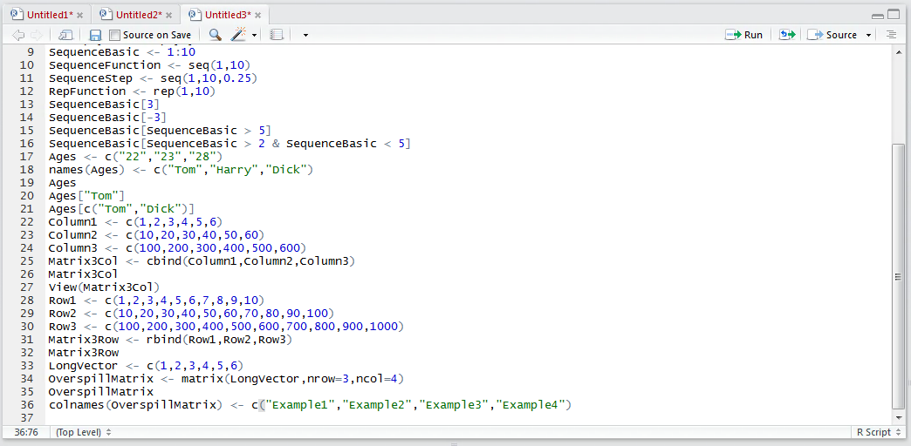
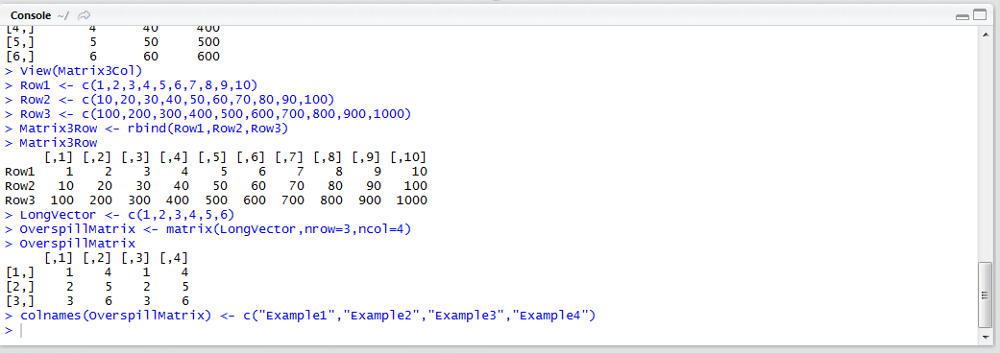
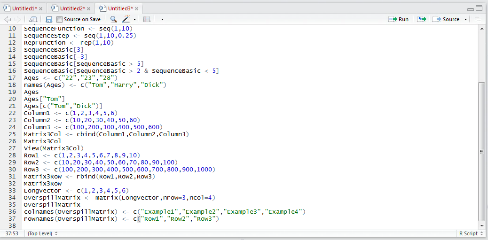
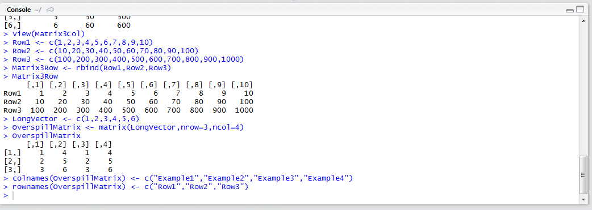
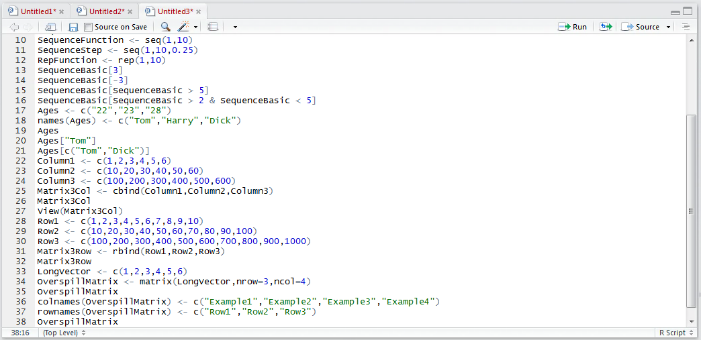
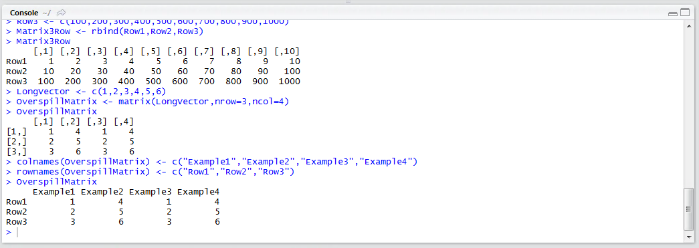

# Procedure 12: Labelling a Matrix.

As seen in procedure 24 it is helpful for reference to label a Vector.  It is possible also to label the rows and the columns of a matrix in a similar fashion using the rownames() and colnames() function.

To set column names assign a Vector to the colnames() function, where the colnames() function accepts the matrix as its argument:

``` r
colnames(OverspillMatrix) <- c("Example1","Example2","Example3","Example4")
```



Run the line of script to console:



The rownames() function has a similar signature and takes a Vector of row names:

``` r
rownames(OverspillMatrix) <- c("Row1","Row2","Row3")
```



Run the line of script to console:



The matrix is now labelled in both directions and can be inspected by typing:

``` r
OverspillMatrix
```



Run the line of script to console:



