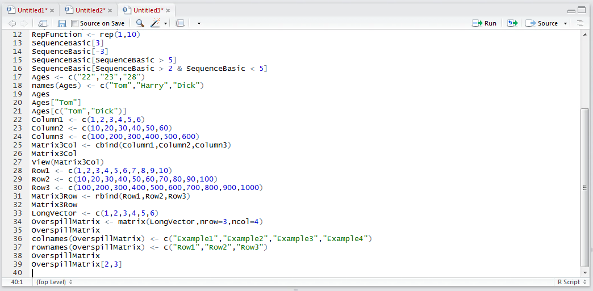
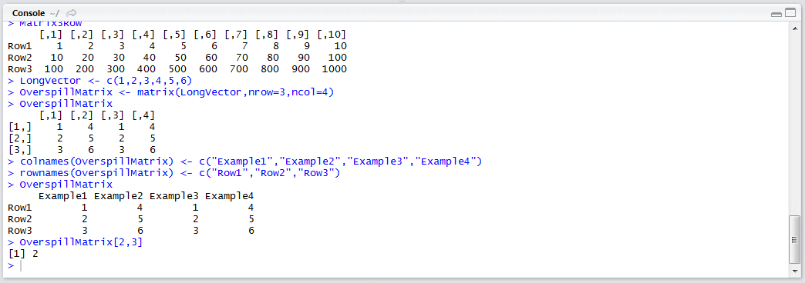
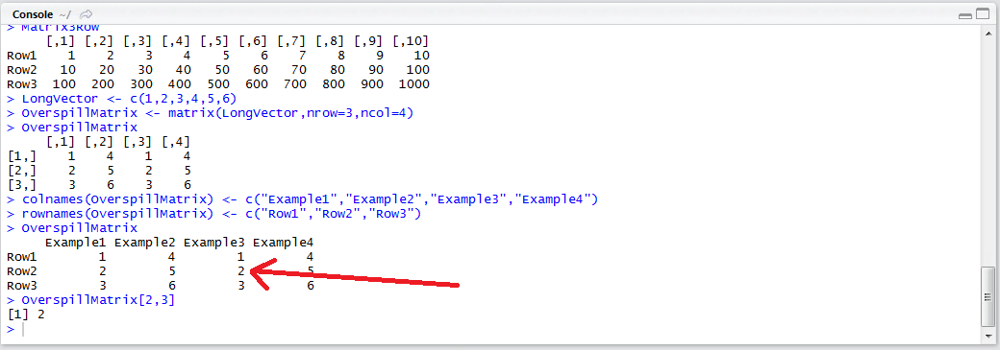

# Procedure 13: Selecting from a Matrix

As a matrix is made up of vectors, it is logical to expect it to bear some resemblance in the way selection from a matrix takes place.   All subscripting types that are described in procedures 24 and 25, are available except for a separate dimension is specified inside the [] square brackets, as separate arguments.  The first argument inside the square brackets relates to the row, the next the column. 

To obtain the value in a given position of a matrix, in this case two down, three across, type:

``` r
OverspillMatrix[2,3]
```



Run the line of script to console:



It can be seen that the value 2 has been returned which corresponds to the position specified:

