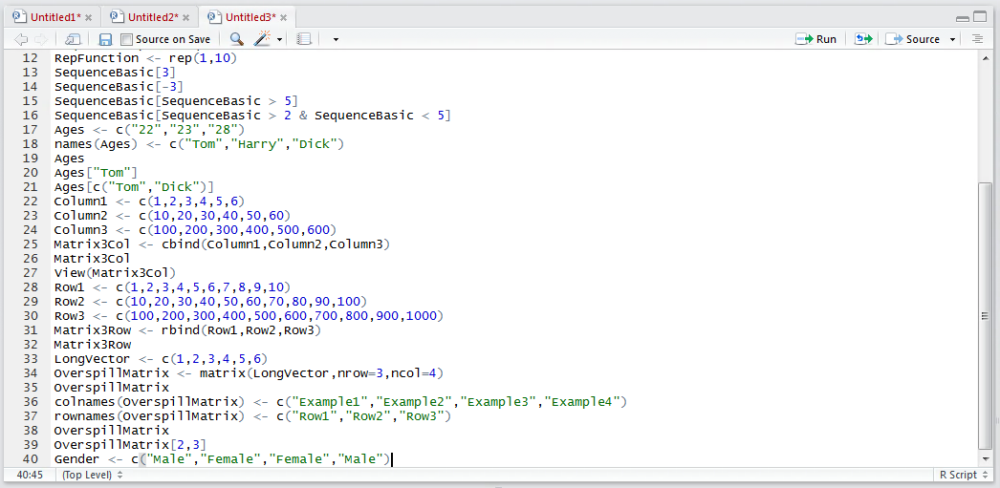
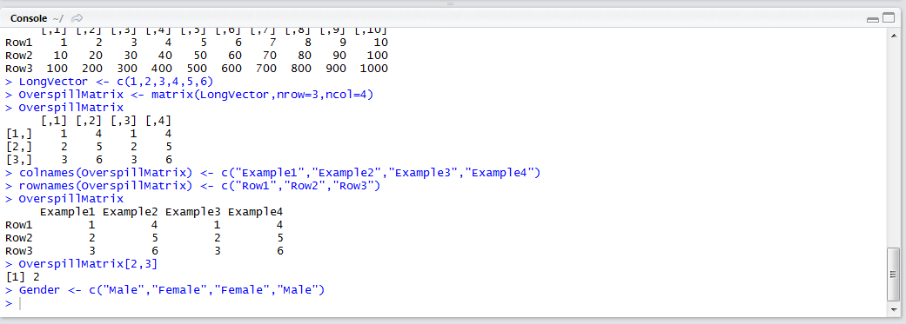
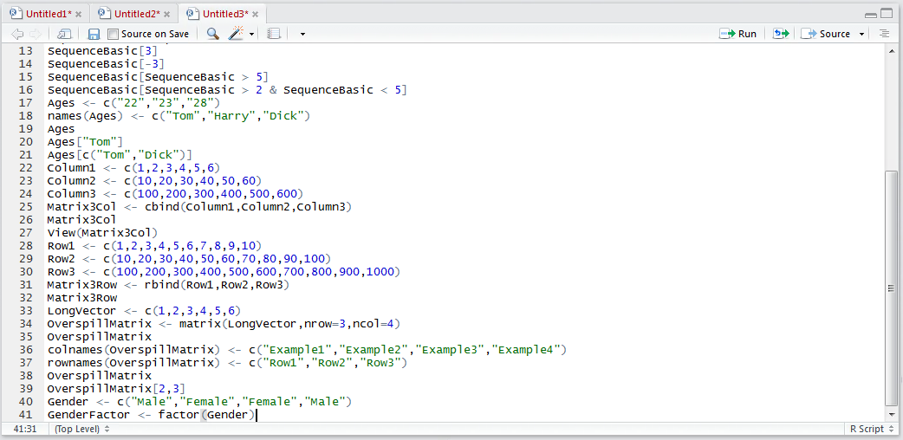
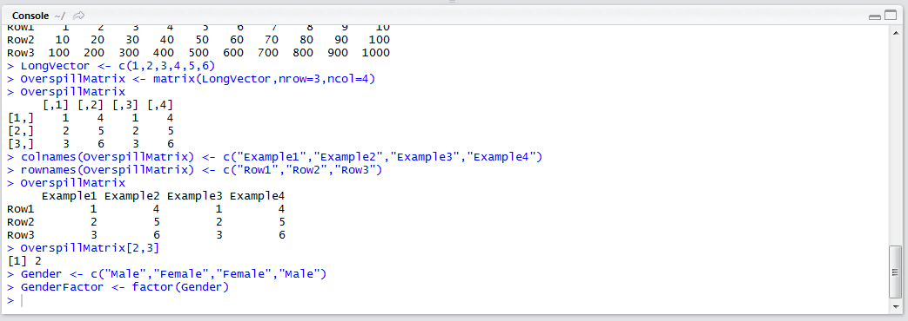
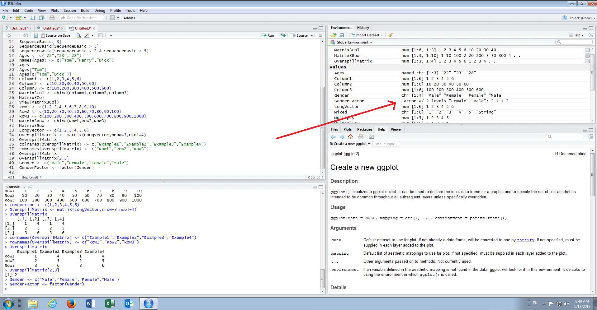
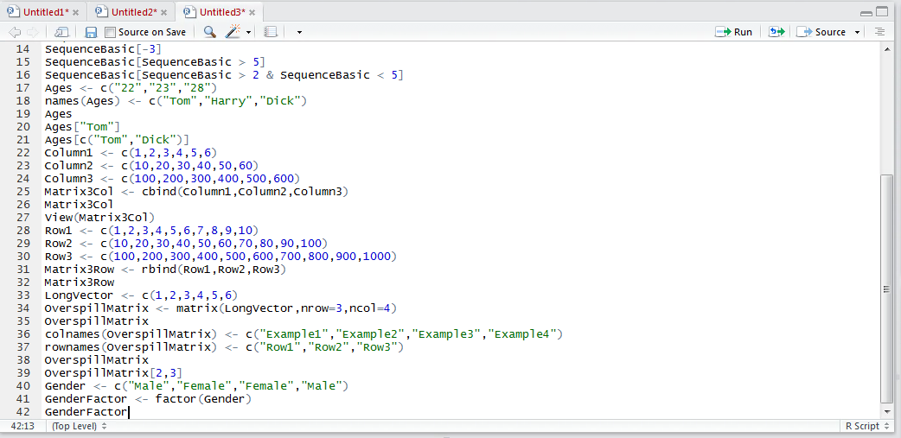
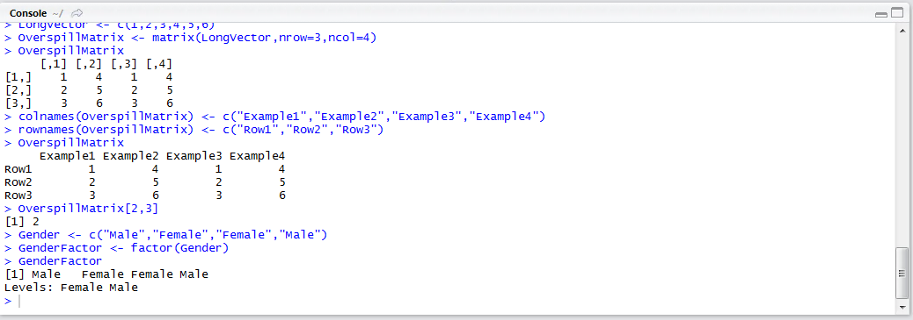

# Procedure 14: Creating a Factor from a Vector

The factor() function turns a Vector containing character fields into a special structure for categorical variables.  Categorical variables are treated differently in data analysis as conceptually they are pivoted to columns in their own right.

Assume that a Vector of customer genders exists:

``` r
Gender <- c("Male","Female","Female","Male")
```



Run the line of script to console:



A standard vector has been created.  To transform this Vector into a Factor, simply pass the Gender Vector as an argument to the factor() function by typing:

``` r
GenderFactor <- factor(gender)
```



Run the line of script to console:



It can be observed that the Factor is now available in the environment pane:



To view the factor in the console type:

``` r
GenderFactor
```



Run the line of script to console:



Closer inspection shows that despite there being a vector of the strings Male and Female duplicated,  the Factor has correctly identified there to be two levels of Male and Female.  This procedure is an example of the levels being inferred.  Categorical data will not be treated natively in the predictive analytics tools as follows.