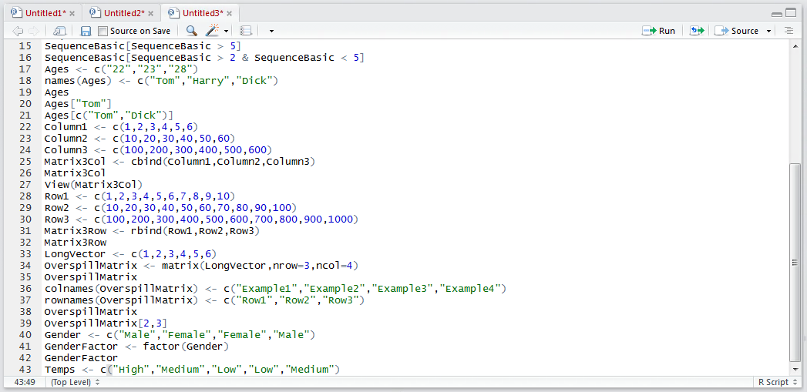
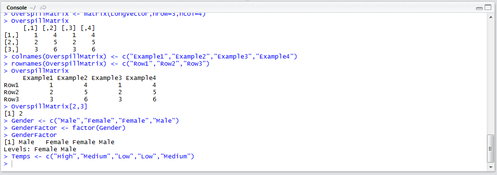
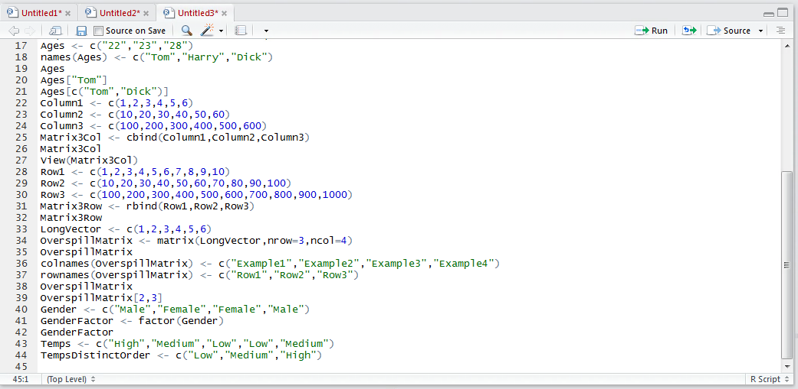
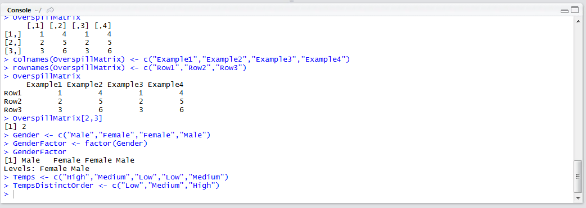
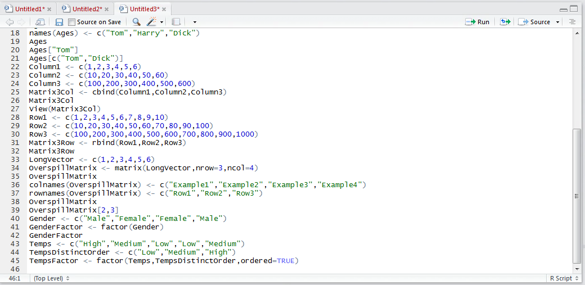
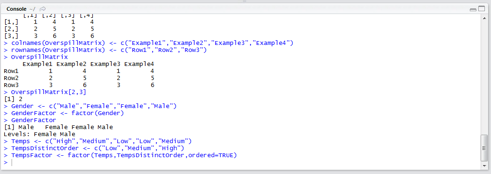
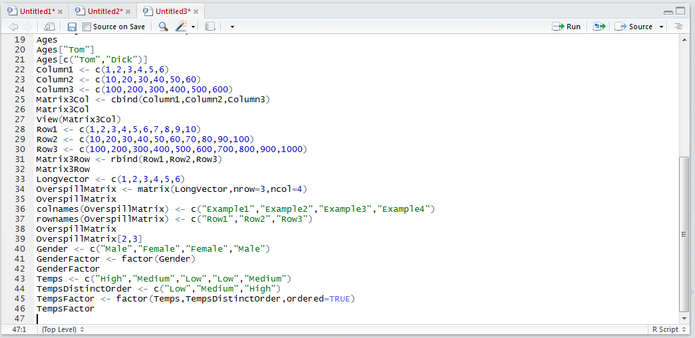
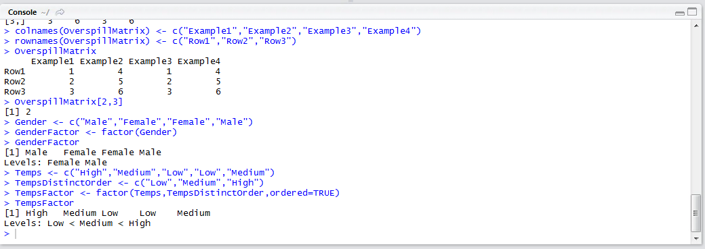
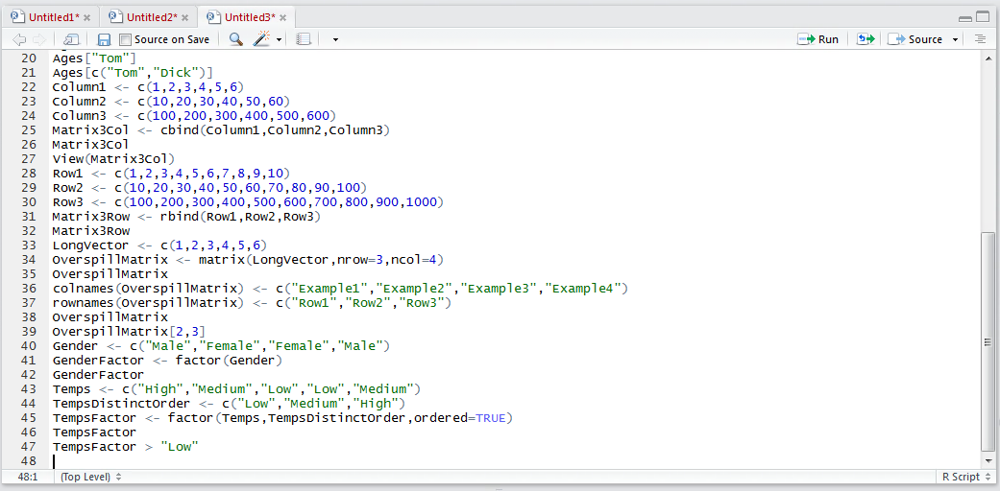
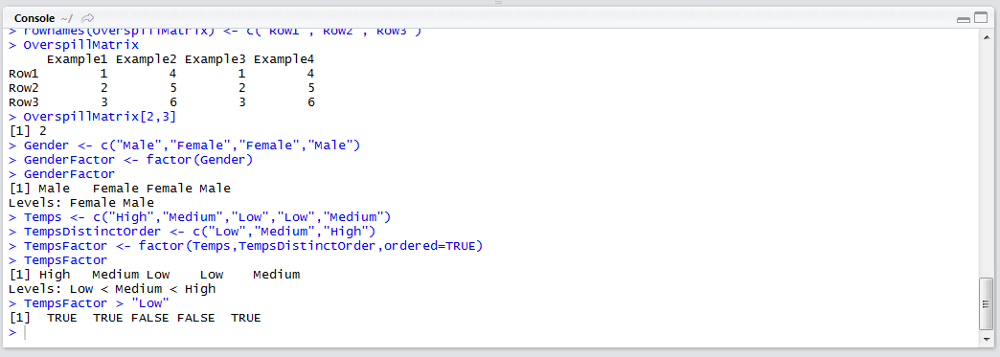

# Procedure 15: Creating a Factor from a Vector with Levels and Ordering

Some categorical data does also have a precedence whereby each of the categorical variables is somehow elevated from the previous one, while not necessarily being distributed in a statistical fashion.  A good example would be temperature.  Start by creating a Vector called Temps:

``` r
Temps <- c("High","Medium","Low","Low","Medium")
```



Run the line of script to console:



Create a similar Vector, this time with the distinct values in the order of precedence:

``` r
TempsDistinctOrder <- c("Low","Medium","High")
```



Run the line of script to console:



Create the factor by bringing the two newly created Vectors together and specifying that ordering is to be observed:

``` r
TempsFactor <- factor(Temps,TempsDistinctOrder,ordered=TRUE)
```



Run the line of script to console:



Write the Factor to console by typing:

``` r
TempsFactor
```



Run the line of script to console:



It can be seen that the Factor levels now have < chevrons which denote the precedence.  Low is less than Medium,  Medium is less than High.  Rather usefully it is possible to use a logical test condition to perform a logical test for only those values in the factor that exceed a given level,  for example type:

``` r
TempsFactor > "Low"
```



Run the line of script to console:



It can be seen that a Vector of logical operators has been returned that could further be used for selecting and subsetting.