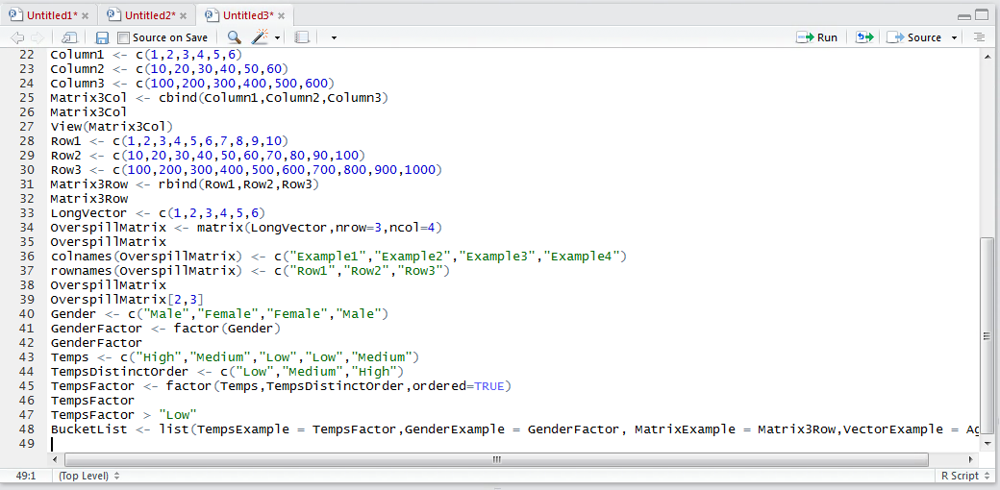
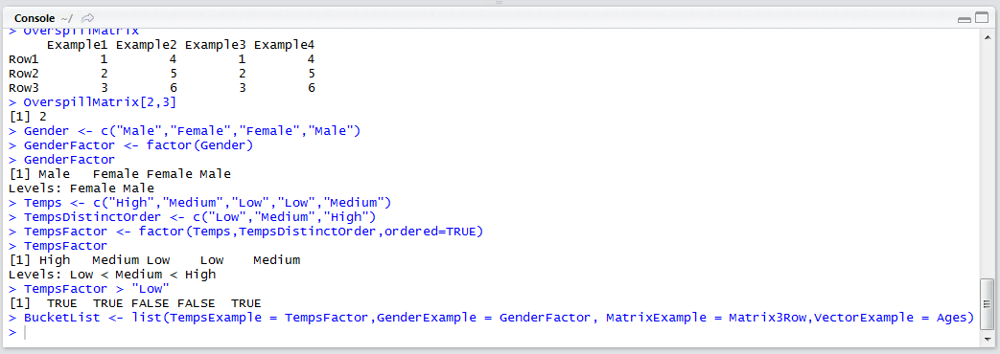
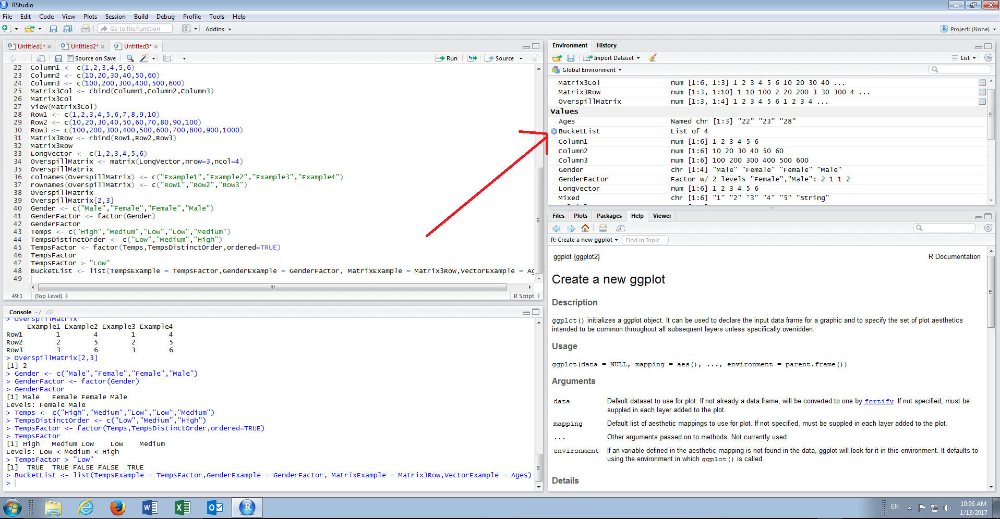
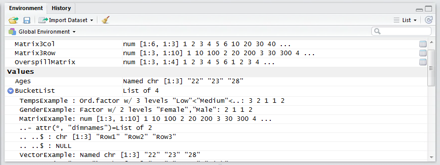
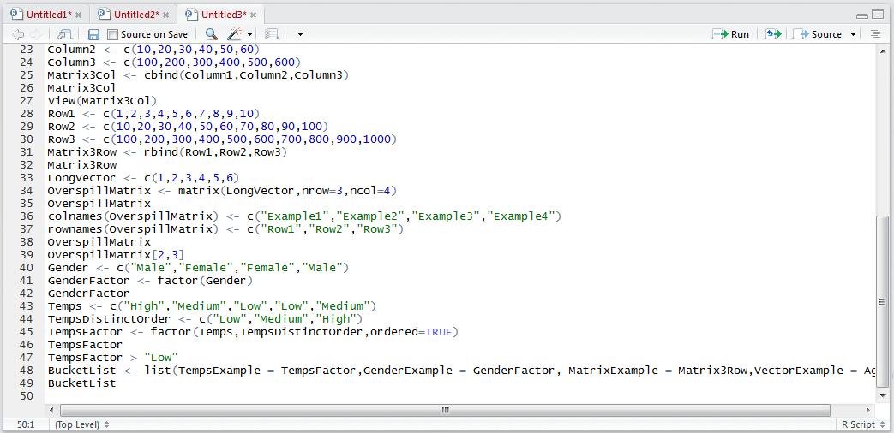

# Procedure 16: Creating a list with a variety of objects

A list is very similar to a Vector except it allows the storage of more than one type of object,  whereas a Vector must be the same type.  In the procedures preceding, many objects have been created.  A list can bring these objects together despite them being of radically different types.

The list() function, used to create lists, is very similar to that of the c() function except it has a broader ability to specify object names at creation.   To create a list aggregating some objects created in the preceding procedures:

``` r
BucketList <- list(TempsExample = TempsFactors,GenderExample = GenderFactors,MatrixExample = Matrix3Row,VectorExample = Ages)
```



Run the line of script to console:



It can be seen that the list is now available in the environment pane:



Specifically it is possible,  by clicking on the play icon,  to expand the list and inspect the objects inside the list in turn:



To write out the entire contents of the list to the console type:

``` r
BucketList
```



Run the line of script to console. It can be seen that each item of the list and its contents have been written out in turn.