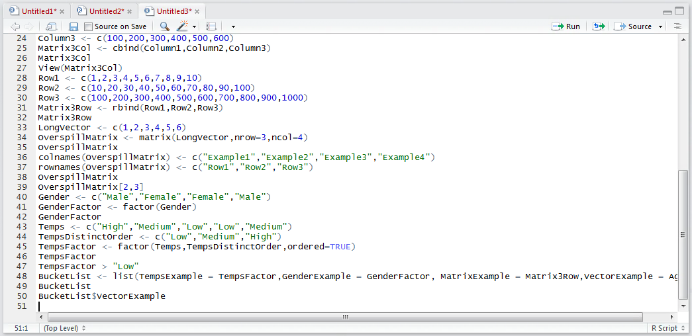
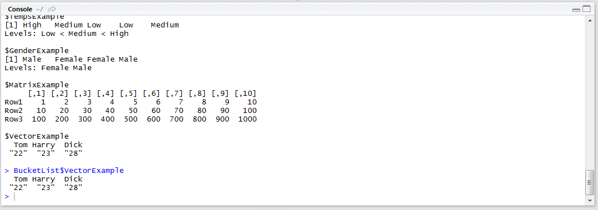
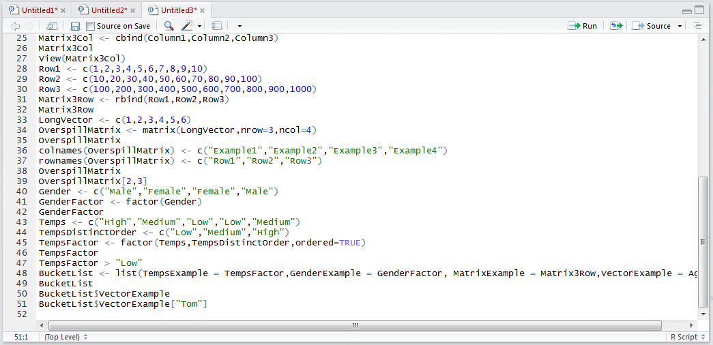
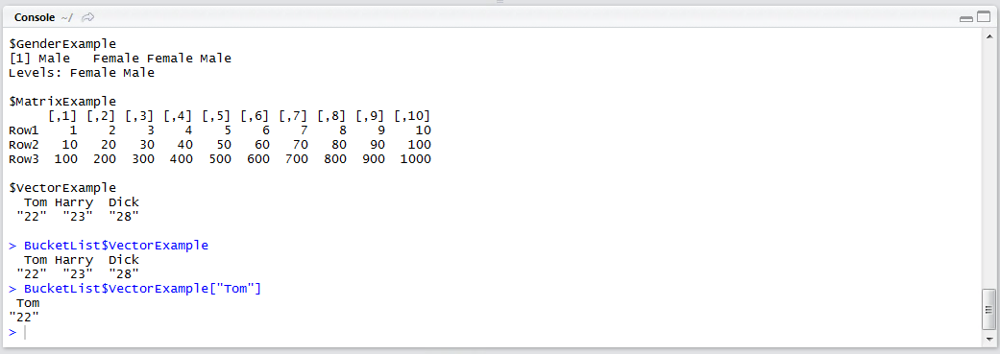

# Procedure 17: Subsetting and referencing objects with a name

The most useful and common way to navigate a list is by referencing the entry in the list  by name then subsetting the object therafter.  The approach of referencing list objects by name,  then subsetting therafter can serve to make a distinction between a list and a vector in day to day use.

The list created in procedure 34 has several objects with the names TempsExample, GenderExample,MatrixExample and VectorExample.  Start by returning a vector object by name:

``` r
BucketList$VectorExample
```



Run the line of script to console:



It can be seen that the object stored under the name "VectorExample" is a labeled Vector.  As this is a Vector,  it is possible to further subset this using techniques outlined in procedure 25.  For example,  to return Tom’s age from the Vector,  type:

``` r
BucketList$VectorExample["Tom"]
```



Run the line of script to console:



It can be observed that the vector was drawn from the list by name, then subset as is customary for a vector.