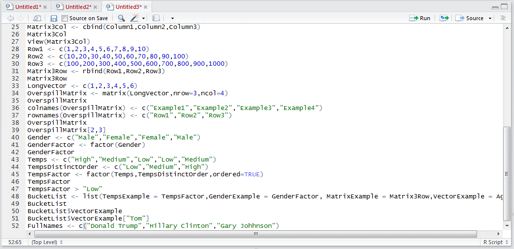
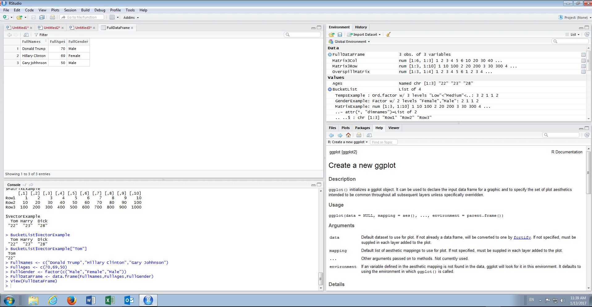

# Procedure 18: Create a Data Frame from Vectors

For the great majority of procedures that follow in this document the Data Frame is clearly demonstrated to be the most important and ubiquitous data structure.  In its core a Data Frame is a list albeit with certain constraints.  A data frame can only make use of Vectors and Factors and furthermore these objects need to be of EXACTLY the same length.  

It can be helpful to thing of a Data Frame a being a hybrid of a Matrix and a List,  with a great deal more usability than a Matrix. It is worth remembering that owing to the presence of Factors and Vectors, this is to say different object types,  a matrix could not be used in all practicality.

To create a data frame of customers,  start by creating a vector of full names:

``` r
FullNames <- c("Donald Trump","Hilary Clinton"," Gary Johnson")
```



Run the line of script to console:


Repeat for a Vector of FullAges:

``` r
FullAges <- c(70,69,50)
```


Run the line of script to console:


Repeat for a Factor of FullGender, noting that the result of the c() function is being passed as the argument to thee factor() function:

``` r
FullGender <- factor(c("Male","Female","Male"))
```


Run the line of script to console:


In a similar manner to both the c() function and the list() function,  the data.frame() function takes Vectors or Factors of the same length and combines them into a Data Frame.  As with the list() function it accepts a number of arguments in its advanced use,  however,  its most basic structure is the same as c().  To create a dataframe with default arguments type:

``` r
FullDataFrame <- data.frame(FullNames,FullAges,FullGender)
```


Run the line of script to console:


It can be observed that the data frame is now displayed in the environment pane under the data section and as such can be viewed in a similar manner to that set forth in procedure 27.


In this example a view is performed by a single click of the entry under the data section of the environment pane:



In a similar manner to a Matrix,  the Data Frame is expanded into the grid viewer section of RStudio as a table.