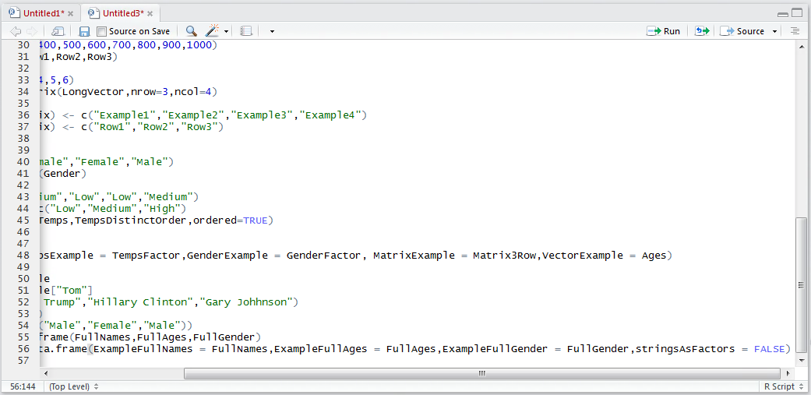
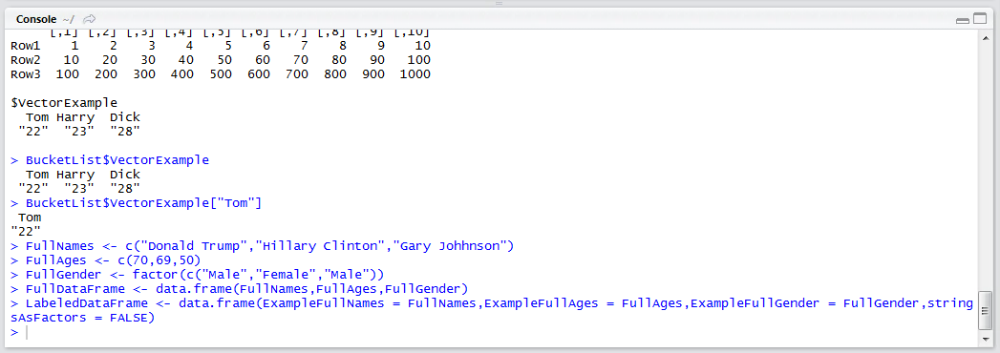
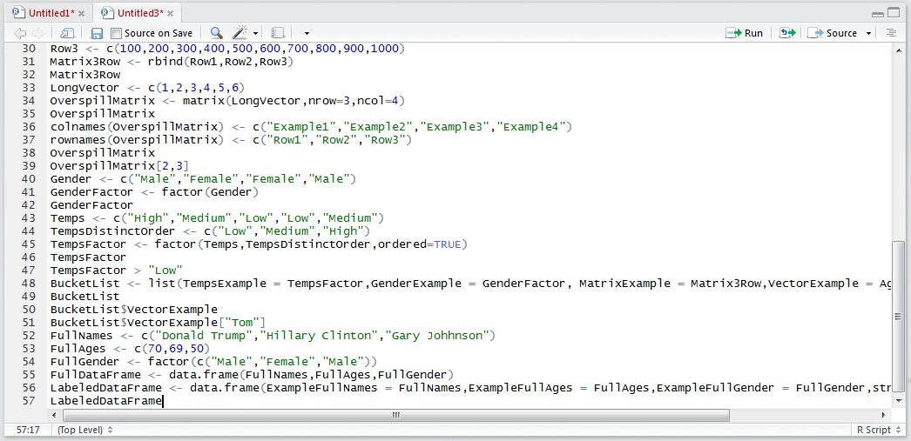
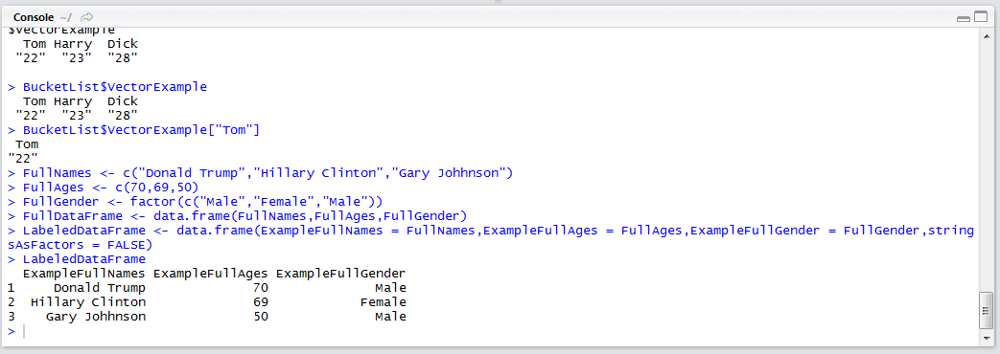

# Procedure 19: Create a Data Frame from Names and stringsAsFactors

As introduced previously the data.frame() function, not unlike the list() function, has more flexibility to be able to create objects than the c() function.   As seems intuitive it is possible to specify names explicit rather than take the names of the Vectors by default.  There is an argument to the data.frame() function that can easy the burden of creating factors upon detection of character vectors in the for of the stringsAsFactors switch (although it is not always sensible to use it in the case of numeric prediction focus).

To create a Data Frame with specific names and disabling stringsAsFactors:

``` r
LabeledDataFrame <- data.frame(data.frame(ExampleFullNames = FullNames,ExampleFullAges = FullAges,ExampleFullGender = FullGender,stringsAsFactors = FALSE))
```



Run the line of script to console:



Return the Data Frame by typing:



Run the line of script to console:



It can be observed that the column names have been correctly specified.  Unless a factor has been specifically allocated it can be trusted that other character Vectors,  such as FullName in this example, will not be transposed to factors automatically.