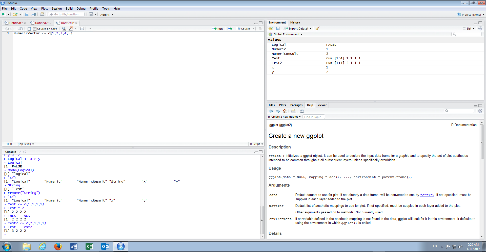
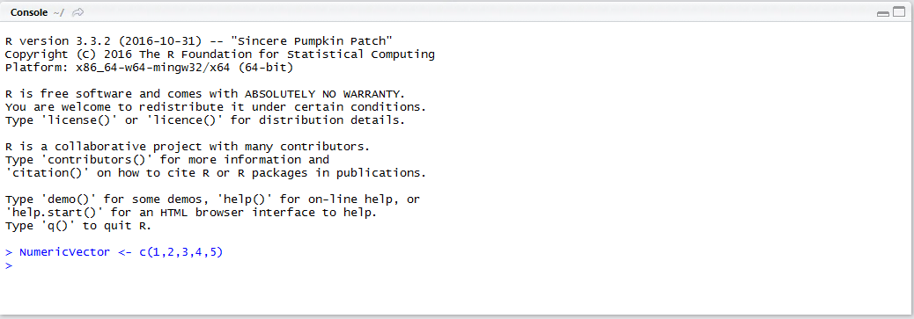
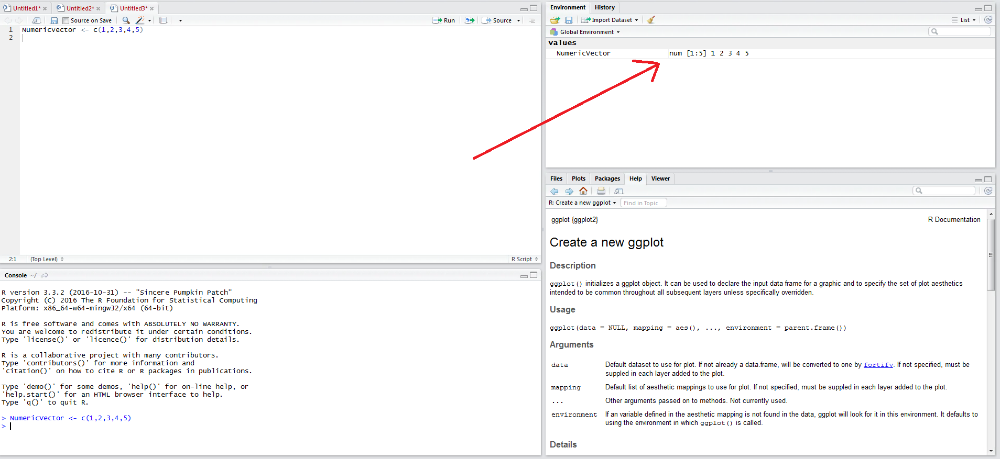
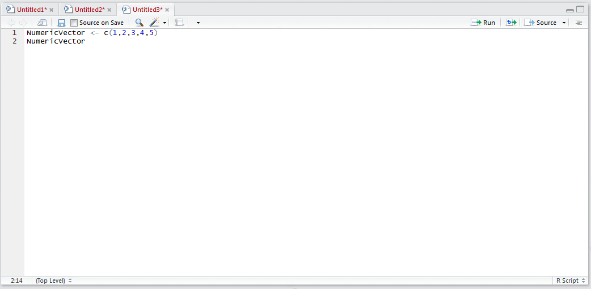
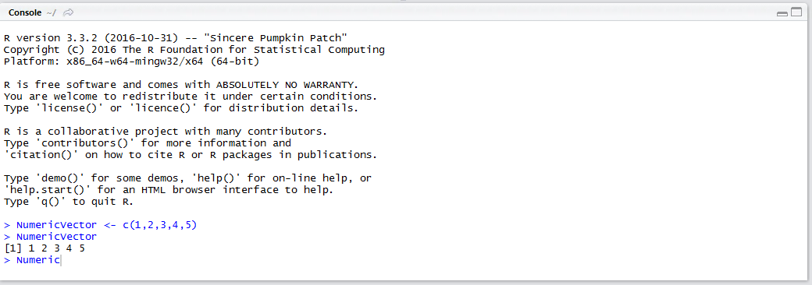
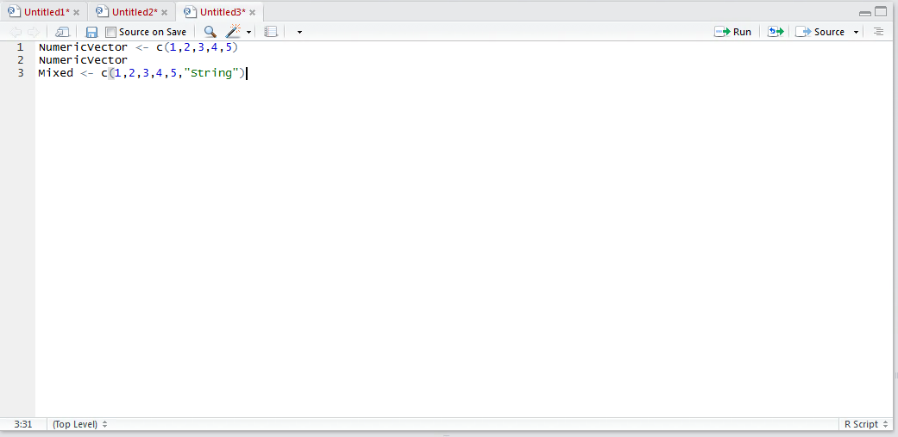
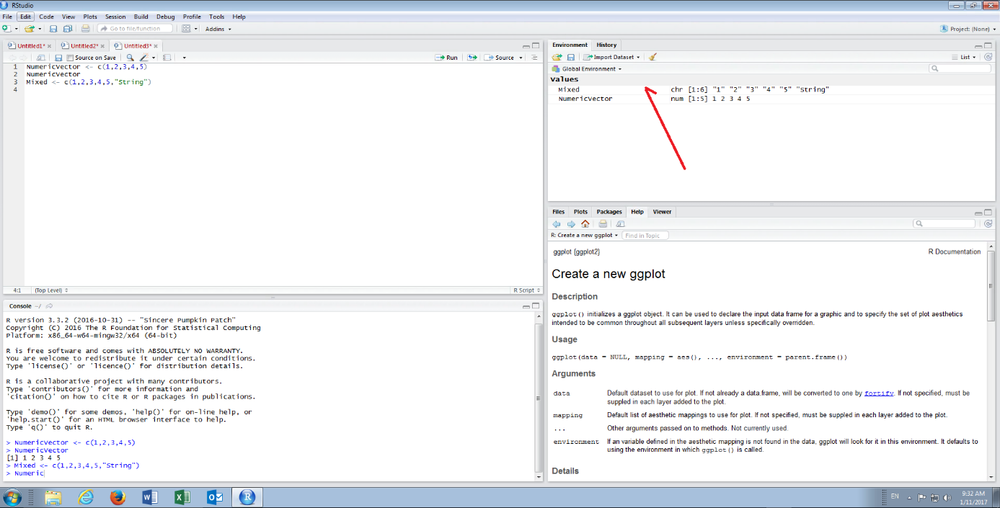
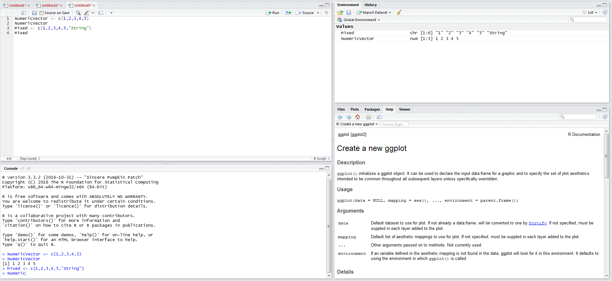
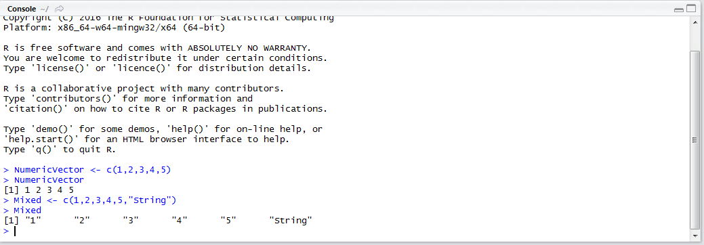

# Procedure 1: Create a Vector with c Function
The c function is used to combine variables into a vector.  To create a numeric Vector,  start by typing:

``` r
NumericVector <- c(1,2,3,4,5)
```



Run the line of script to console:



The vector appears in the environment pane,  showing the dimensions of [1,5],  which would suggest 1 row,  five columns:



The vector can be referenced in the console, as with all other variables, by typing:

``` r
NumericVector
```



Run the line of script to the console:



To observe how R handles vectors, comprised of separate types (in so far as it CANT handle it), start by typing:



Run the script to console:



It can be seen that the vector has been created and is displayed in the environment pane, however, it is being created as a character vector owing to the presence of character argument which cannot be coerced to a numeric value and as such the entire vector becomes a character vector.  To validate this in the console, type:

``` r
Mixed
```



Run the line of script to console:



It can be validated that the vector has been created as a string, based on the premise of the double quotations around all of the entries.