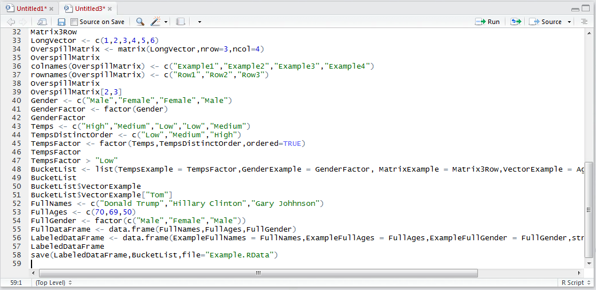
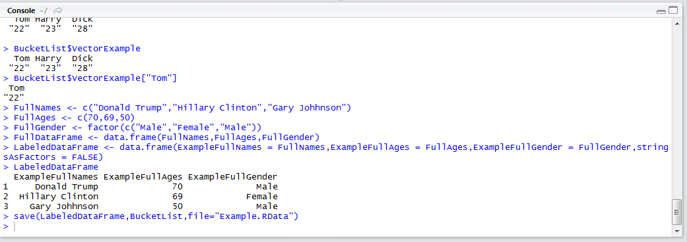
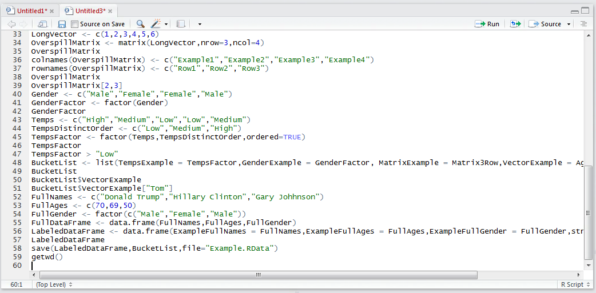
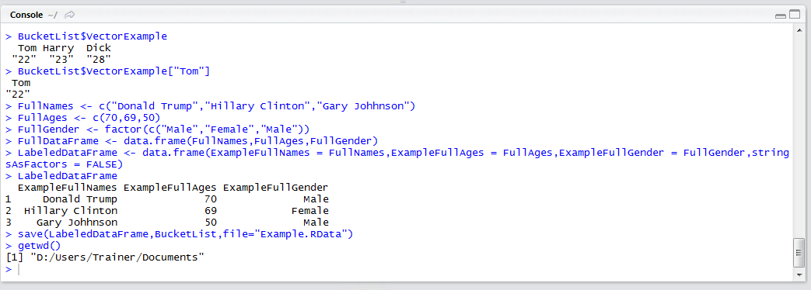
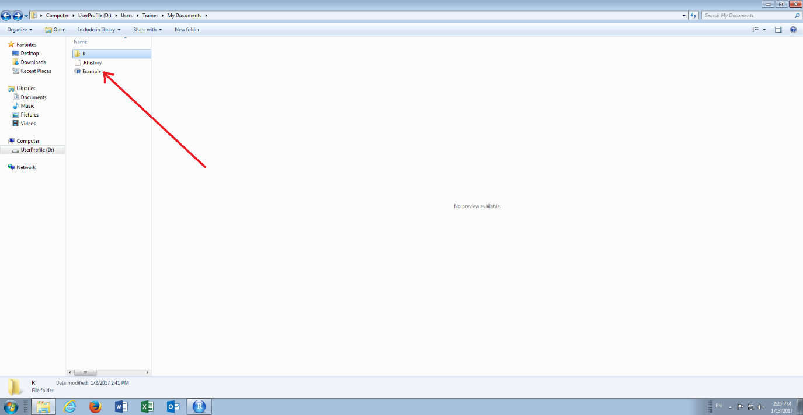

# Procedure 20: Saving .Rdata to file

Machine learning is predominantly a challenge of data abstraction – this is the shaping and moulding of data – and presenting it to advanced machine learning algorithms on a commodity basis.  It follows that upon having spent time and effort creating an elaborate Data Frame,  it likely that it will need to be saved for future use (if only to avoid the computational expense of recreating it).

The save() function exists for the purpose of saving most objects that can be created and populated with data to a file in the working directory.  It is a very important part to deploying models on a real-time basis.

To save the Data Frame LabeledDataFrame and BucketList to a specified file by the name of "Example.RData":

``` r
save(LabeledDataFrame,BucketList,file = "Example.RData")
```



Run the line of script to console:



A file titled Example.RData is not written out to the Working Directory.  To remind the working directory:

``` r
getwd()
```



Run the line of script to console:



Having identified the working directory, navigate to the same in windows explorer:



The saved file is clearly visible in this directory ready for real-time deployment or being reloaded to an R session.