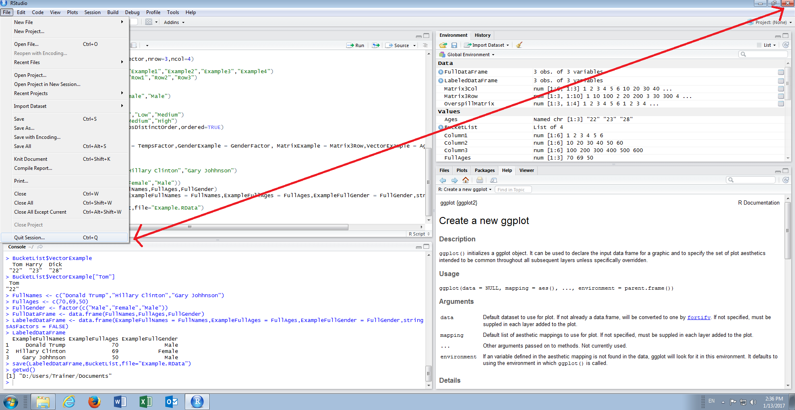
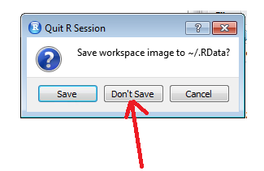
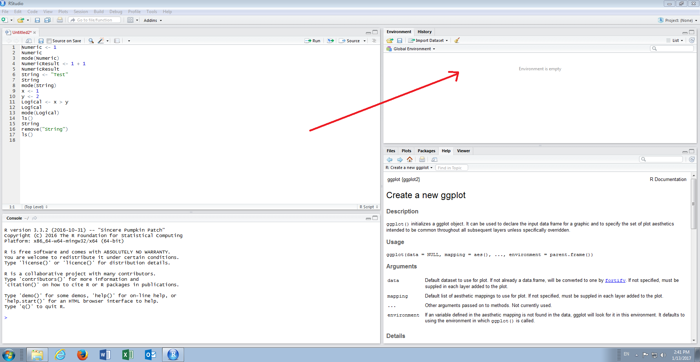
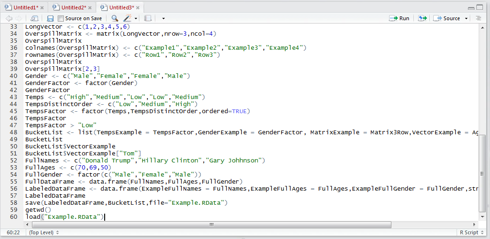
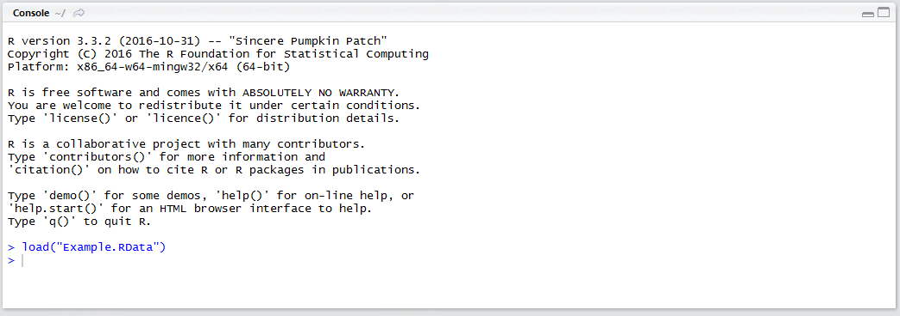
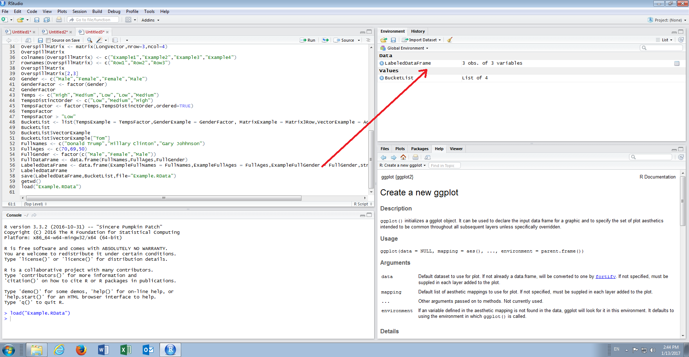

# Procedure 21: Loading .Rdata from file

To fully demonstrate the process of loading objects from an RData file fully close down RStudio by clicking File,  then upon the menu expanding,  clicking Quit Session or by clicking on the close button in the top right hand corner:



As expected,  similarly to procedure 38, confirmation will be sought about the treatment of the current session.  Elect not to save the session by clicking "Don’t Save":



Upon termination of RStudio,  simply reload as specified in procedure 5:



It can be seen that there are no objects loaded.  Assuming the working directory is unchanged, to load the objects saved in procedure 38, simply type:

``` r
load("Example.RData")
```



Run the line of script to console:



The objects saved previously are promptly loaded and available in the environment pane of RStudio and by implication available for recall in scripts and \ or the console.



As R has several programmatic implementations,  such as R.net which is used for real-time invocation,  the saving and loading of R sessions provides a useful means to be able to deploy objects.