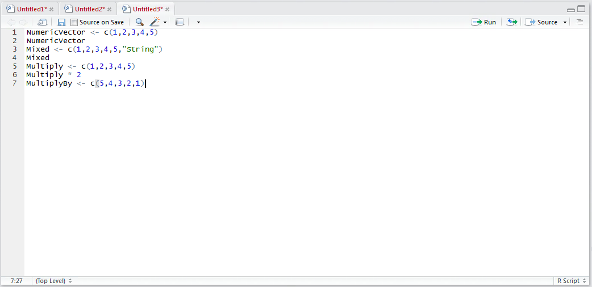

# Procedure 2: Perform Vector Arithmetic

A variety of arithmetic operators can be used against vectors such as:

* + Addition
* - Subtraction
* * Multiplication
* / Division
* ^ Power
* %% mod

In this example, a numeric Vector will be multiplied by 2.  Start by creating a Vector, type:

``` r
Multiply <- c(1,2,3,4,5)
```


Run the line of script to console:


In this example, multiply the vector by 2.   Type:

``` r
Multiply * 2
```


Run the line of script to console to write out the new vector:


It can be observed that each position in the vector has been multiplied by the value of 2.  It is also possible to multiple by another vector.  Create another vector by typing:

``` r
MultiplyBy <- c(5,4,3,2,1)
```



Then multiply the existing vector Multiply by the new vector MultiplyBy by typing:

``` r
Multiply * MultiplyBy
```


Run the line of script to console:


It can be observed that for each position in the vector, the value in that position has been multiplied by the same position in the other vector.  Think of this as the equivalent of filling down in an Excel spreadsheet.