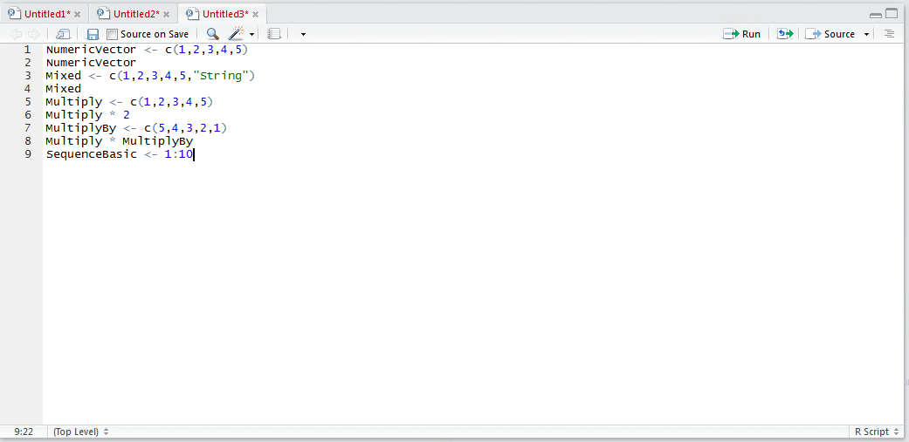
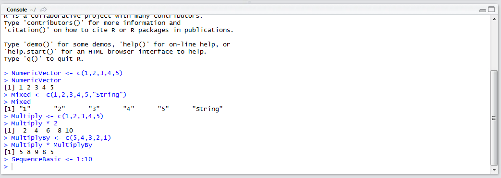
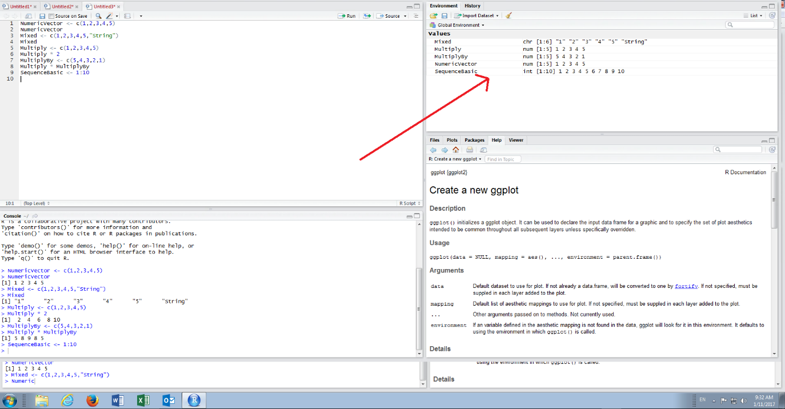
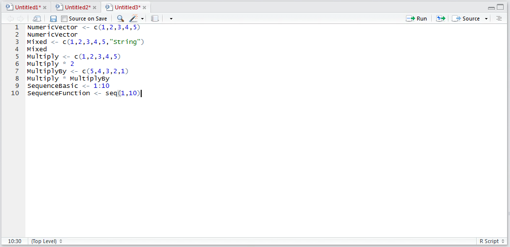
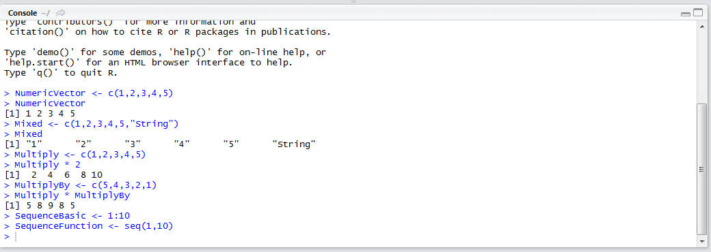
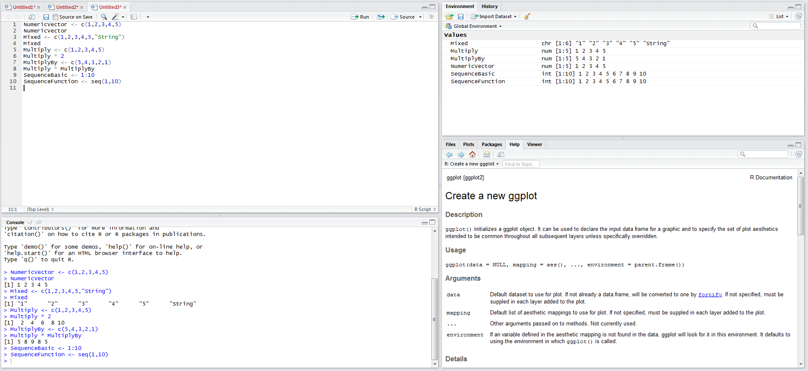
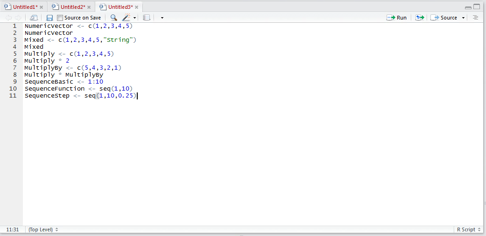
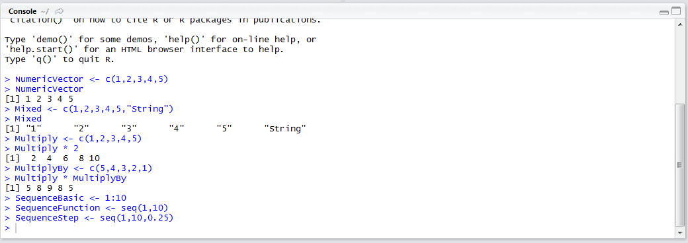
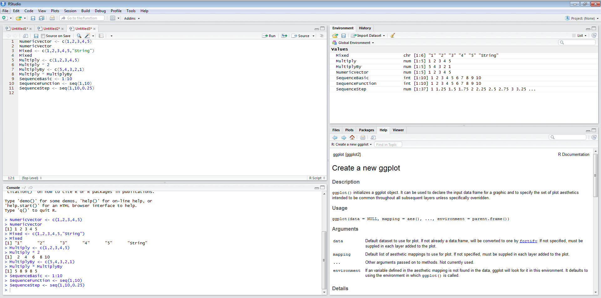

# Procedure 3: Create Vector via a Sequence

There are two main ways to create vectors in a sequence of number in R, the first is using the semicolon in assignment, the second is using a function that archives much the same while offering more flexibility.  The purpose of this procedure is to introduce some of the more sophisticated elements of the R language, however, for the purposes of predictive analytics it is not absolutely necessary to delve into such depth to achieve the end result of reliable predictive analytics.

To create a vector which is a sequence of numbers from 1 to 10, type:

``` r
SequenceBasic <- 1:10
```



Run the line of script to console:



It can be seen from the environment pane that the vector has been created and that the values span from 1 to 10 in increments of 1:



Introducing functions, the same using the seq() function can be achieved by typing:

``` r
SequenceFunction <- seq(1,10)
```



Run the line of script to console:



It can be observed that SequenceBasic and SequenceFunction take the same form in the environment pane:



The benefits of using the seq() function is that it allows for sequences to be created with different steps sizes,  where the default is 1.  To create a step of 0.25, type:

``` r
SequenceStep <= seq(1,10,0.25)
```



Run the line of script to console:



It can be seen that a much larger vector has been created by inspecting the environment pane, where the values increase by 0.25 increments:



The seq() function provides a lot of other options for the creation of sequences such as repetition which would be outside the scope of this procedure.  The seq() function has been introduced as a means to demonstrate assignment by function return values.