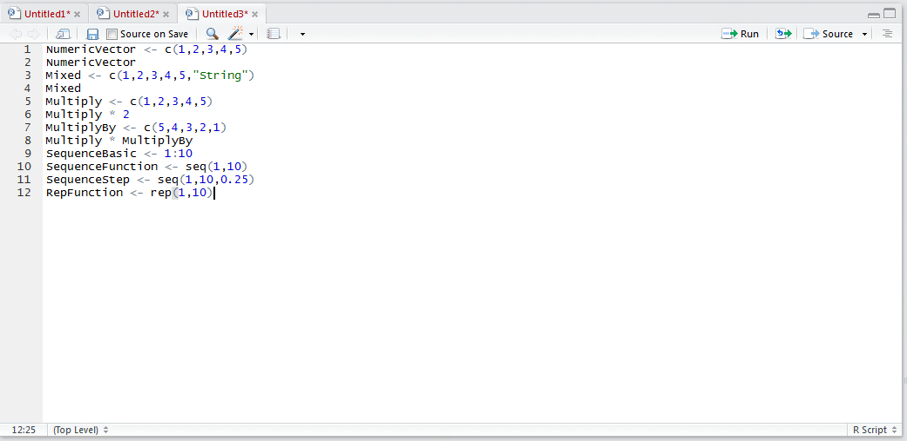
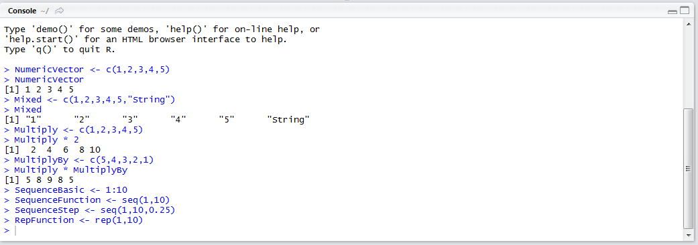
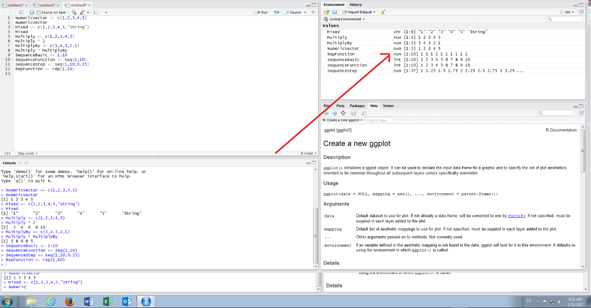

# Procedure 4: Create a Vector via Repetition
Hitherto repetition of values in a vector has been achieved by typing out the vector using the c() function (i.e c(1,1,1,1,1,1,)).  The rep() function can achieve this quite simply, by taking the value and then an argument specifying the number of times this is to be repeated:

``` r
RepFunction <- rep(1,10)
```



Run the line of script to console:



It can be observed in the environment pane that a vector has been created, repeating the value 1, 10 times:



As with the seq() function,  the rep() function provides many more options which are outside the scope of this procedure.

The rep() function is used most commonly in these procedures for the purposes of creating dummy variables in Data Frames,  where it may be called upon to add a vector to a Data Frame yet it is imperative to create the vector manually via the c function owing to the possibility that there is many thousands of entries.