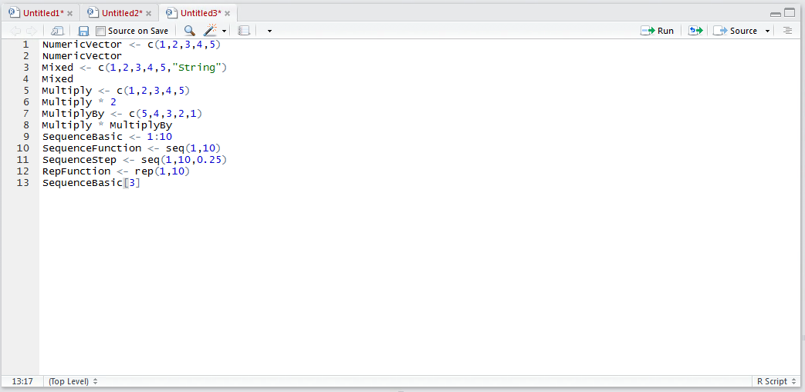
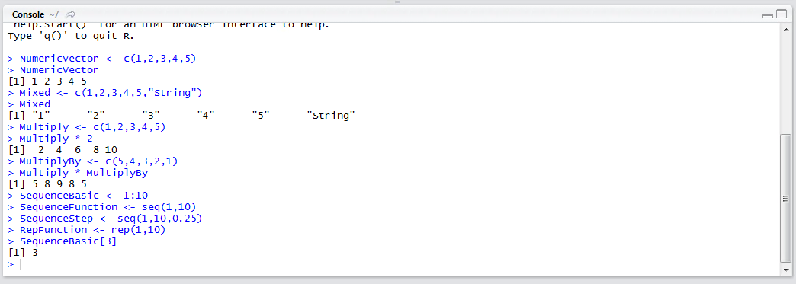
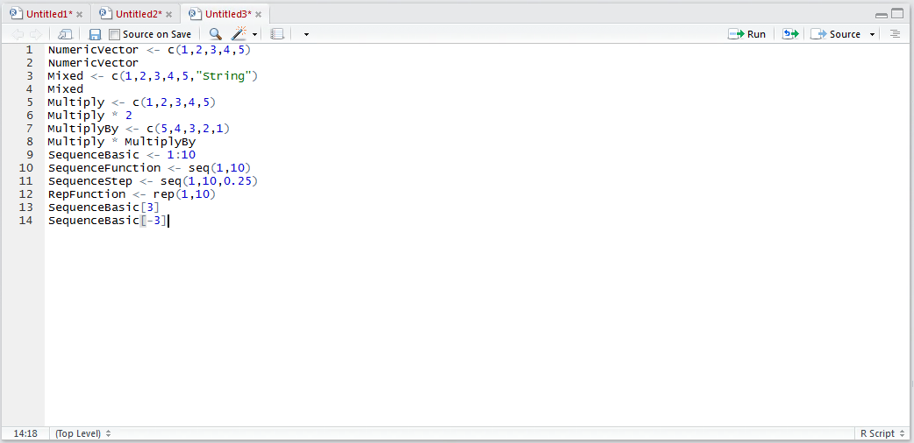
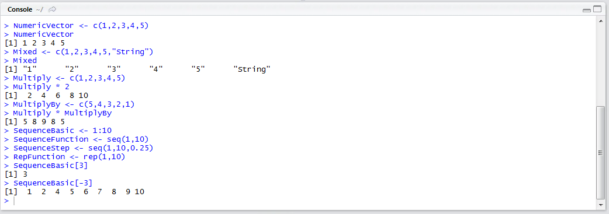
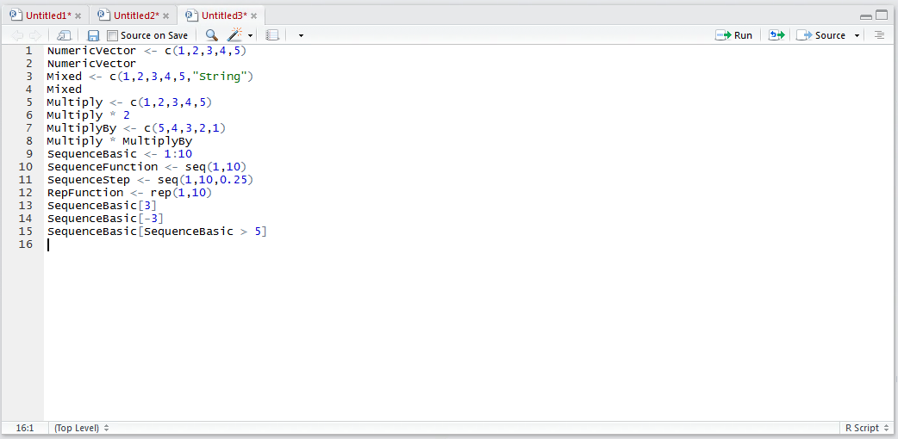
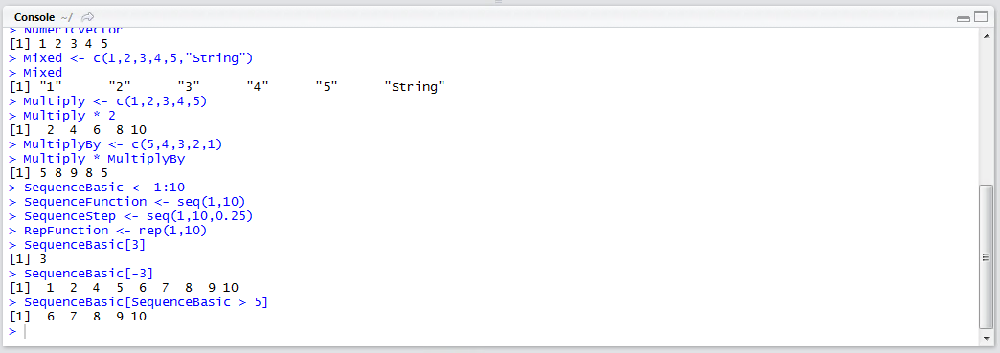
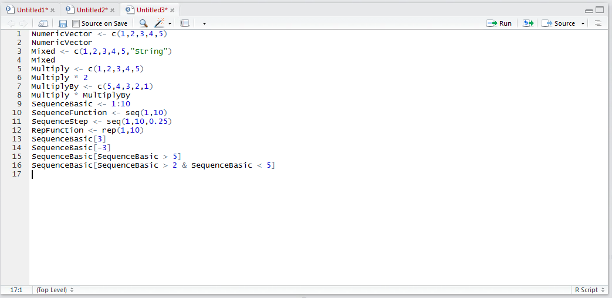
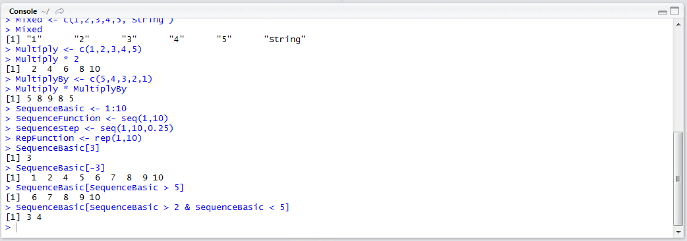

# Procedure 5: Selecting and Filtering from a numeric Vector.

There are a number of ways to specifically extract data from a vector, a process sometimes called subscripting.  In this procedure, the vector created in procedure 21 will be used.  The simplest way to extract data from a vector is to specify the position inside square brackets.  To subscript and retrieve the third value in the vector type:

``` r
SequenceBasic[3]
```



Run the line of script to console:



It can be observed that the value at the third position in the SequenceBasic vector has been returned.  Alternatively, specifying a negative value of 3 would return everything except the third position:



Run the line of script to console:



It can be observed that the third position of the vector has been excluded in the output.

Far more powerful is the ability to select from vectors based upon a logical statement, such as all values > 5:

``` r
SequenceBasic[SequenceBasic > 5]
```



Run the line of script to console:



It can be seen that only values greater than five have been returned.  The notion of selecting from a vector based on logical conditions further introduces operators:

* & And.
* | Or.
* ! Not.

To create more discriminating selection from a vector, where the value must be > 2 and less than 5, type:

``` r
SequenceBasic[SequenceBasic > 2 & SequenceBasic <5]
```



Run the line of script to the console:



It can be seen that only the two values between 2 and 5 have been returned.