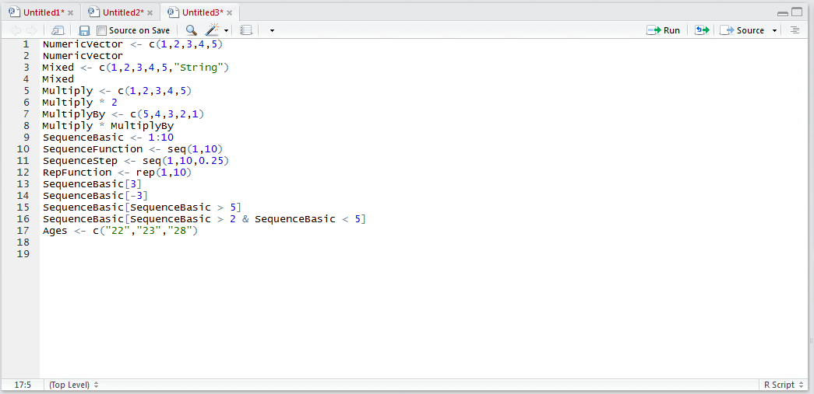
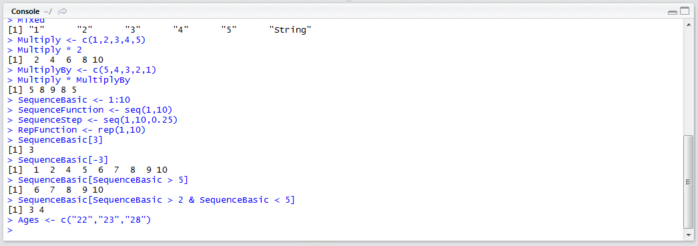
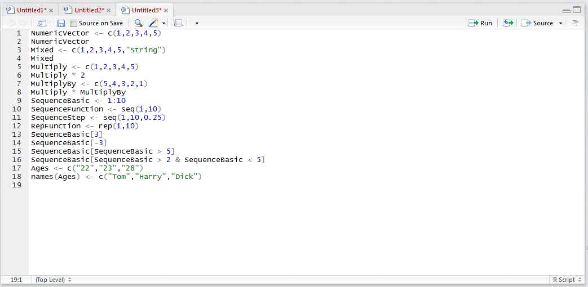
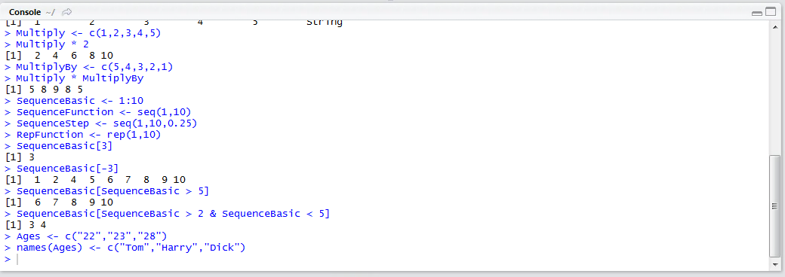
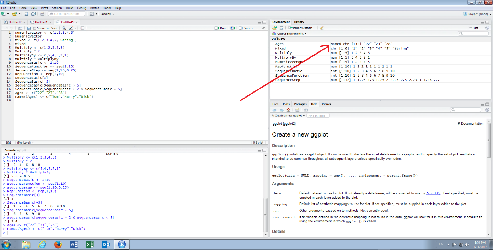
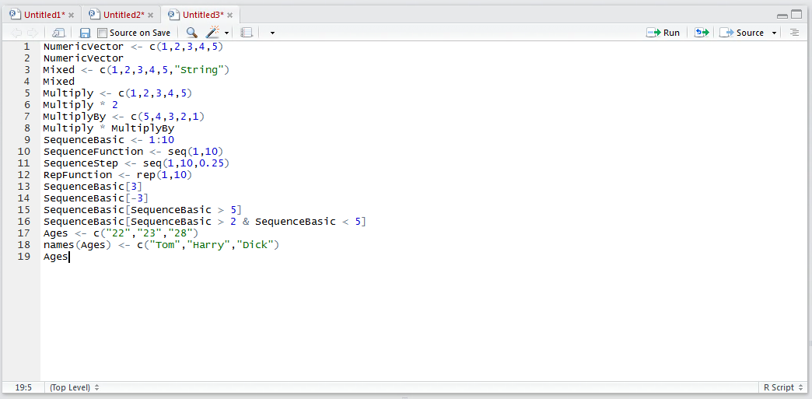
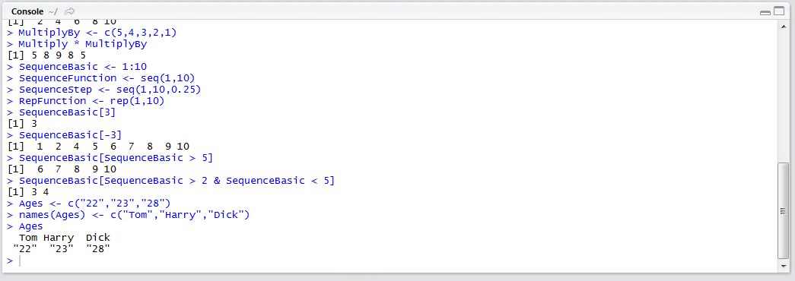

# Procedure 6: Setting Vector Labels or Names

Selecting from a character vector follows the same pattern,  in so far as the criteria sits inside [] square brackets and allows for the specific selection of values or the specific exclusion of values.  Create a character vector by typing numbers,  henceforth ages:

``` r
Ages <- c(22,23,28)
```



Run the line of script to console:



It is possible to add labels to the entries in the vector using the names() function, similar to column headers in an Excel spreadsheet.   The label 22 is Tom’s Age, 23 is Harries Age and lastly 28 is Dicks Age.  To add labels to each Vector value, type:

``` r
names(Ages) <- c("Tom","Harry","Dick")
```



Run the line of script to console:



It can be observed that the Vector in the environment pane is now marked as being a ‘Named’ vector:



Outputting the Vector to console, type:



Run the line of script to console:



It can be observed that the vector more closely resembles the row of a spreadsheet.  The names function will be used more extensively when aggregating Vectors into a Matrix, for the time being however, it will be used to allow for the selection of just that individuals Age.