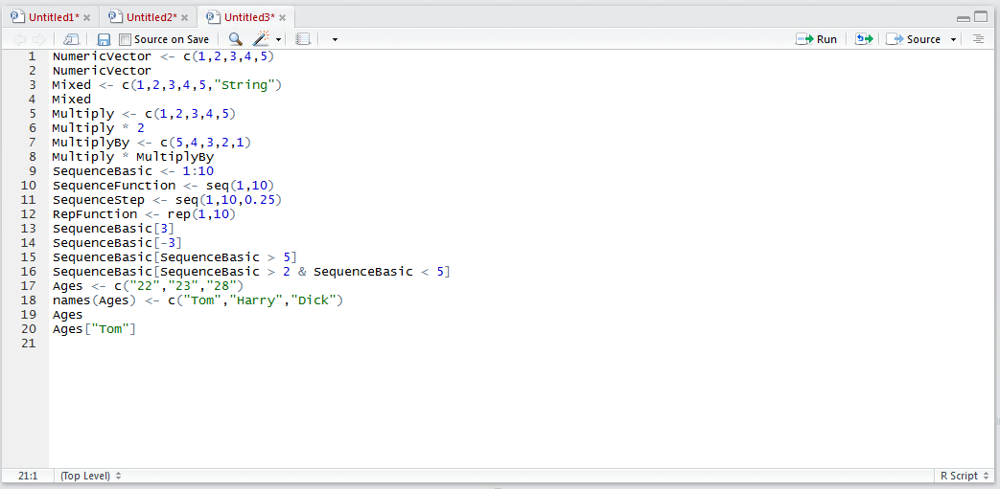
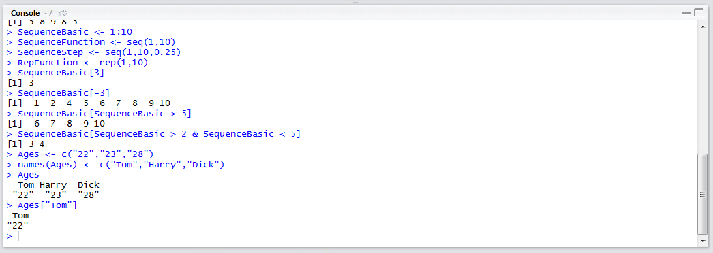
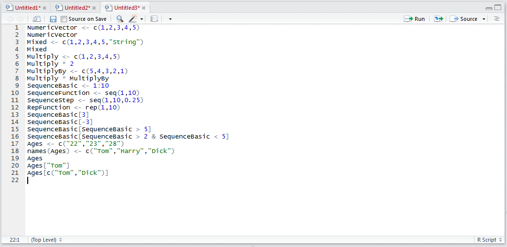
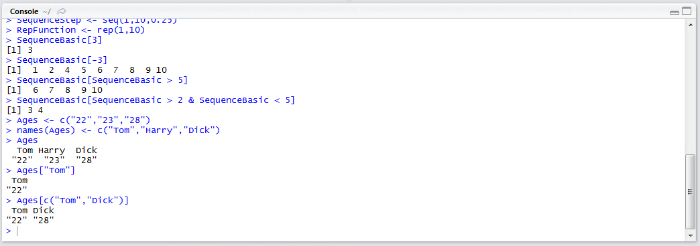

# Procedure 7: Selecting and Filtering from a Character Vector

Once a Vector has been named,  attaching a label to each value,  it can be selected using the [] square bracket structure.  In this example,  the age for Tom needs to be extracted by typing:

``` r
Ages["Tom"]
```



Run the line of script to console:



Tom’s age is returned as 22, rather the value in the Vector carrying the label "Tom" is returned as 22.  

To select more than one label, it is a matter of creating a Vector with the criteria then passing that Vector inside the [] square brackets.  In this example, selecting Tom and Dick:

``` r
Ages[c("Tom","Dick")]
```



Run the line of script to console:

