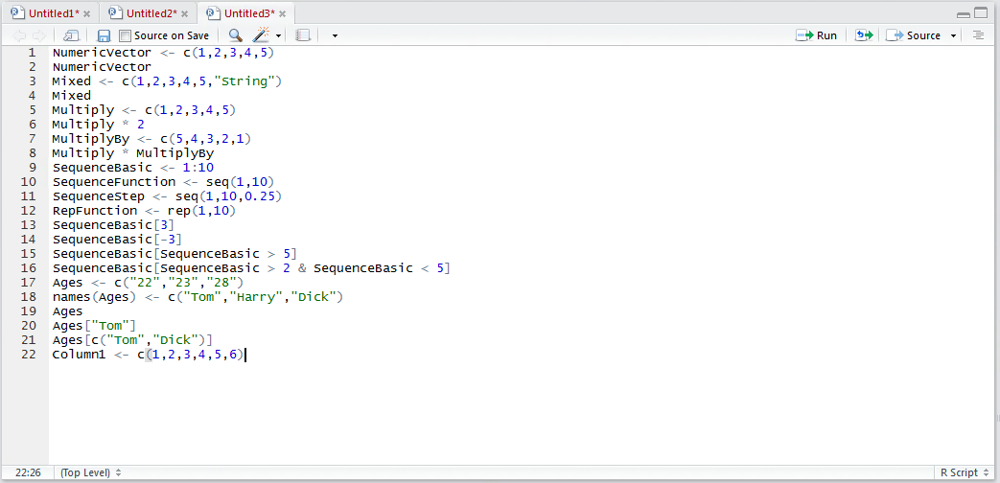
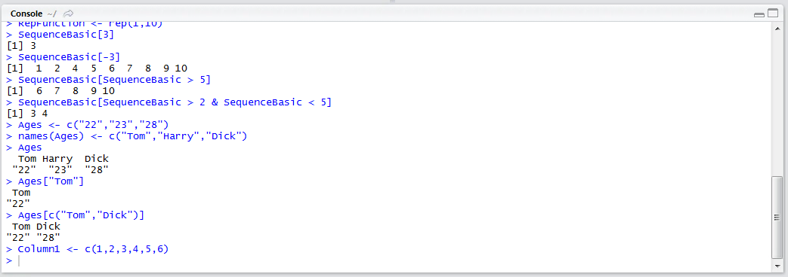
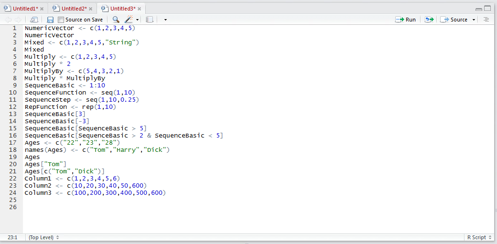
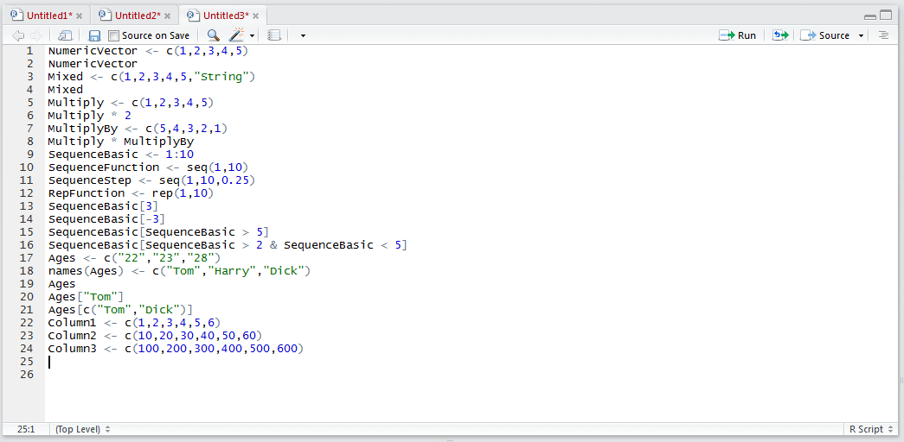
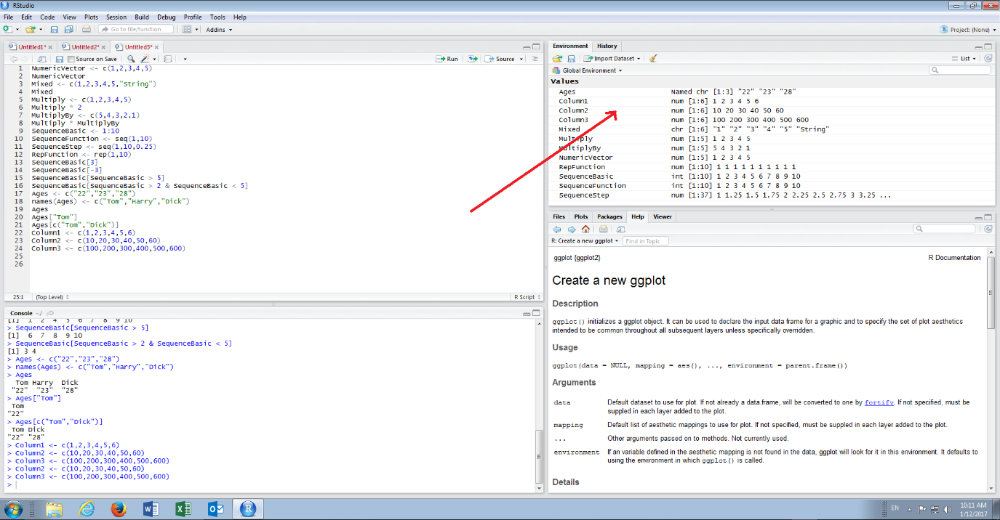
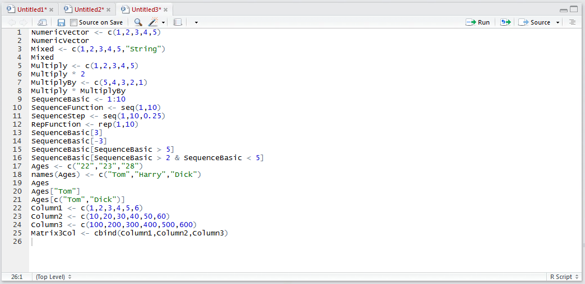
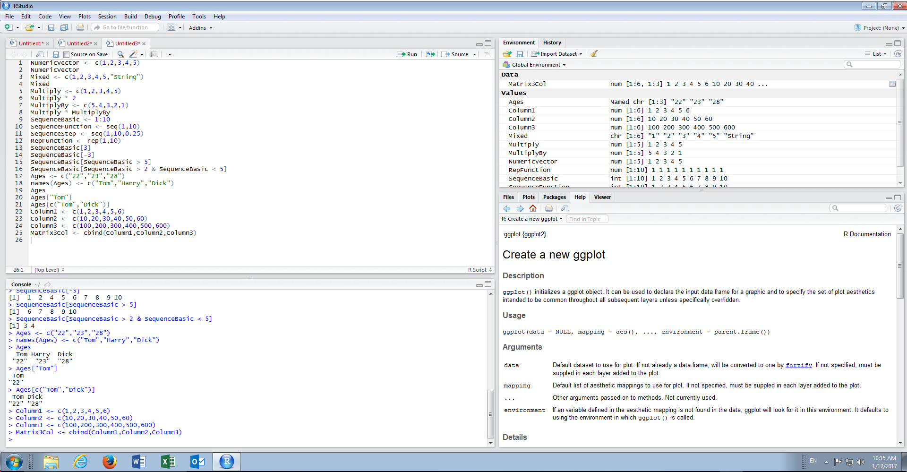
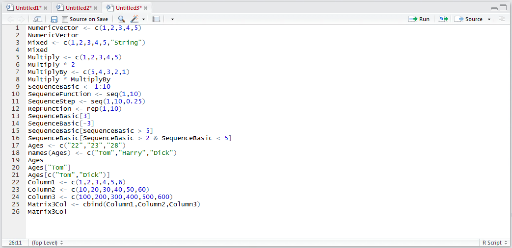
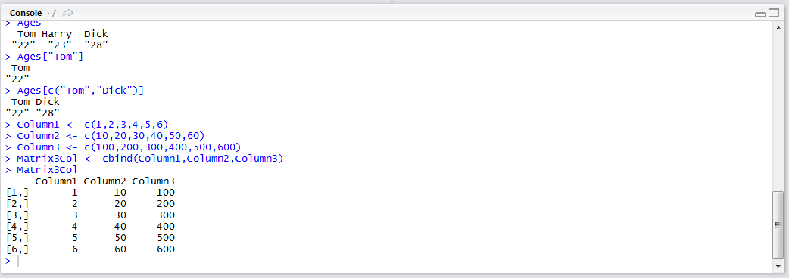

# Procedure 8: Combine Vectors to make a Matrix with cbind

A vector could be viewed as a column in an Excel spreadsheet.  It follows that if there are several vectors,  they would need to be brought together to create a similar structure.  One structure that closely resembles a spreadsheet,  working with the assumption that the contents of that spreadsheet is all the same data type, is a matrix.

To assume that every vector is to be a column in the matrix, the cbind() function is used to bring those columns together into this data structure.   

To start,  create three vectors of the same length:

``` r
Column1 <- c(1,2,3,4,5,6)
```



Run the line of script to the console:



Repeat for two new columns,  creating a script block:

``` r
Column2 <- c(10,20,30,40,50,60)
Column3 <- c(100,200,300,400,500,600)
```



Run each new line of script to console.  It is important to note that each line of script will have to be run to the console individually by navigating to the end of the line,  clicking the Run button (or CTRL+Enter) and repeating a click of the Run button upon the cursor being moved to the next line.  Hitherto this procedure of running more lines to console will be referred to as running the script block to console.



It can be observed that there are now three Vectors,  columns,  in the environment pane:



The task is to bring these columns together into a Matrix,  rather bind these columns.  The cbind() function is used to instruct this binding of columns.  Type:

``` r
Matrix3Col <- cbind(Column1,Column2,Column3)
```



Run the line of script to console:



It can be seen that a new section in the environment pane has been created, titled Data:


Naturally the new matrix can be viewed by simply typing the Matrix name:

``` r
Matrix3Col
```



Run the line of script to console:

