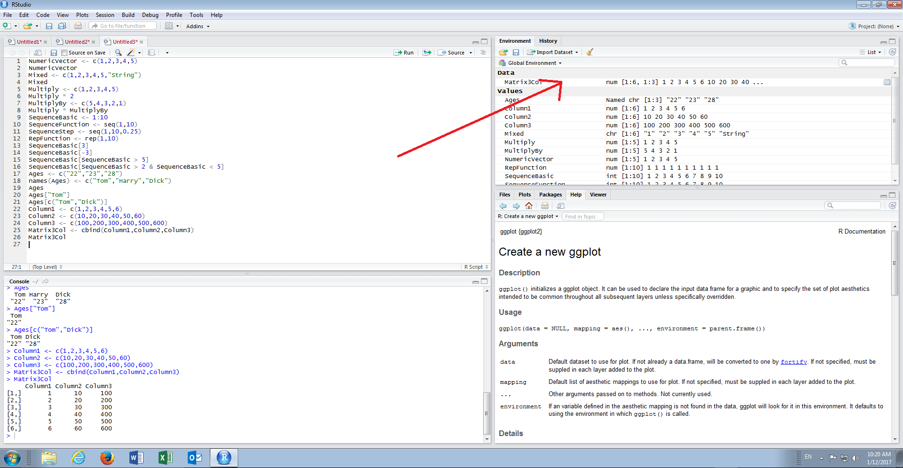
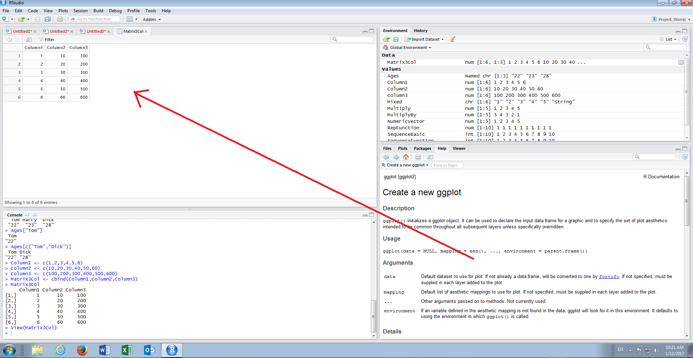
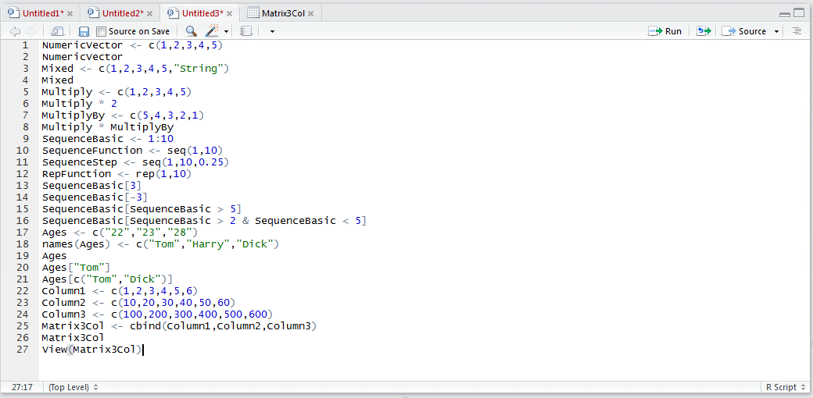
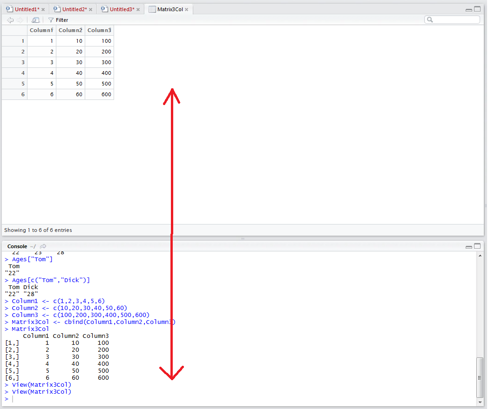

# Procedure 9: Viewing a Matrix

It can be observed that the matrix created in procedure 26 has been written out to the console.  It was noted that there is a new section titled data in the environment pane,  under which the matrix is displayed.  

To expand the data into a tabbed grid,  simply click with the mouse on the Matrix3Col under the data section of the environment pane:



The tabbed grid will explode:



Note also that on clicking the matrix in the environment pane,  that a script command has actually sent to the console.  As such viewing data in this manner can be invoked via a line of script. Using the script editor type:

``` r
View(Matrix3Col)
```



Run the line of script to the console:

