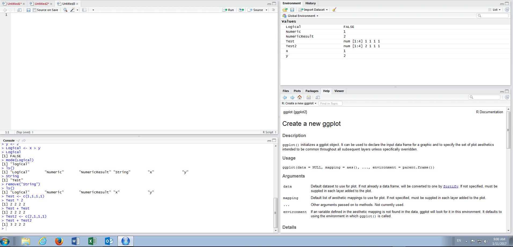

# Module 3 Data Structures Introduction

Although R seems intimidating at first, requiring what seems to be programming skills, this belies that most of the procedures for complex predictive analytics can in fact be distilled into simple procedures.  It is most certainly not correct that R need be viewed upon as a programming language.

There are certain basic principles that need to be understood however and as covered in Module 1, Module 2 sets out to emphasise these principles.

In this module, Data Structures, available to R, will be explored.   The exercise will require a new script to have been opened in RStudio as will have become familiar in procedures set forth in Module 1:

