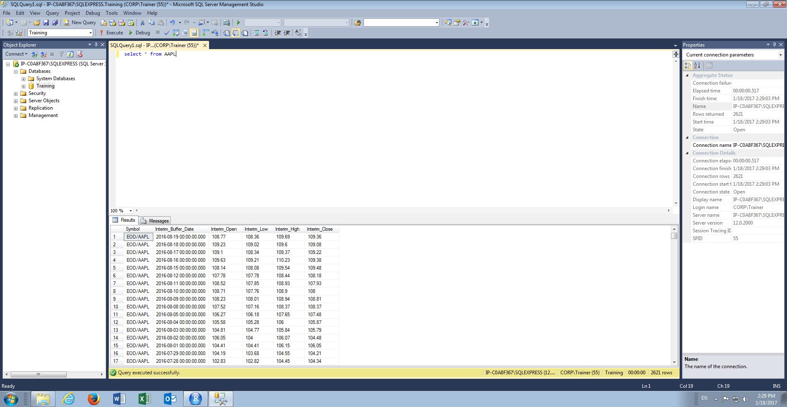
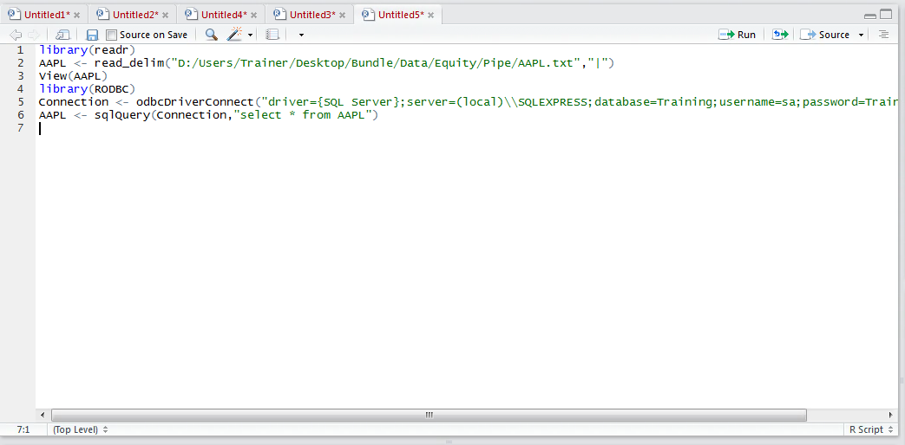
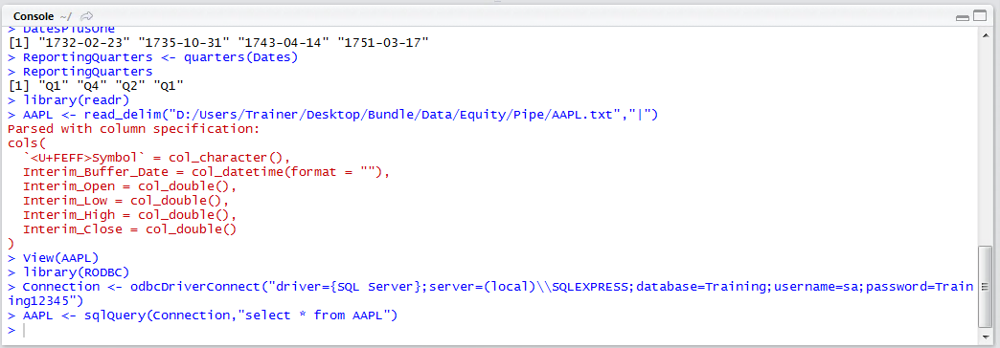
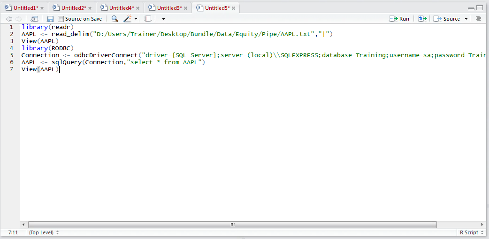
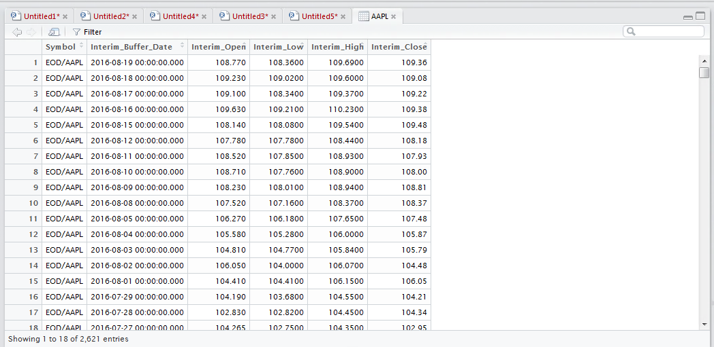

# Procedure 10: Fetch an entire table from an SQL Server Database

It suffices, for the purpose of this procedure, that there is a table in the SQL Server database titled AAPL containing the same information as the AAPL.csv and AAPL.txt files loaded in procedure 46 and y:



Offloading data mining and wrangling to SQL Server is covered in much more detail in module 5.  For the purposes of this procedure, select the contents of the table to a Data Frame by typing:

``` r
AAPL <- sqlQuery(Connection,"select * from AAPL")
```



Run the line of script to console to execute the SQL statement "select * from AAPL" via the connect established in beforehand:



The absence of any errors indicates that the SQL Query ran successfully, while an execution of the View() function against the data frame can further offer validation:

``` r
View(AAPL)
```



Run the line of script to console to expand the AAPL data frame into a table in the script section of RStudio:

