# Procedure 11: Sorting a Data Frame with the arrange() function

The procedures that follows are born of the dplyr package which is a collection of functions that exist for the purpose of shaping and moulding data frames.  The first step is to ensure that the dplyr package is available by installing it through the Install section of the packages pane and as descried in procedure 9.  Search for dplyr:

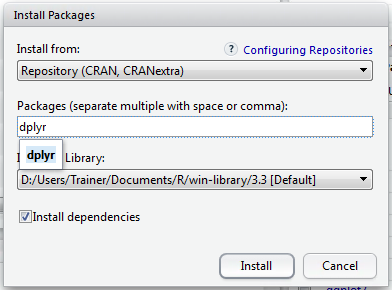

Click Install to download and install the dplyr package:

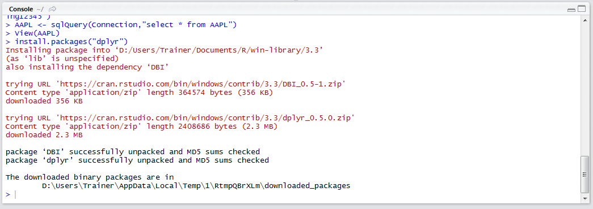

Load the dplyr library by typing:

``` r
library(dplyr)
```

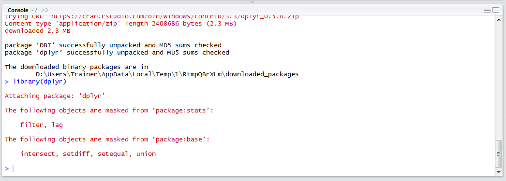

The package dplyr exposes several functions for shaping and moulding data.  The arrange() function is used to rearrange, rather sort, the order of data in a data frame by columns in ascending order. To arrange data by date for the AAPL data frame:

``` r
AAPL <- arrange(AAPL,Interim_Buffer_Date)
```

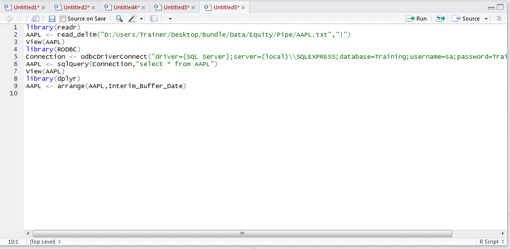

Run the line of script to console:

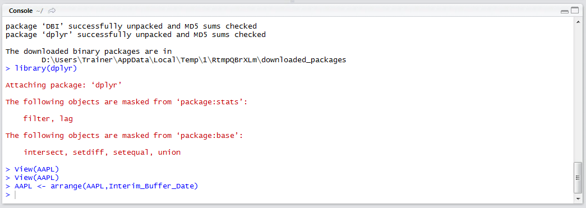

View the AAPL data frame to observe the change in row arrangement:

``` r
View(AAPL)
```

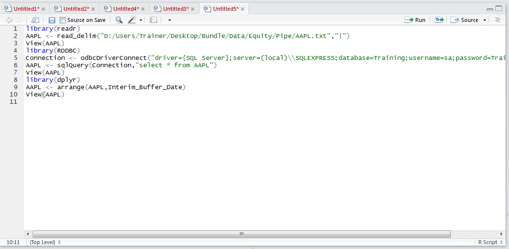

Run the line of script to console:

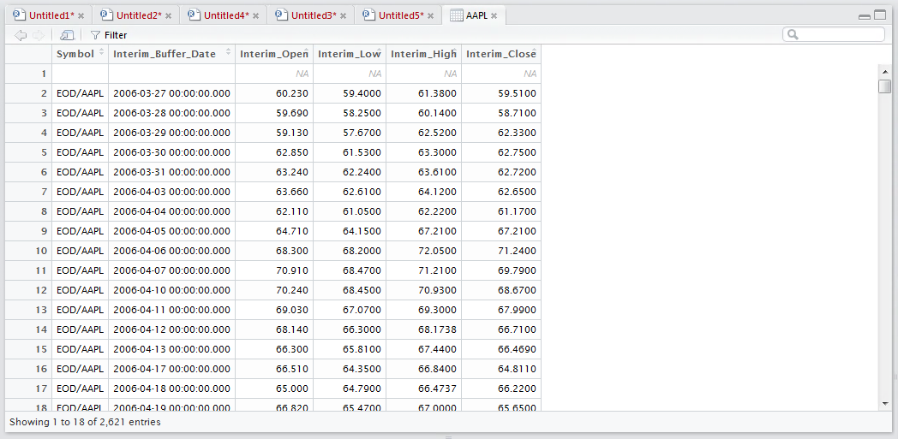

Run sort in a different direction can be achieved using the desc() function wrapped around the column to be sorted.   To change the direction of sort order on the Interim_Buffer_Date type:

``` r
AAPL <- arrange(AAPL,desc(Interim_Buffer_Date))
```

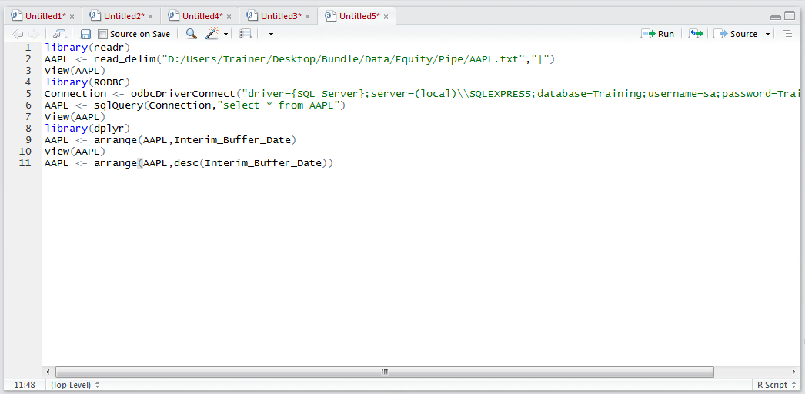

Run the line of script to console:

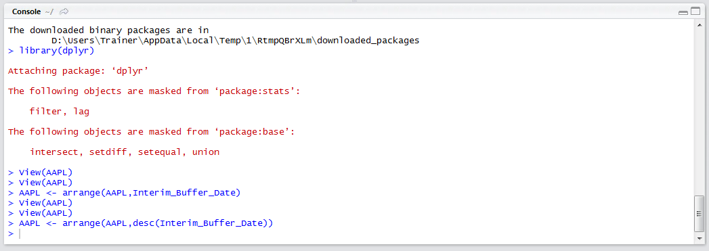

Observe the change in sort order:

``` r
View(AAPL)
```

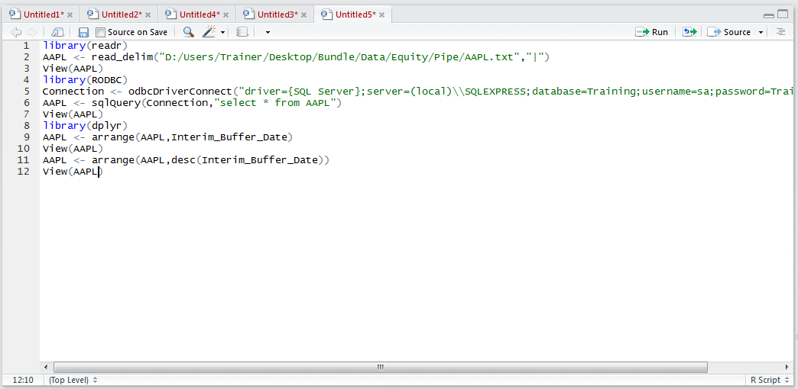

Run the line of script to console:

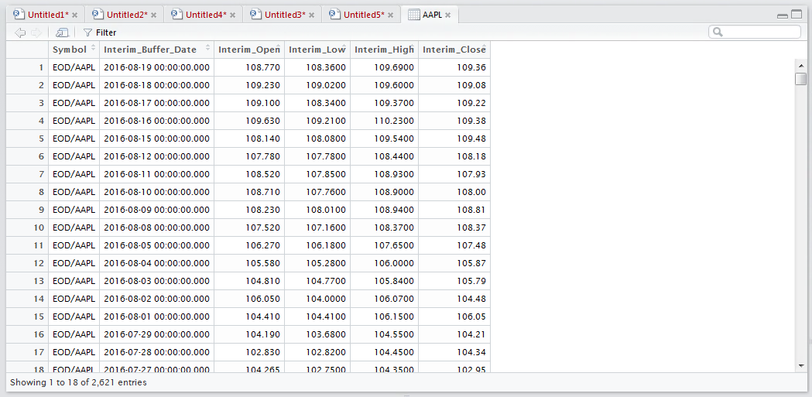

It can be seen that the sort order has changed direction completely.  To sort by one column, then the next, simply list out the columns in order then direction of the sort:

``` r
AAPL <- arrange(AAPL,desc(Interim_Buffer_Date),Interim_Close)
```

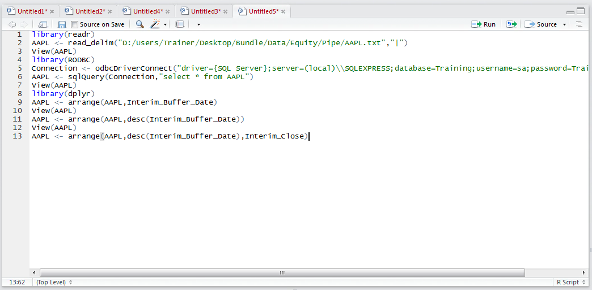

Run the line of script to console:

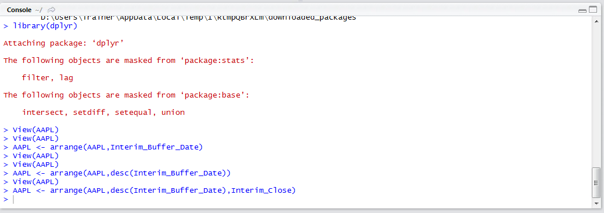