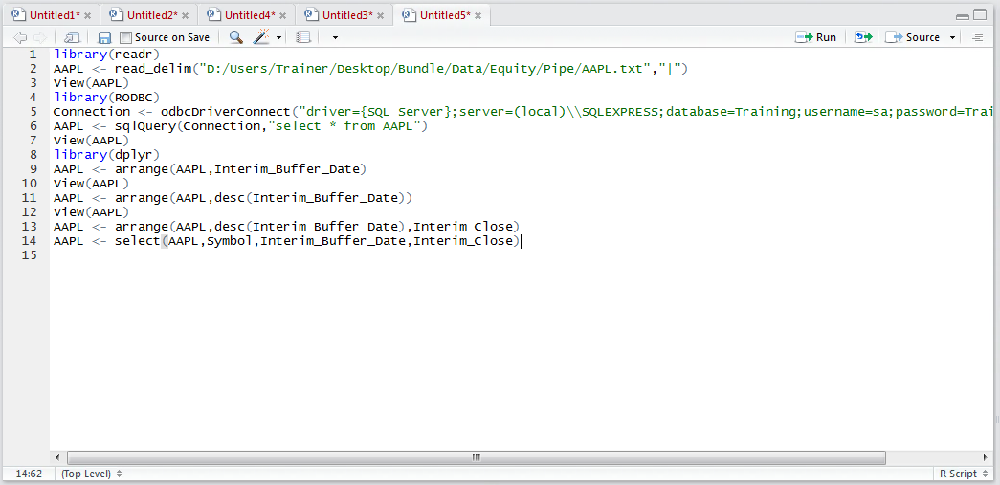
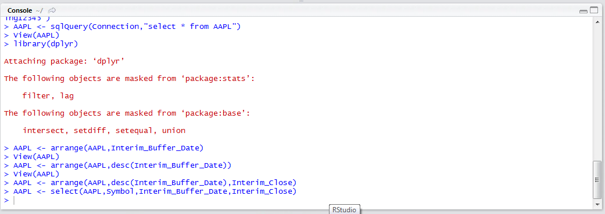
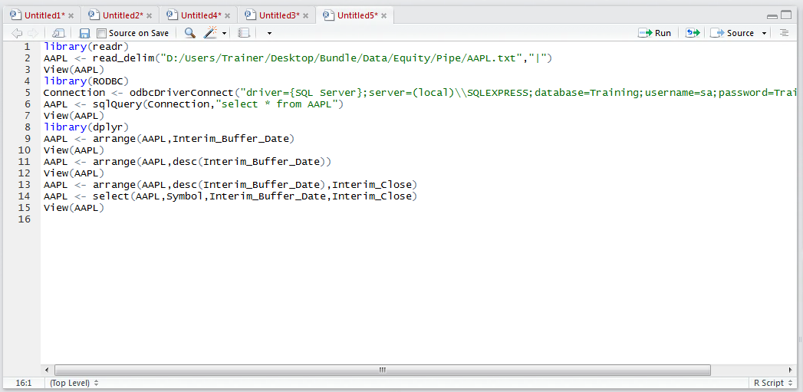
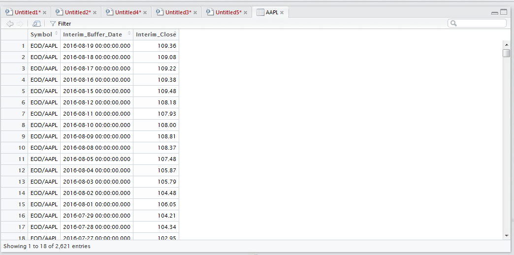

# Procedure 12: Specifying columns of a Data Frame to return

The select() function returns just the columns specified after the data frame.  In this example, the AAPL data frame will be have some columns truncated leaving only the columns Interim_Buffer_Date and Interim_Close:

``` r
AAPL <- select(AAPL,Symbol,Interim_Buffer_Date,Interim_Close)
```



Run the line of script to console:



View the data frame:

``` r
View(AAPL)
```



Run the line of script to console:



It can be observed that the data frame has discarded columns that were not specified explicitly.