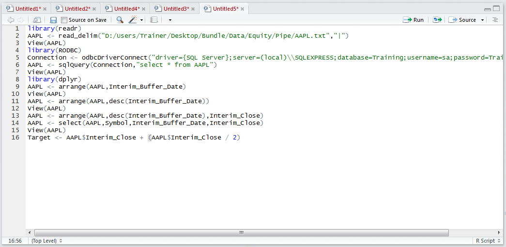
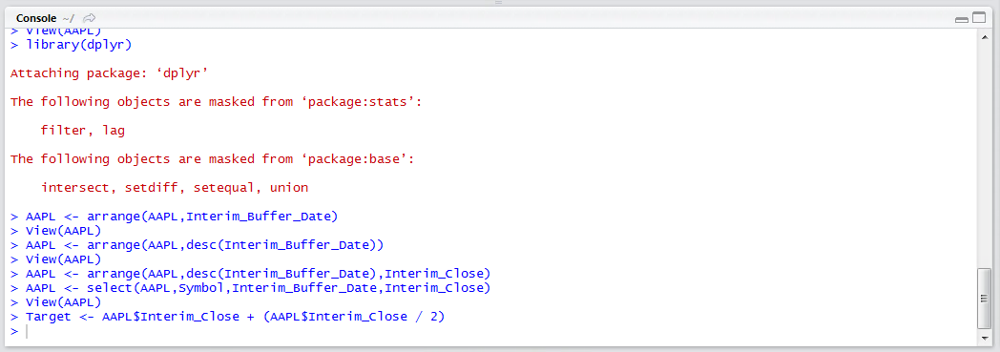
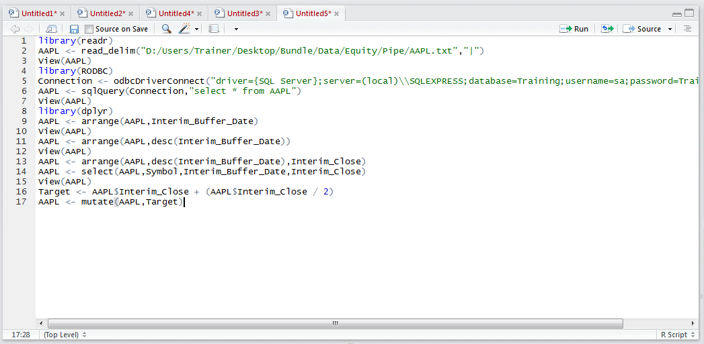
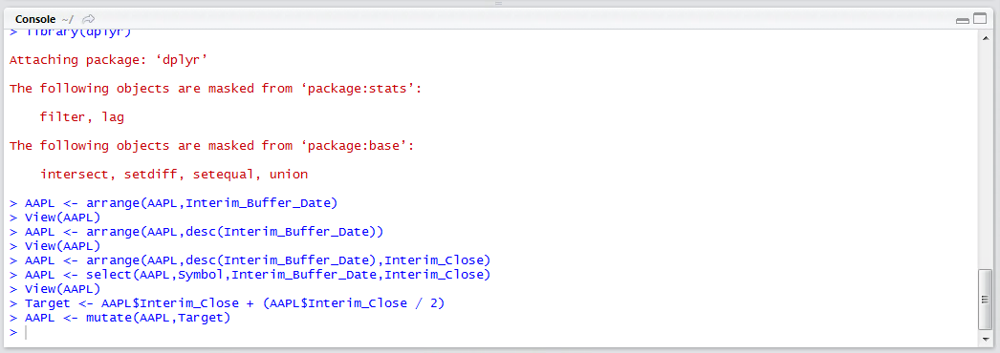
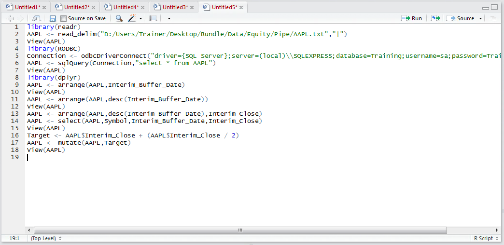
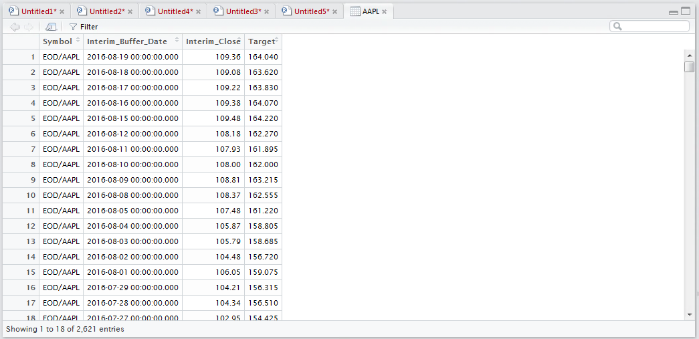

# Procedure 13: Adding Vectors or Factors to an existing Data Frame

Abstraction is a core part of the machine learning task and horizontal abstraction would see the creation of many columns which rely on the foundational columns.  In this example, a target of 50% uplift on the current price will be created as a separate column called Target (i.e. Interim_Close + (Interim_Close / 2).  Firstly, create a vector which performs the formula on the Interim_Close value of the data frame AAPL by typing:

``` r
Target = AAPL$Interim_Close + (AAPL$Interim_Close  / 2)
```



Run the line of script to console:



To add the column to the AAPL data frame use the mutate() function which takes the target data frame as first argument,  followed by the column to added:

``` r
AAPL <- mutate(AAPL,Target)
```



Run the line of script to console:



View the newly created column by typing:

``` r
View(AAPL)
```



Run the line of script to console to expand the data viewer in the script window:



It can be observed that the vector has been added to the data frame.  The mutate() function is by far the most useful function in the creation of abstractions, whereby a vector is created via several steps,  with the final vector being mutated into a Target data frame.