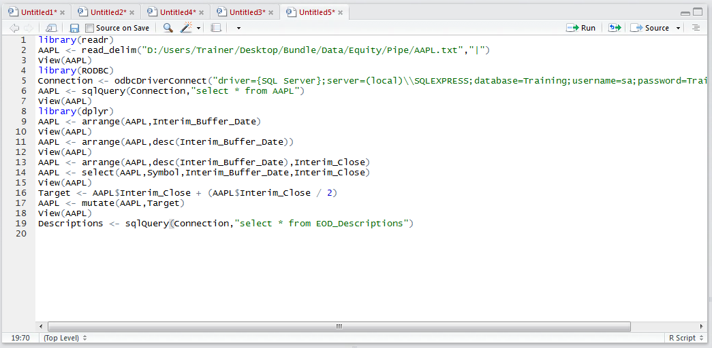
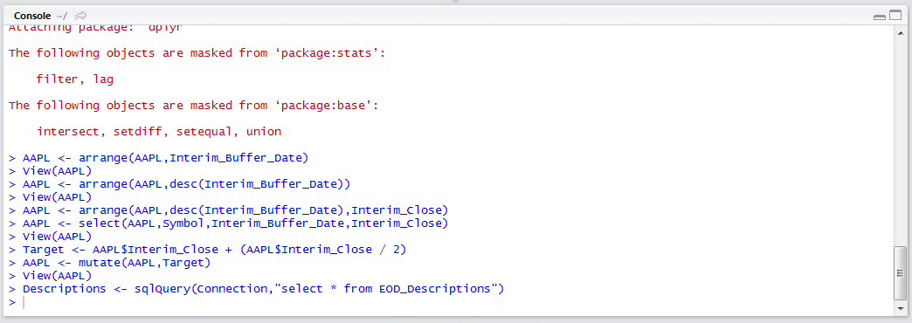
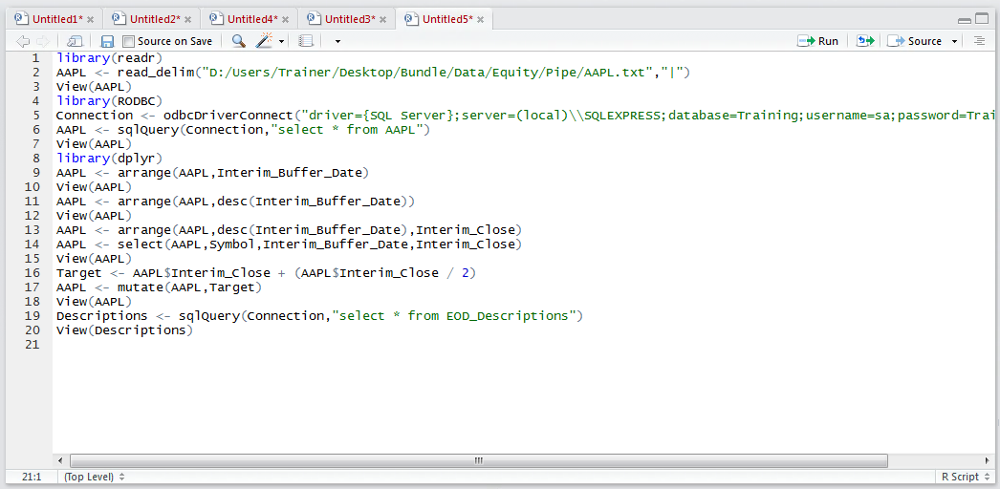
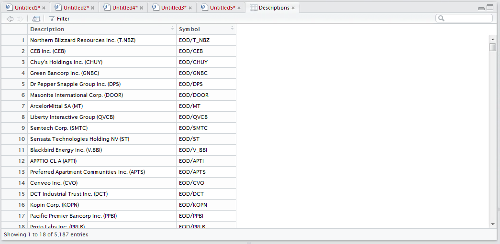
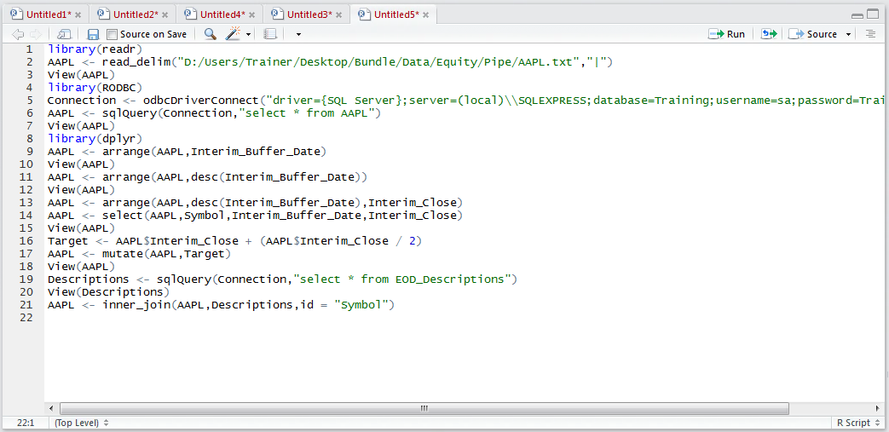
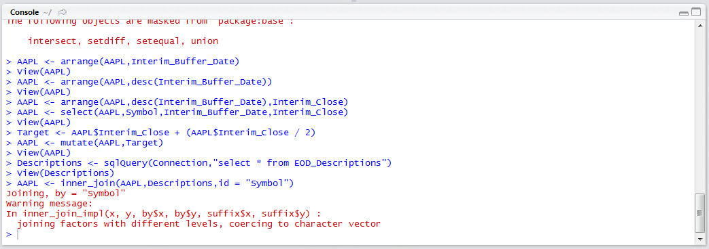
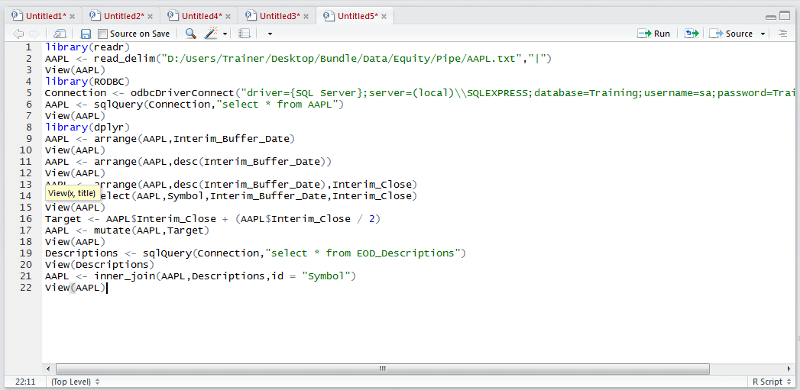
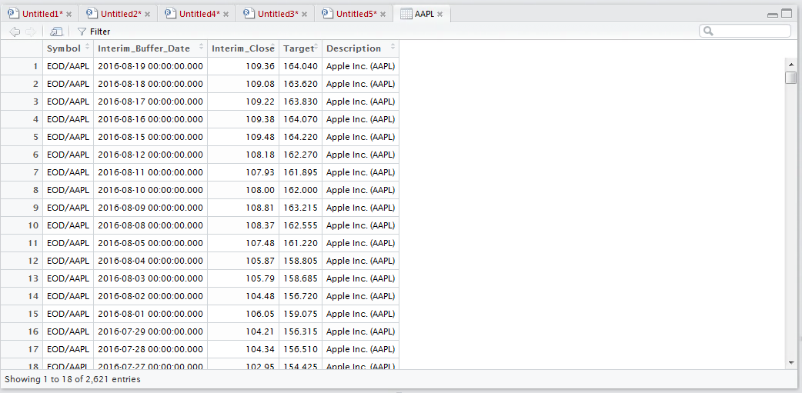

# Procedure 14: Merging a Data Frame

Repeat the process to create a data frame, this time creating a data frame called Descriptions from the table EOD_Descriptions by typing:

``` r
Descriptions <- sqlQuery(Connection,"select * from EOD_Desccriptions")
```



Run the line of script to console:



View the Descriptions data frame by typing:



Run the line of script to console:



It can be seen that symbol column is common between the AAPL table and the Descriptions table.
The task in this procedure is to merge the data frames together on the Symbol identifier, which will then provide a description next to each and every record in the AAPL dataset.  The inner_join() function seeks to bring together all records where the key in one data frame is present in the other.

To join two data frames in this manner type:

``` r
AAPL <- inner_join(AAPL,Descriptions,ID = "Symbol")
```



Run the line of script to console:



Notice that an error relating to levels has been produced, this is owing to there being a disparity in the number of records in one table as opposed to the next.  Inspect the new dataset by typing:

``` r
View(AAPl)
```



It can be seen that the description field from the Descriptions Data Frame has been duplicated across each record in the AAPL Data Frame, as would be expected of an Inner Join in a database:

