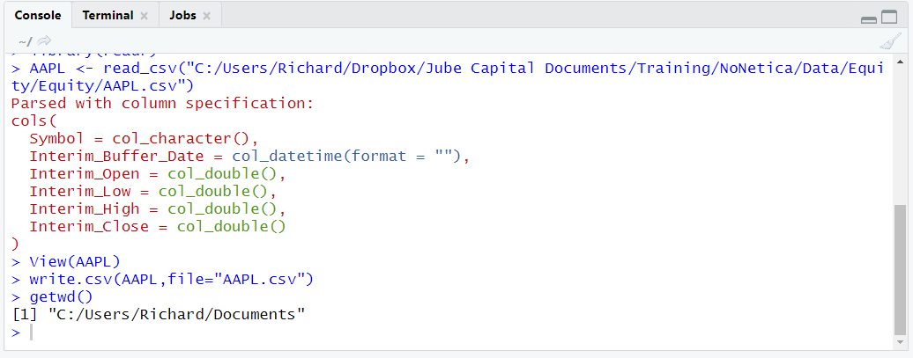

# Procedure 16: Exporting a csv file

By this stage a large amount of manipulation has been performed on the AAPL data frame and it bears little resemblance to that which was originally loaded.  Exporting data frames from R is a common requirement to communicate work product to business users.  In general, if there is an object to read something into R, then there is the near equivalent to write from R.  In this example, the write.csv function will be used to write the AAPL dataframe to a csv file, in the file system:

``` r
write.csv(AAPL,file="AAPL.csv")
```


Run the line of script to console:


To identify the location of the working directory, use the getwd() function:

``` r
getwd()
```


Run the line of script to console:



Open the directory in windows explorer:


Opening the file, it can be seen that the data frame has been reliably exported:

