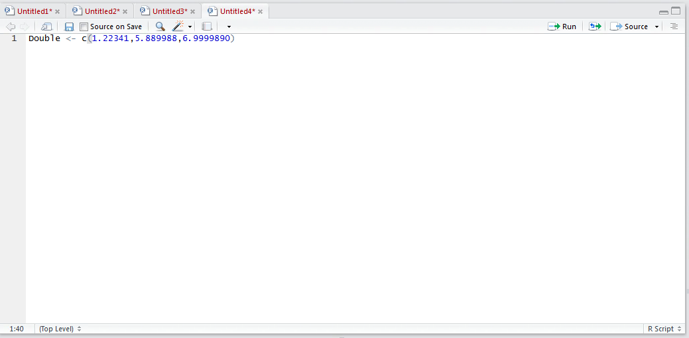
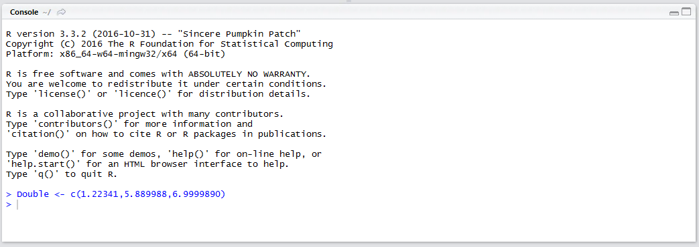
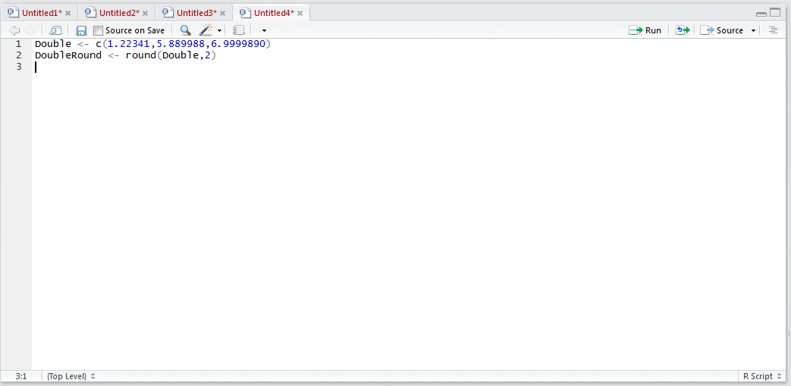
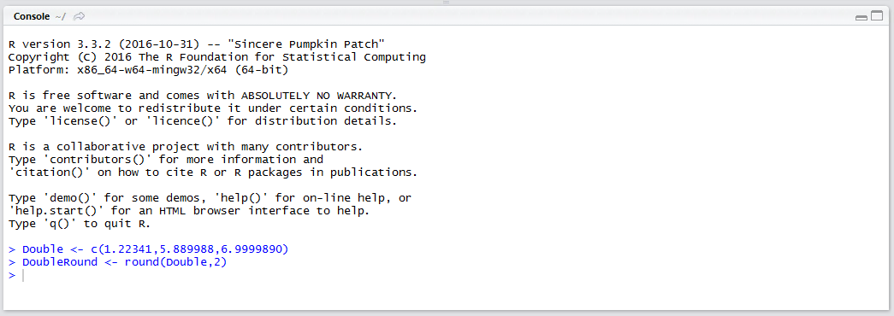
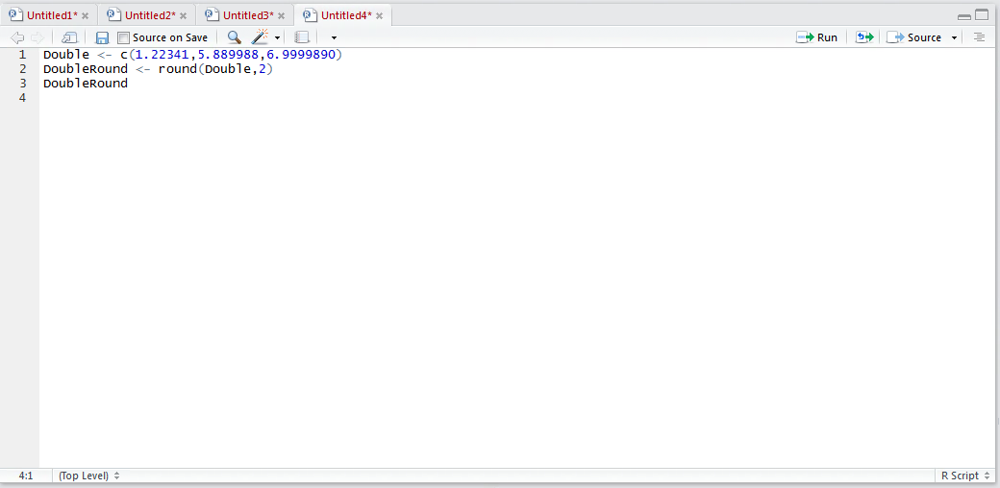
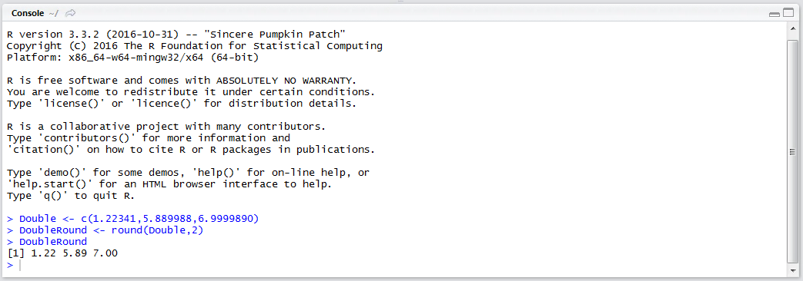
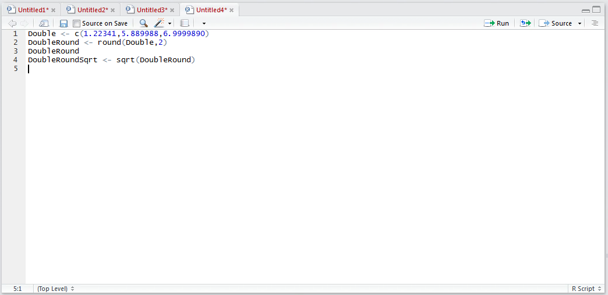
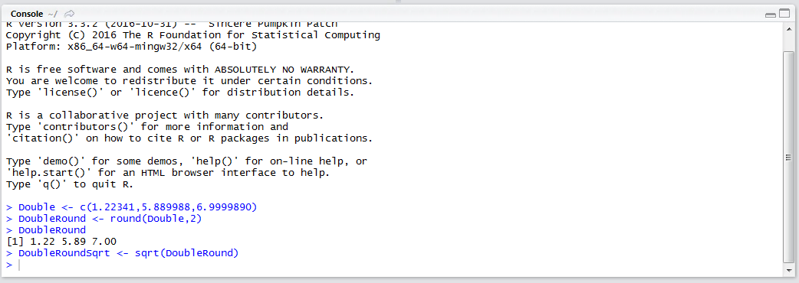
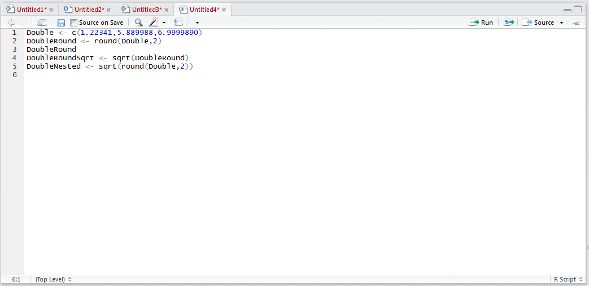
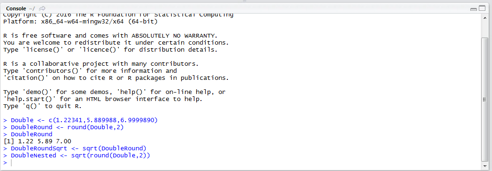

# Procedure 1: Using Numeric Functions to create a Horizontal Abstraction

As introduced R has a plethora of procedures that facilitate the creation of Vectors and Matrices, furthermore there are base numeric operators which facilitate:

* + Addition.
* - Subtraction.
* \* Multiplication.
* / Division.
* %% Exponent.
* ^ Power Of.

Functions also provide the ability to perform mathematical operations.  In this example, a vector of double values will be created then rounded.  Create a new script and start by creating a vector containing double values:

``` r
Double <- c(1.22341,5.889988,6.9999890)
```



Run the line of script to console:



Use the round() function,  which takes two arguments of value and digits, to round the Double vector to two decimal places assigning that vector:

``` r
DoubleRound <- round(Double,2)
```



Run the line of script to console:



Write out the DoubleRound vector by typing:

``` r
DoubleRound
```



Run the line of script to console:



It can be observed that the vector has been rounded to two decimal places.  By way of further abstraction find the square root:

``` r
DoubleRoundSqrt(VectorRound)
```



Run the line of script to console:



A more concise way to create a line of script relying on several functions, could include nesting the functions:

``` r
DoubleNested <- sqrt(round(Double,2))
```



Run the line of script to console:



It can be observed that with the help of several R numeric functions that complex horizontal abstractions can take place.