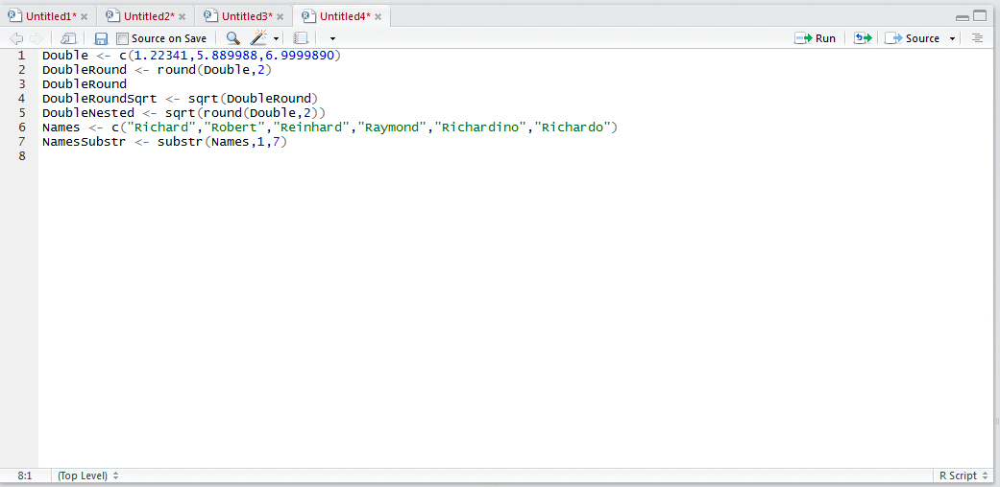
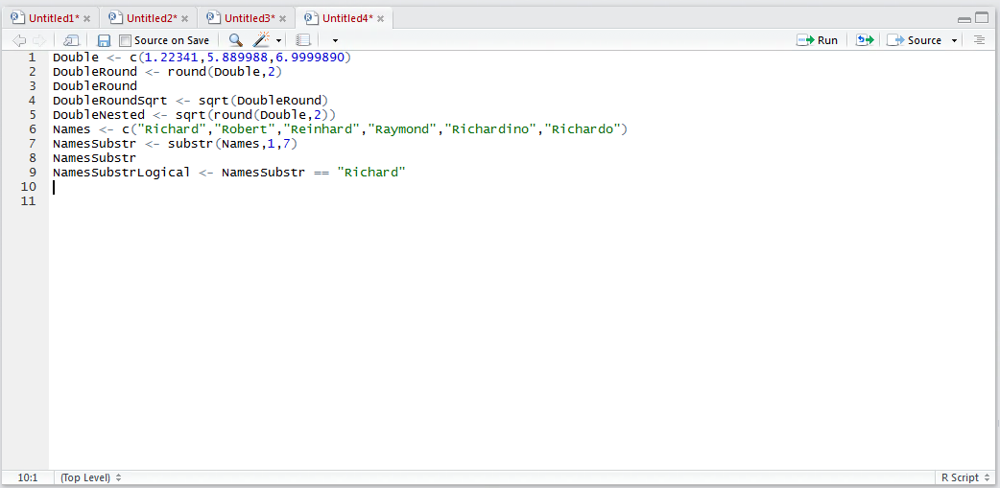

# Procedure 2: Extracting a substring from a string, testing logically and presenting for machine learning

In Horizontal Abstraction, it is quite common to have the requirement to inspect a string of data looking for an occurrence (or pattern) and return a logical value that can be used in machine learning.

In this example, a string will be inspected and return a 1 in the event that the string "Richard" is present.

Firstly, create a vector of name strings by typing:

``` r
Names <- c("Richard","Robert","Reinhard","Raymond","Richardino","Richardo")
```


Run the line of script to console:


Use the substr() function to create a vector of the first 7 characters of the value contained in the Names vector,  by typing:

``` r
NamesSubstr <= substr(Names,1,7)
```



Write the NamesSubstr vector:

``` r
NamesSubstr
```


Run the line of script to console:


The question being posed is whether the first characters of the name is equal to "Richard".  To perform this evaluation, create a logical vector from the NamesSubstr vector by typing:

``` r
NamesSubstrLogical <- NamesSubstr == "Richard"
```



Notice how a double equals sign is used to eliminate confusion between evaluation and assignment. 

Run the line of script to console:


Write the logical vector out to console by typing:

``` r
NamesSubstrLogical
```


Run the line of script to console:


The character notion of TRUE or FALSE cannot be used in machine learning readily (you can’t multiply by text) and it follows that these values should be converted to a numeric value using the as.numeric() function,  typing:

``` r
NamesSubstrLogicalNumeric <- as.numeric(NamesSubstrLogical)
```


Run the line of script to console:


Write the newly created vector to console by typing:


Run the line of script to console:


A more concise line of script nesting the functions might be:

``` r
NamesSubstrLogicalNumericNested <- as.numeric(substr(Names,1,7) == "Richard")
```


An alternative approach might be converting the logical vector to a factor as explained elsewhere.
