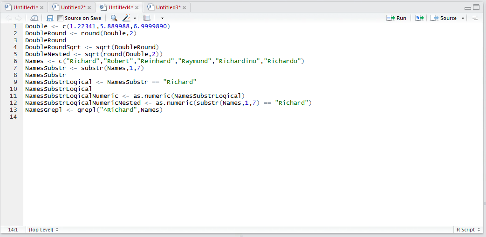
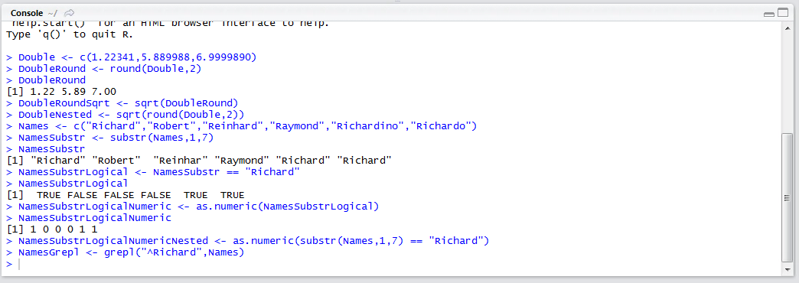
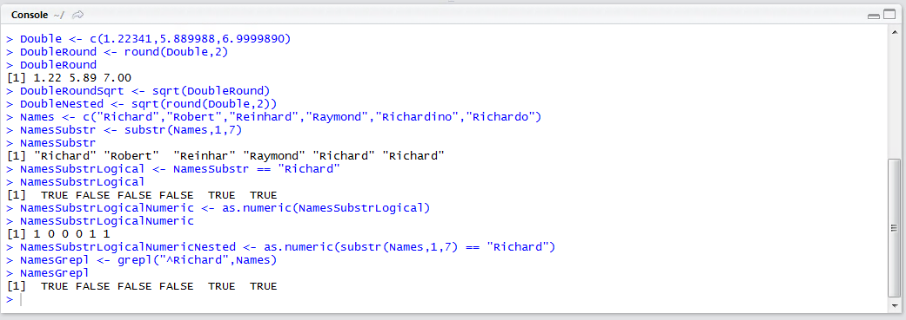
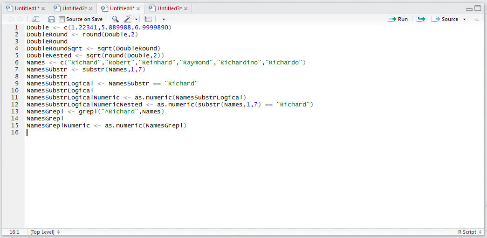
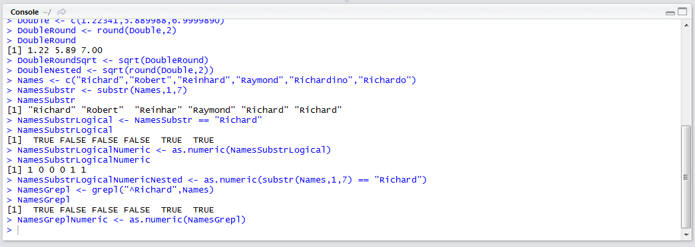
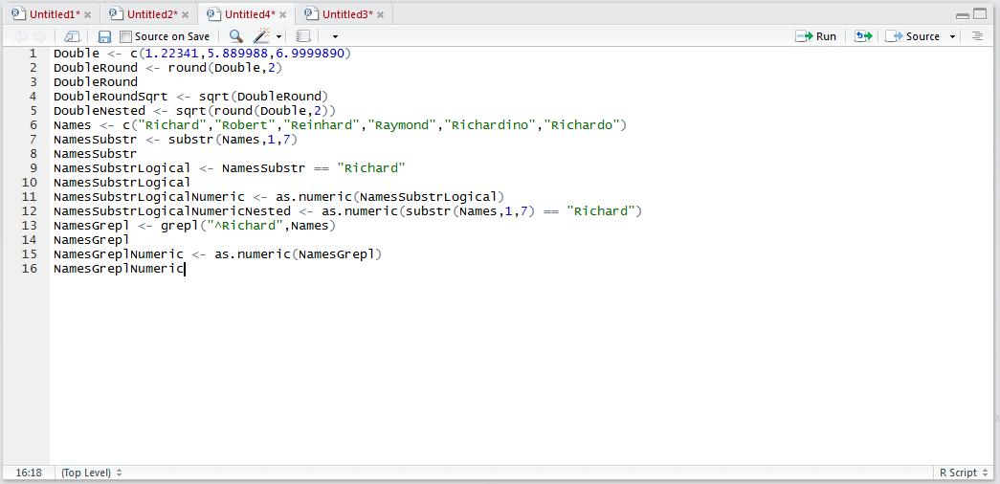
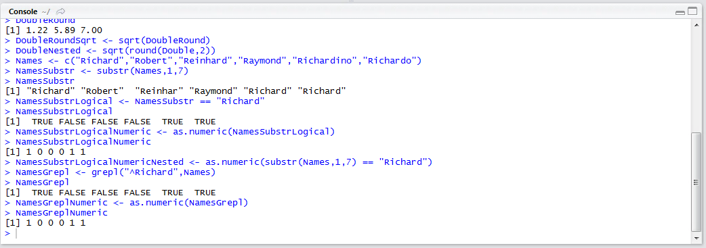
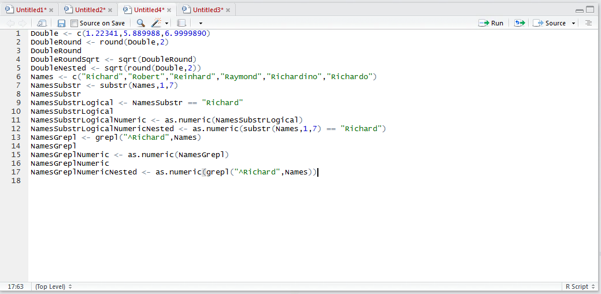

# Procedure 3: Searching with Regular Expressions

Beforehand the substr() function was used to search for any occurrence of the string "Richard".  The substr() is a very limited function and assumes a certain amount of structure exists in the base string.  The grepl() function allows for the searching of a character string with regular expressions rather than specific location based arguments.  Regular Expressions are a sequence of symbols and characters expressing a string, or pattern, describing a search within a longer piece of text.  Regular Expressions can be quite complex but they are extraordinarily powerful for string matching.

This procedure sets out to replicate the substr() function using Regular Expressions and the grepl() function,  searching for any string that starts with "Richard" using the ^ symbol:

``` r
NamesGrepl <- grepl(^Richard,NamesSubstr)
```



Run the line of script to console:



Write the NamesGrepl vector out to console by typing:

``` r
NamesGrepl
```



It can be observed that any name string starting with "Richard" has been returned as a logical vector.  To make this abstraction useful for machine learning it is a simple matter of transforming it to a numeric vector by typing:

``` r
NameGreplNumeric <- as.numeric(NamesGrepl)
```



Run the line of script to console:



Write out the NamesGrepNumeric vector by typing:

``` r
NamesGrepNumeric
```



Run the line of script to console:



It can be seen that this vector is now more appropriate for machine learning.  Nesting the functions,  the procedure could be created more succinctly by typing:

``` r
NamesGrepNumericNested <- as.numeric(grepl("^Richard",Names))
```

