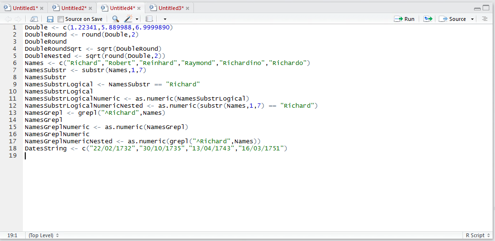
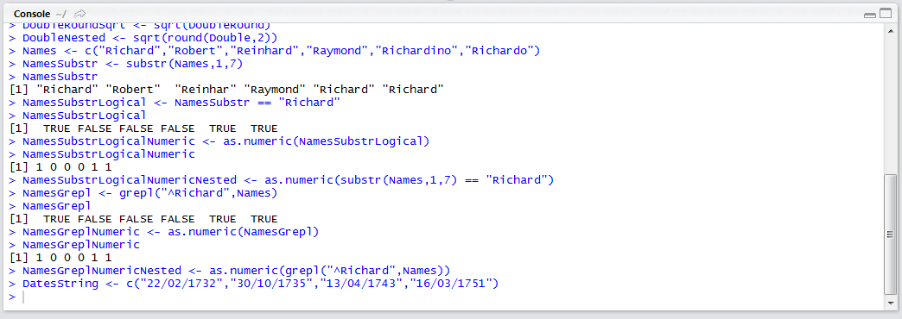
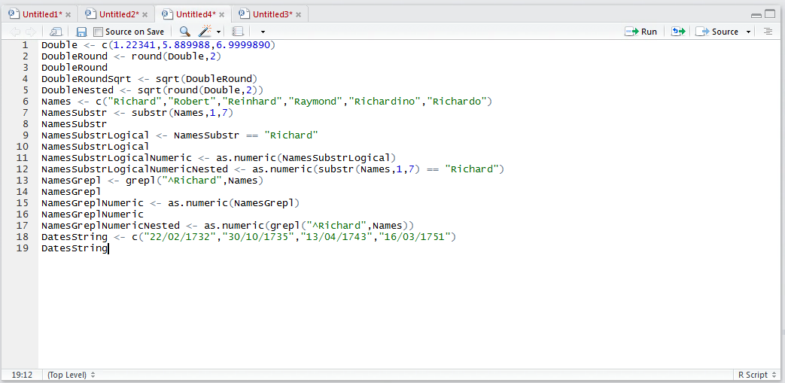
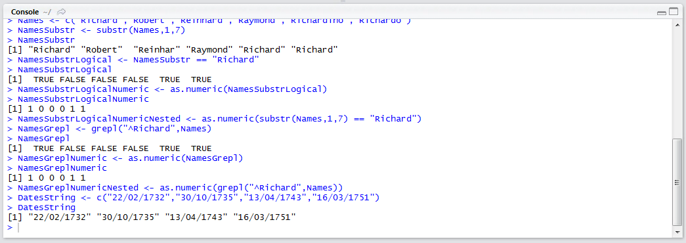
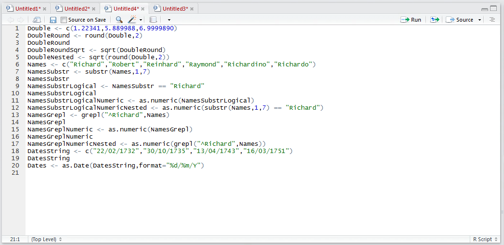
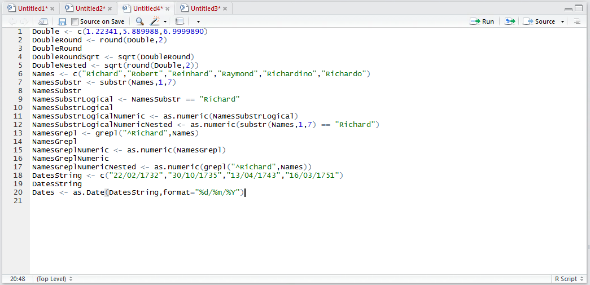
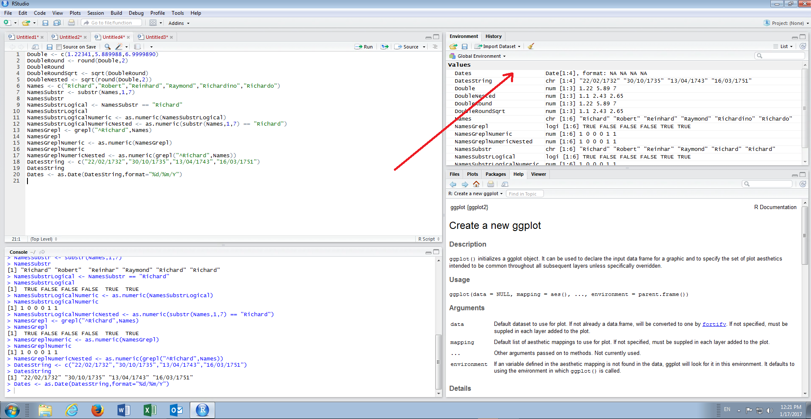
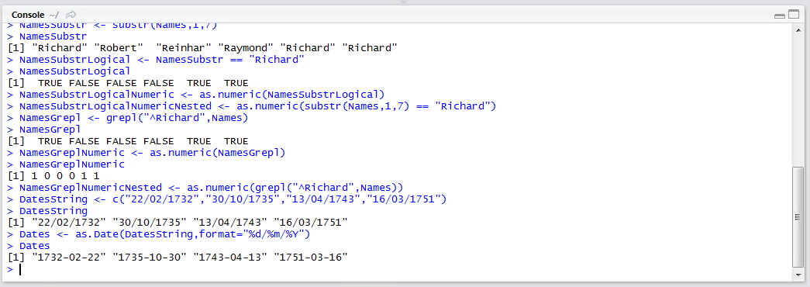

# Procedure 4: Create a Date with a specific Date and Time format

Dates have rather special treatment in R, not least that data can be presented in raw data in a variety of formats (e.g. DDMMYYYY,  DD/MM/YYYY).  The date data type in R exists for the purpose of interacting and manipulating dates. 

A vector of dates would start out as a character vector:

``` r
DatesString <- c("22/02/1732","30/10/1735","13/04/1743","16/03/1751")
```



Run the line of script to console:



It can be observed that the dates are of the form charterer by typing:



Run the line of script to console:



To convert the DatesString vector to the correct data type, R needs to know where to find the year component, the day component and the month component while knowing how to separate the elements.  The following tokens specify the components:

* %Y is a four digit number.
* %y is a two digit number.
* %m is the month as a number.
* %d is the day as a number.
* %b is a short month (such as Jan).
* %B is a long month (such as January).

Outside of the % tokenisation characters can be specified that should be excluded in the overall tokenisation.  To convert the character string vector of dates to a date vector type:

``` r
Dates <- as.Date(DatesString,format="%d/%m/%Y")
```



Run the line of script to console:



It can be observed that the Dates vector has been created in the environment pane:



Run the line of script to console:

