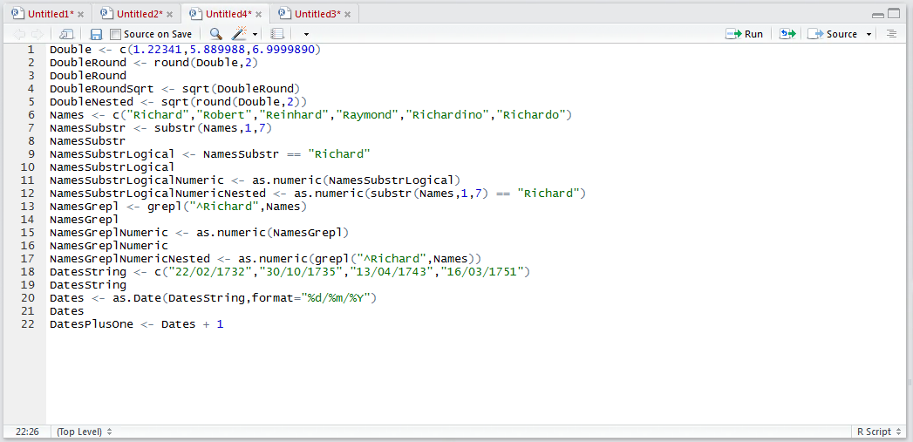
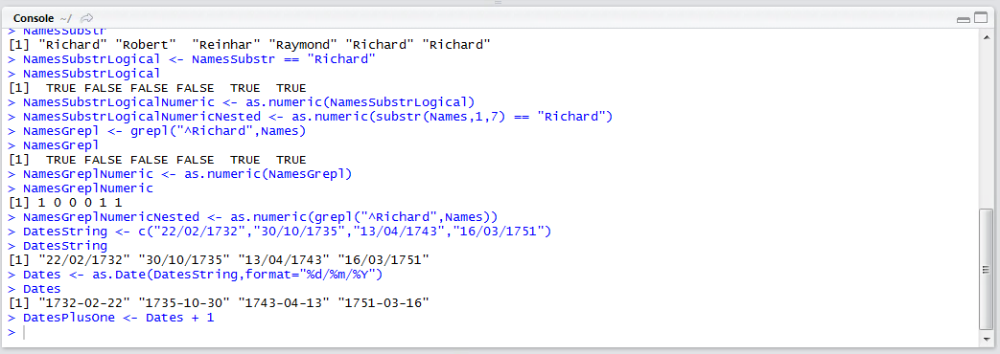
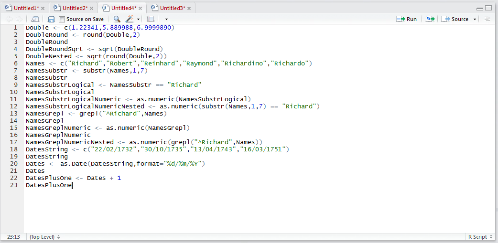
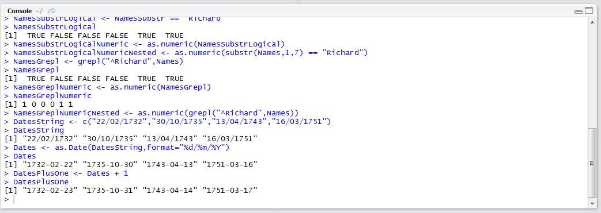

# Procedure 5: Perform Date Arithmetic

Upon a date object, having been created it is possible to perform arithmetic on the dates.  In this example one day is going to be added to the dates in the vector.  To add a day to each value in vector type:

``` r
DatesPlusOne <- Dates + 1
```



Run the line of script to console:



Write the new vector out by typing:

``` r
DatesPlusOne
```



Run the line of script to console:



It can be observed that a day has been subtracted from the Dates vector?