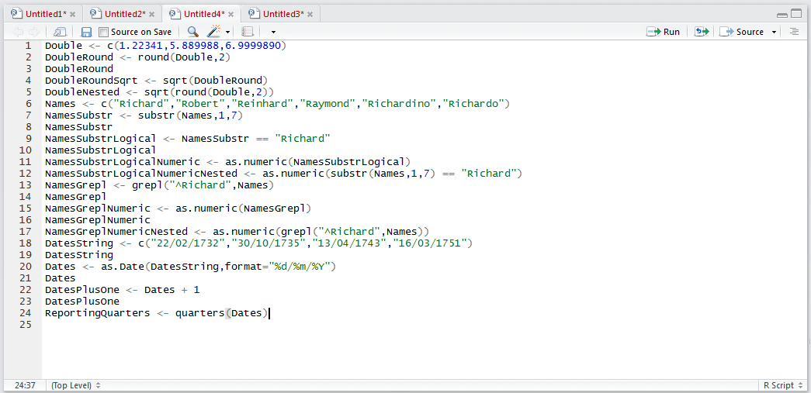
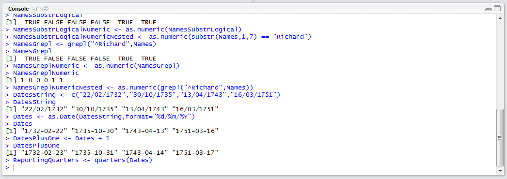
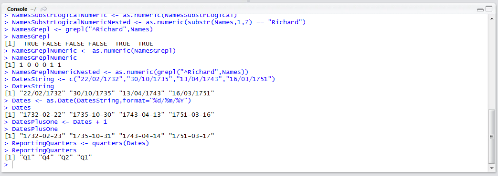

# Procedure 6: Extract Reporting Periods from a Date

There are many functions that exist to extract useful information from dates such as weekdays, months or quarters which make reporting on dates more native. This procedure focuses on three functions:

* weekdays() which extracts the particular day of the week (e.g. Monday).
* months() which extracts the month of the year (e.g. June).
* quarters() which extracts the quarter of the date in the year (e.g. Q3).

All these functions work in the same manner, in that they take just one date argument and return a value.  In this example, the quarter is to be returned for the purpose of reporting.  To return the quarter value:

``` r
ReportingQuarters <- quarters(Dates)
```



Run the line of script to console:



Writing out the vector typing:

``` r
ReportingQuarters
```



It can be observed that the new vectors details the quarter extracted from the Dates() vector.  The procedure may be used interchangeable between the weekdays() and months() function.