# Procedure 7: Importing a CSV file with R Studio

RStudio offers a simple GUI user interface to load files into Data Frames.  The functionality is of course distinct to RStudio but in practice it is a code creator that uses the read.table() function to load a variety of common file formats to a Data Frame.

The procedure here in will use the datasets contained in the bundle.  In this procedure, the csv datasets contained in \Bundle\Data\Equity\Equity will be targeted:

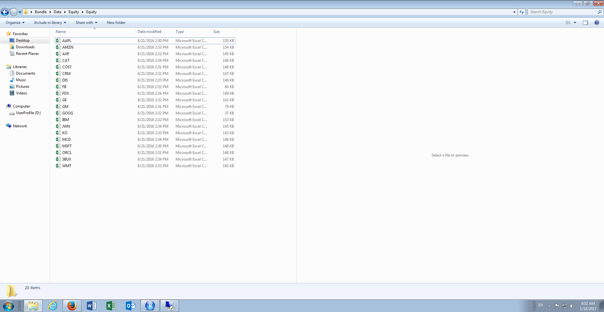

Specifically, the AAPL.csv file which contains a series of prices relating to the Apple share price:

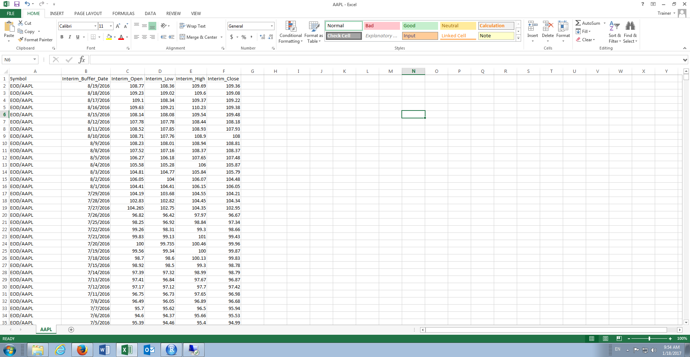

In RStudio, navigate to the Import Dataset button in the top right-hand corner of the screen, above the environment pane:

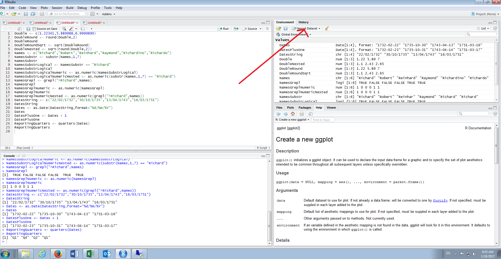

Click the button Import Dataset:

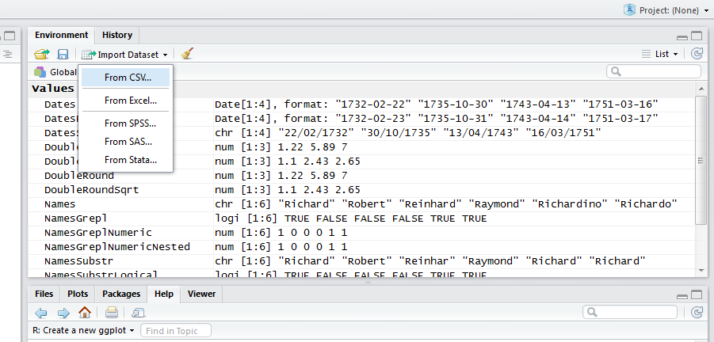

Click the From CVS sub menu:

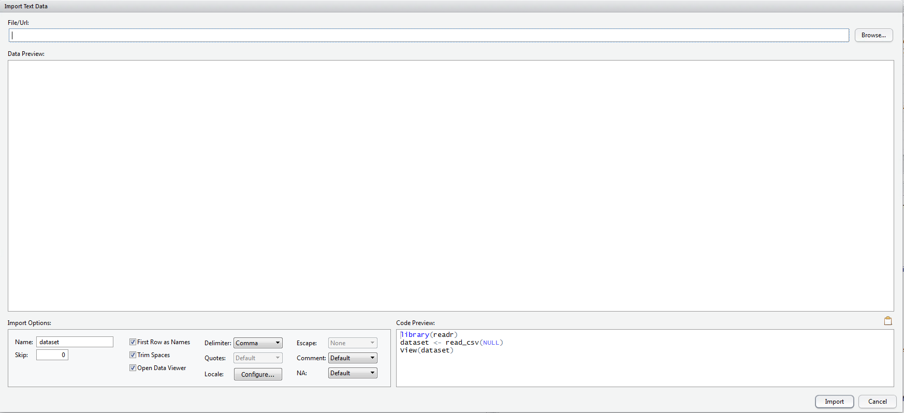

Navigate to Bundle\Data\Equity\Equity\AAPL.csv and click the Open button:

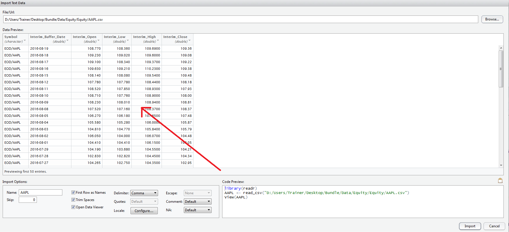

A preview of the file is show in the window for the purposes of validation:

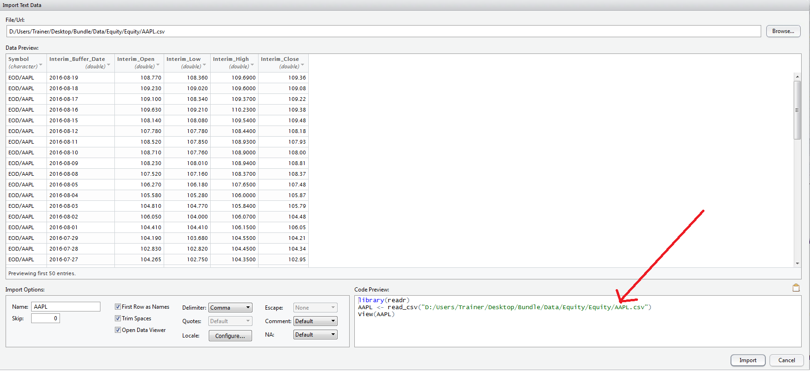

As is the case with many RStudio functions it is in essence a macro or code creation widget.  It can be seen in the bottom right hand corner that RStudio has created the corresponding R script block that will be responsible for importing the file in the console:

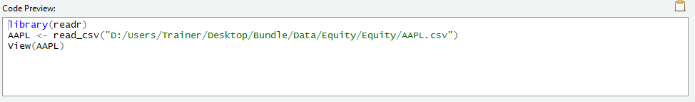

In this example, it can be observed that the readr package is being loaded, the csv file is being loaded to a data frame called AAPL using the read_csv function.  The readr is a more efficient package for the importing and exporting of data created by the RStudio team and while there are several functions for the import and export of data native to R, these are not especially performant.  It is worth noting that this package WILL NOT convert strings to factors, making it a more labour-intensive choice for text rich datasets that are intended to be the source of predictive analytics methods.

Towards the bottom left hand corner of window is additional parameters available in the creation of the csv file.

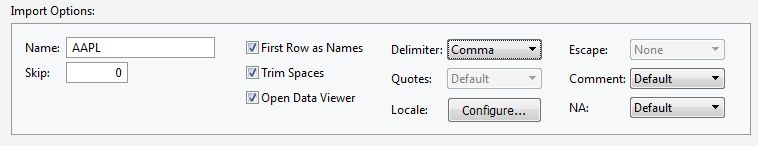

Simply click import to load the data into the R session:

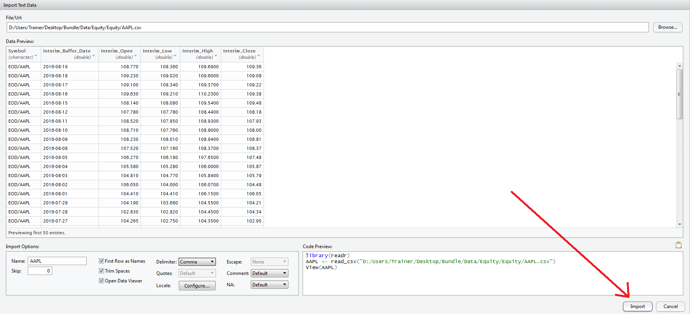

It can be seen that the block of script has been run to console, that the AAPL data frame is now available in the environment pane and care of the View() function, that the data frame has been displayed in a tab of the script pane:

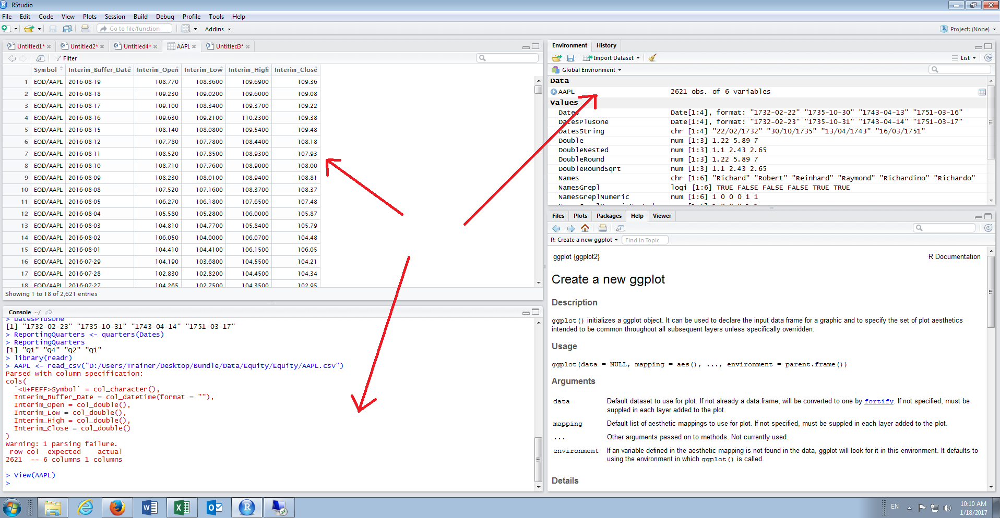

It is important to note that all RStudio had done is create a block of R script and executed this to console.  In the interests of reproducibility and in a script active console passive methodology, this block of script should be reproduced directly in a script.  By way of standard, the readr package will be used in most, but not all, importing methods.

Expanding on the data frame it can be observed that the readr package has facilitated the creation of the correct object types:

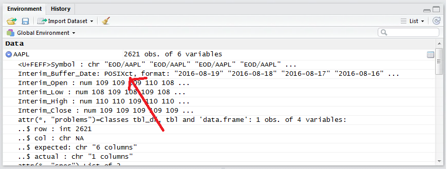

In this case, it can be seen that the handling of dates has taken place via POSIXCT, which is an alternative date handling object.