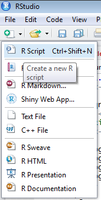
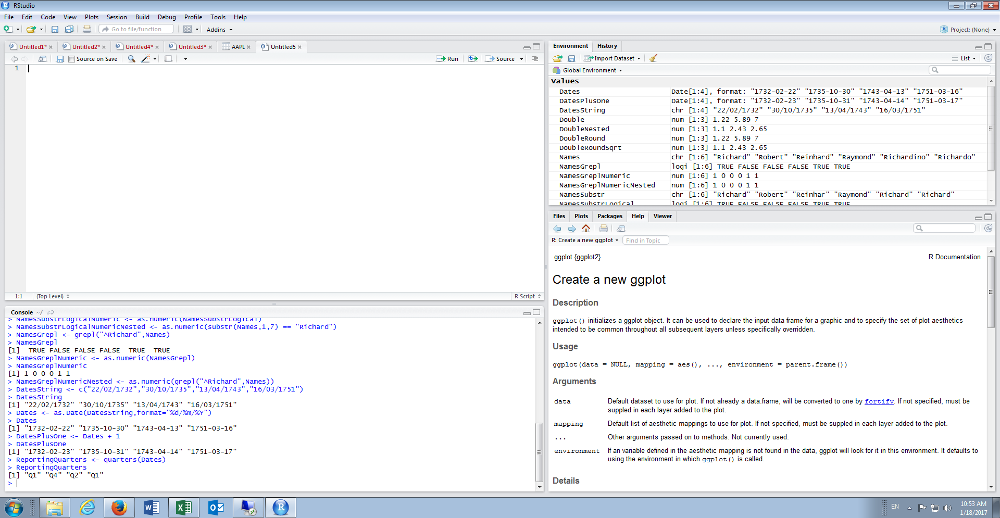
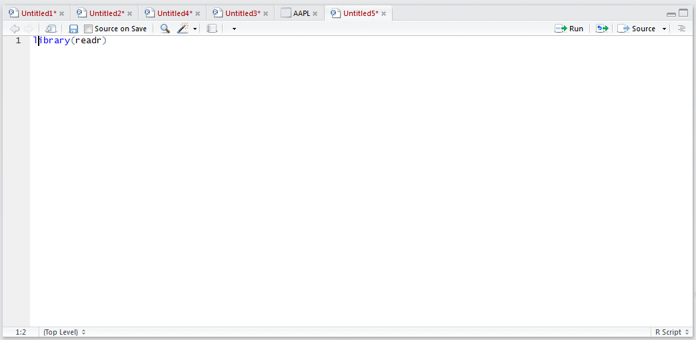
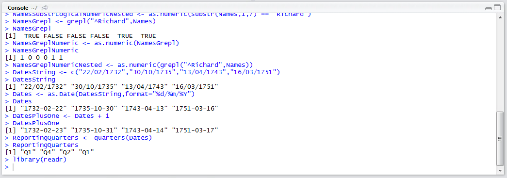
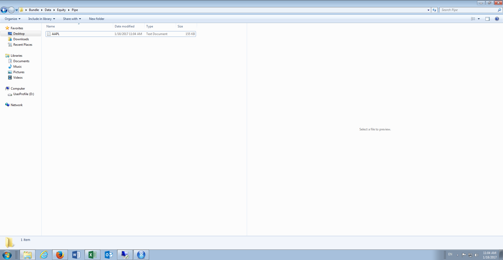
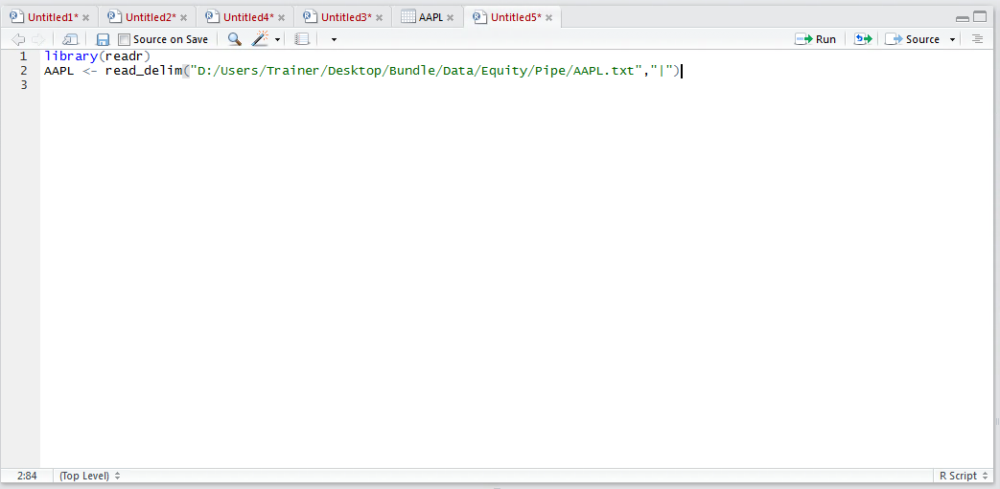
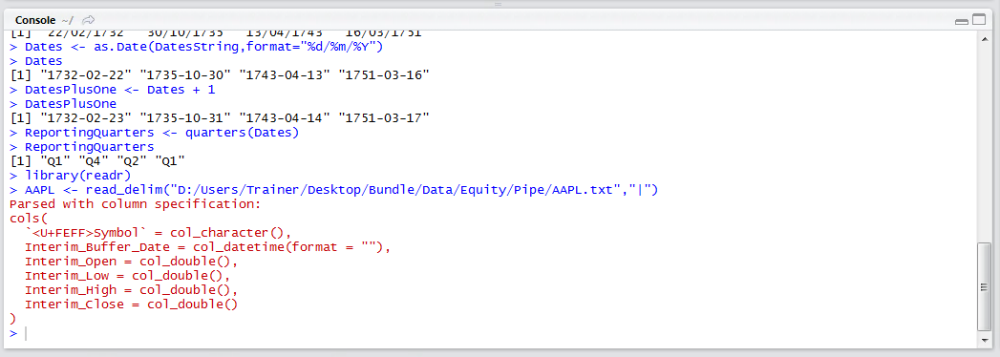
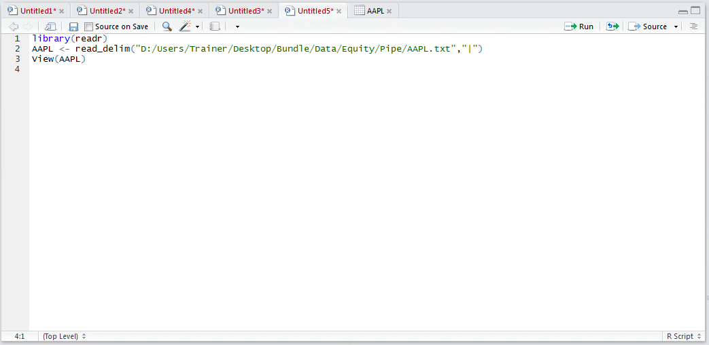
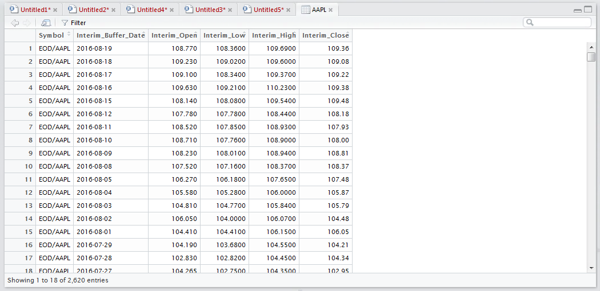

# Procedure 8: Importing a pipe separated file

While a csv file is the most prolific means to exchange datasets, it is not by any means the only structure of text file.  Other types of delimiter, this is to say using something other than a comma to separate the fields of a dataset, may include a pipe (i.e |) a tab, a semicolon (;) or just a space.

The readr package provides for the importing of data which has a slightly different structure to a csv file.  This procedure will not use RStudio, instead focus on creating a script for the purposes of reproducibility.

Create a new script window in RStudio by navigating to clicking on the new script icon, then clicking RScript:



A blank script will be created:



Start by loading the readr library by typing:

``` r
library(readr)
```



Run the line of script to console:



In this example, a file containing the same data as imported in procedure 46 will be used albeit the delimiter is a pipe and not a comma.  The file is available in Bundle\Data\Equity\Pipe\AAPL.txt:



To import the pipe delimited file use the read_delim() function of the readr package.  The function takes the arguments of the name and location of the file (in this case Bundle\Data\Equity\Pipe\AAPL.txt) then the delimiter (in this case |).  To layout the read_delim() function type:

``` r
AAPL <- Read_delim("D:/Users/Trainer/Desktop/Bundle/Data/Equity/Pipe/AAPL.txt","|")
```



Note that the default backslash file structure used in windows (i.e. \) has been changed to a forward slash (i.e. /).  Further in this example it is important to change the preceding file location of the bundle to the correct location on the computer (i.e. D:/Users/Trainer/Desktop/).  Run the line of script to console:



It can be seen that the specification for the data frame has been written out and that there are now errors.  View, and validate, the import by typing:

``` r
View(AAPL)
```



Run the line of script to console to expand the data frame to the script window:

