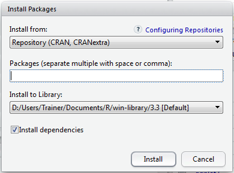
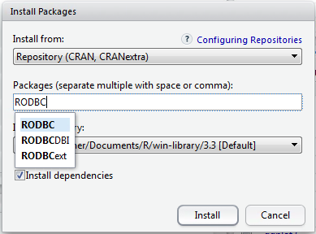
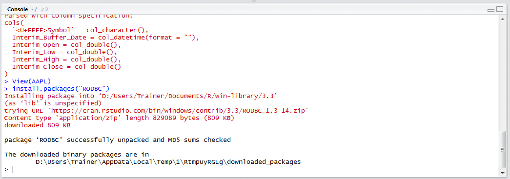
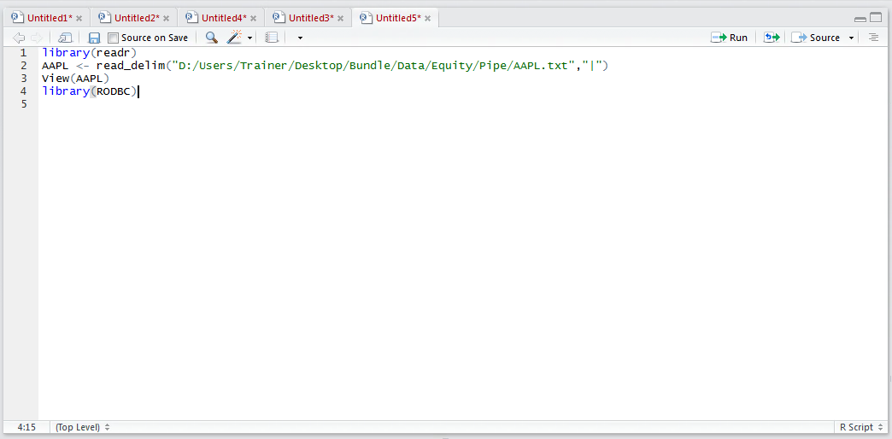
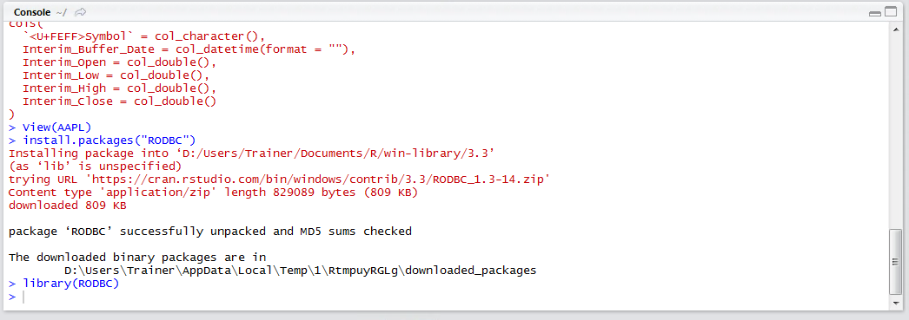
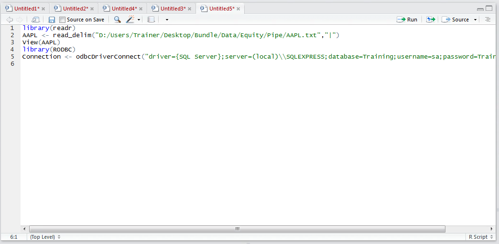
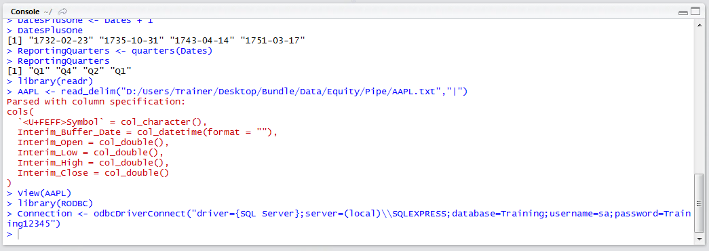

# Procedure 9: Connect to an SQL Server Database

This training course has a module dedicated to the creation of SQL statements for data mining and wrangling, for the purposes of this procedure it is only necessary to introduce SQL Server as a relational database management platform comprised of tables which are little more than a static equivalent to a csv file.

To connect to an SQL Server, the first step is to obtain the location of the server, the database name and credentials to log into this database, which for this document are detailed in the following table:

| Credentials | Value              | 
|-------------|--------------------|
| Server      | (local)/SQLEXPRESS |
| Database    | Training           |
| User        | Sa                 |
| Password    | Training12345      |

There are many different packages that facilitate the connection to databases for the purposes of retrieving tables and executing SQL.  In this procedure, the RODBC (R Open Database Connectivity) will be used as it one of the most established packages available for the purposes of cross platform database connection.

Firstly, RODBC relies on the RODBC package and as such this needs to be installed.  Navigate to and click the install packaged button as per procedure 9:



The packages textbox will auto complete on the submission of the package name, in this case RODBC:



Click install to being the download and installation of the RODBC package:



The package can be observed as having been installed, which will allow for the package to be referenced using the library() function.  Navigate to the script pane and type:

``` r
library(RODBC)
```



Run the line of script to console:



Databases maintain a static connection that should be explicitly opened and closed with the credentials of the database.  To connect to an SQL Server database, retaining the connection for future use, type:

``` r
Connection <- odbcDriverConnect("driver={SQL Server};server=(local)\\SQLEXPRESS;database=Training;username=sa;password=Training12345")
```



Notice how a backslash has special meaning in R, hence it has been escaped with a double backslash.

Run the line of script to console:



The absence of any errors is a signal that the connection to the database has been established successfully.
